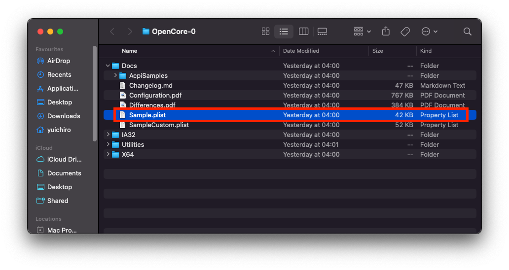
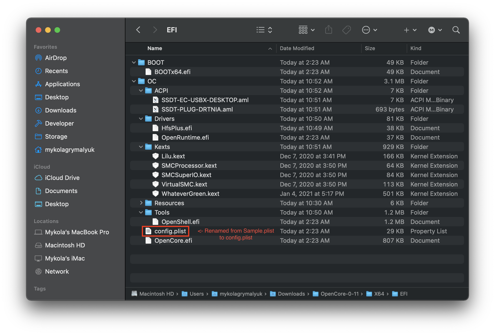
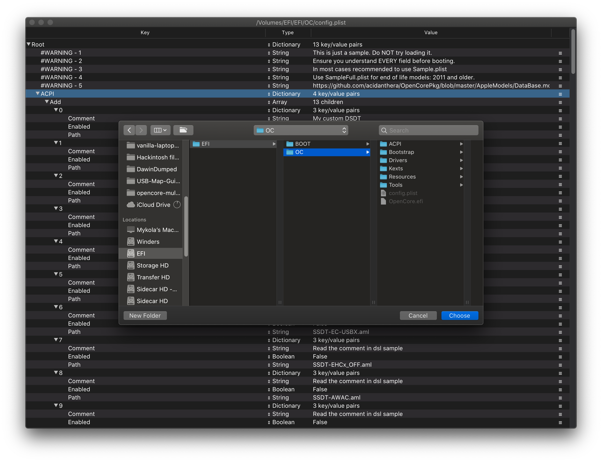
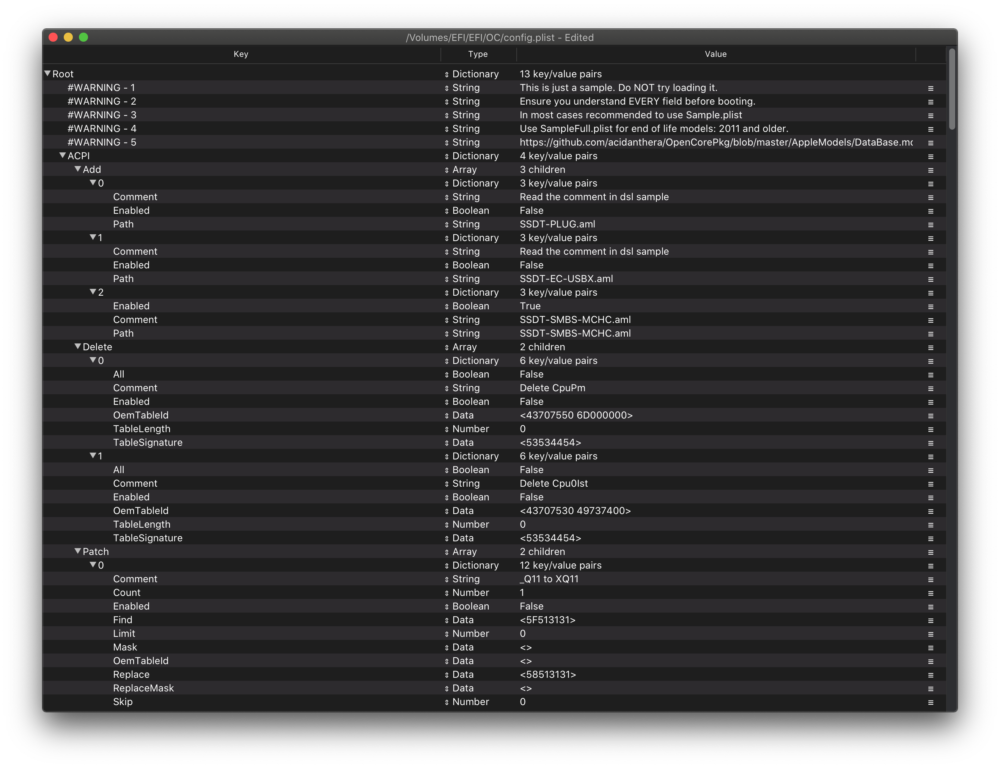
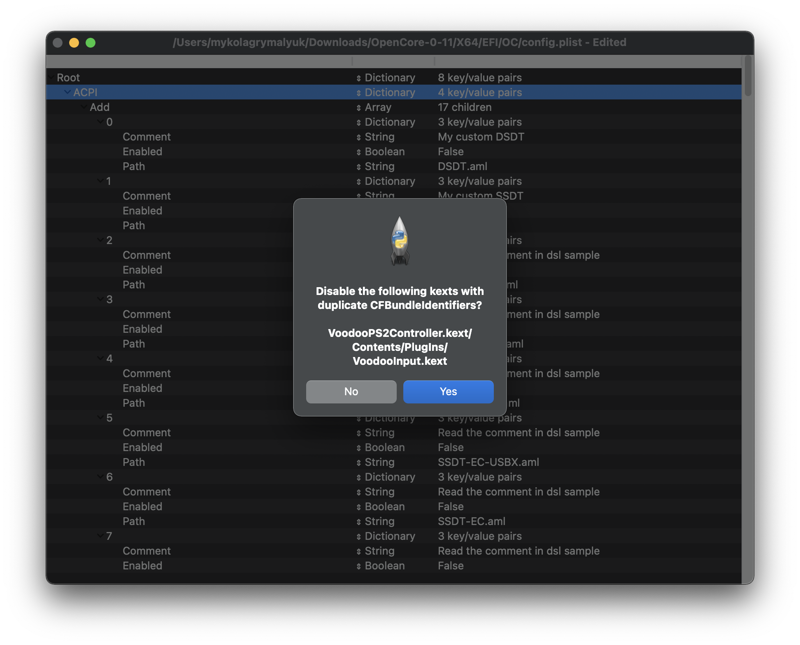

# config.plist 設定

現在，我們收集了所有需要的 Kext (.kext)、SSDT (.aml) 和韌體驅動程式 (.efi)，你的 USB 隨身碟應該開始看起來像這樣：

* **注意**：你的隨身碟**看起來可能會與上圖有所不同**，不同的系統都會有不同的需求。

## 建立你的 config.plist

首先，我們要取得 `Sample.plist`，這個檔案在 [OpenCorePkg](https://github.com/acidanthera/OpenCorePkg/releases)的 `Docs` 資料夾之下：

接下來，我們將它移動到隨身碟的 EFI 磁碟區（在 Windows 上稱為 BOOT）under `EFI/OC/`, 並將其重新命名為 config.plist：

## 加入你需要的 SSDT、Kexts 和韌體驅動程式

在本指南接下來的部分，你需要某種形式的 plist 編輯。在本指南中，我們將使用 ProperTree 和 GenSMBIOS 來幫助自動化一些乏味的工作：

* [ProperTree](https://github.com/corpnewt/ProperTree)
  * 通用的 plist 編輯器
* [GenSMBIOS](https://github.com/corpnewt/GenSMBIOS)
  * 用於生成 SMBIOS 資料

接下來，打開 ProperTree 並編輯我們的 config.plist：

* `ProperTree.command`
  * 適用於 macOS
  * 提示：在 Scripts 資料夾中有一個 buildapp.command 工具程式，可讓你在 macOS 中將 ProperTree 轉換為獨立的應用程式
* `ProperTree.bat`
  * 適用於 Windows

當 ProperTree 運行後, 通過按下 **Cmd/Ctrl + O** 開啟在隨身碟的的 config.plist。

在配置檔案打開後，按 **Cmd/Ctrl + Shift + R** 並將其指向你的 EFI/OC 資料夾來執行「清理快照」：

* 這將從 config.plist 中刪除所有條目，然後將所有 SSDT、kext 和韌體驅動程式的條目新增至配置檔案中
* 另一個做法是 **Cmd/Ctrl + R**，它也會將你所有的檔案條目新增至配置檔案，但如果它們之前已被停用，則會維持原狀。這對你進行故障排除很有用，但對我們目前來說並不需要

完成後，你會看到你的 SSDT、kext 和韌體驅動程式已經加入到你的 config.plist 中：

* **注意：**如果程式彈出了 "Disable the following kexts with Duplicate CFBundleIdentifiers?" 的快顯通知，請按「Yes」。這是為了確保你沒有注入重複的 kext，因為一些 kext 可能內附一些相同的插件（例如：VoodooInput 同時存在於 VoodooPS2 和 VoodooI2C 的插件資料夾中)

如果你想稍微清理一下檔案，你可以刪除 `#WARNING` 條目。這取決於你的個人喜好，因為保留他們不會造成任何問題。

::: danger
config.plist **必須** 與 EFI 資料夾的內容相匹配. 如果您刪除了一個檔案，卻將其保留在 config.plist, OpenCore 將出錯並停止啟動。

如果你做了任何修改，你可以在 ProperTree 中使用 OC 快照工具（**Cmd/Ctrl + R**）來更新 config.plist。
:::

## 選擇你使用的平台

接下来是重要的部分，根據你使用的平台進行配置。每個平台都有自己的設定項（Quirk）需要你的注意，所以了解你的硬體是非常重要的。接下來的步驟請參照下文指引：

### Intel 桌面平台

* 備註：Intel 的 NUC 系列使用被認為是屬於筆記型電腦平台，如果你是這個系列，我們建議參照 [Intel 筆記型電腦平台的部分](#intel-筆記型電腦平台)

| 代號名稱 | 系列 | 發行日期 |
| :--- | :--- | :--- |
| [Yonah, Conroe and Penryn](../config.plist/penryn.md) | E8XXX, Q9XXX, [etc 1](https://en.wikipedia.org/wiki/Yonah_(microprocessor)), [etc 2](https://en.wikipedia.org/wiki/Penryn_(microarchitecture)) | 2006-2009 年 |
| [Lynnfield and Clarkdale](../config.plist/clarkdale.md) | 5XX-8XX | 2010 年 |
| [Sandy Bridge](../config.plist/sandy-bridge.md) | 2XXX | 2011 年 |
| [Ivy Bridge](../config.plist/ivy-bridge.md) | 3XXX | 2012 年 |
| [Haswell](../config.plist/haswell.md) | 4XXX | 2013-2014 年 |
| [Skylake](../config.plist/skylake.md) | 6XXX | 2015-2016 年 |
| [Kaby Lake](../config.plist/kaby-lake.md) | 7XXX | 2017 年 |
| [Coffee Lake](../config.plist/coffee-lake.md) | 8XXX-9XXX | 2017-2019 年 |
| [Comet Lake](../config.plist/comet-lake.md) | 10XXX | 2020 年 |

### Intel 筆記型電腦平台

| 代號名稱 | 系列 | 發行日期 |
| :--- | :--- | :--- |
| [Clarksfield and Arrandale](../config-laptop.plist/arrandale.md) | 3XX-9XX | 2010 年 |
| [Sandy Bridge](../config-laptop.plist/sandy-bridge.md) | 2XXX | 2011 年 |
| [Ivy Bridge](../config-laptop.plist/ivy-bridge.md) | 3XXX | 2012 年 |
| [Haswell](../config-laptop.plist/haswell.md) | 4XXX | 2013-2014 年 |
| [Broadwell](../config-laptop.plist/broadwell.md) | 5XXX | 2014-2015 年 |
| [Skylake](../config-laptop.plist/skylake.md) | 6XXX | 2015-2016 年 |
| [Kaby Lake and Amber Lake](../config-laptop.plist/kaby-lake.md) | 7XXX | 2017 年 |
| [Coffee Lake and Whiskey Lake](../config-laptop.plist/coffee-lake.md) | 8XXX | 2017-2018 年 |
| [Coffee Lake Plus and Comet Lake](../config-laptop.plist/coffee-lake-plus.md) | 9XXX-10XXX | 2019-2020 年 |
| [Ice Lake](../config-laptop.plist/icelake.md) | 10XXX | 2019-2020 年 |

### Intel 高端桌面平台（HEDT）

本章節包括電腦愛好者及伺服器平台硬體。

| 代號名稱 | 系列 | 發行日期 |
| :--- | :--- | :--- |
| [Nehalem and Westmere](../config-HEDT/nehalem.md) | 9XX, X3XXX, X5XXX, [etc 1](https://en.wikipedia.org/wiki/Nehalem_(microarchitecture)), [2](https://en.wikipedia.org/wiki/Westmere_(microarchitecture)) | 2008-2010 年 |
| [Sandy/Ivy Bridge-E](../config-HEDT/ivy-bridge-e.md) | 3XXX, 4XXX | 2011-2013 年 |
| [Haswell-E](../config-HEDT/haswell-e.md) | 5XXX | 2014 年 |
| [Broadwell-E](../config-HEDT/broadwell-e.md) | 6XXX | 2016 年 |
| [Skylake/Cascade Lake-X/W](../config-HEDT/skylake-x.md) | 7XXX, 9XXX, 10XXX | 2017-2019 年 |

### AMD

| 代號名稱 | 系列 | 發行日期 |
| :--- | :--- | :--- |
| [Bulldozer/Jaguar](../AMD/fx.md) | [非常奇怪](https://en.wikipedia.org/wiki/List_of_AMD_processors#Bulldozer_architecture;_Bulldozer,_Piledriver,_Steamroller,_Excavator_(2011%E2%80%932017)) | [AMD 當時（2011-2017 年）的命名可謂是雜亂無章](https://en.wikipedia.org/wiki/List_of_AMD_processors#Bulldozer_architecture;_Bulldozer,_Piledriver,_Steamroller,_Excavator_(2011%E2%80%932017)) |
| [Zen](../AMD/zen.md) | 1XXX, 2XXX, 3XXX, 4XXX, 5XXX | 2017-2020 年 |

* 注意：~~第 3 代 Threadripper (39XX) 目前不支援，但是 1 代和 2 代都是支援的~~
  * 最新版本的 BIOS 和 OpenCore 已經修復了該問題，所有 Threadripper 平台的 CPU 都已支援。
