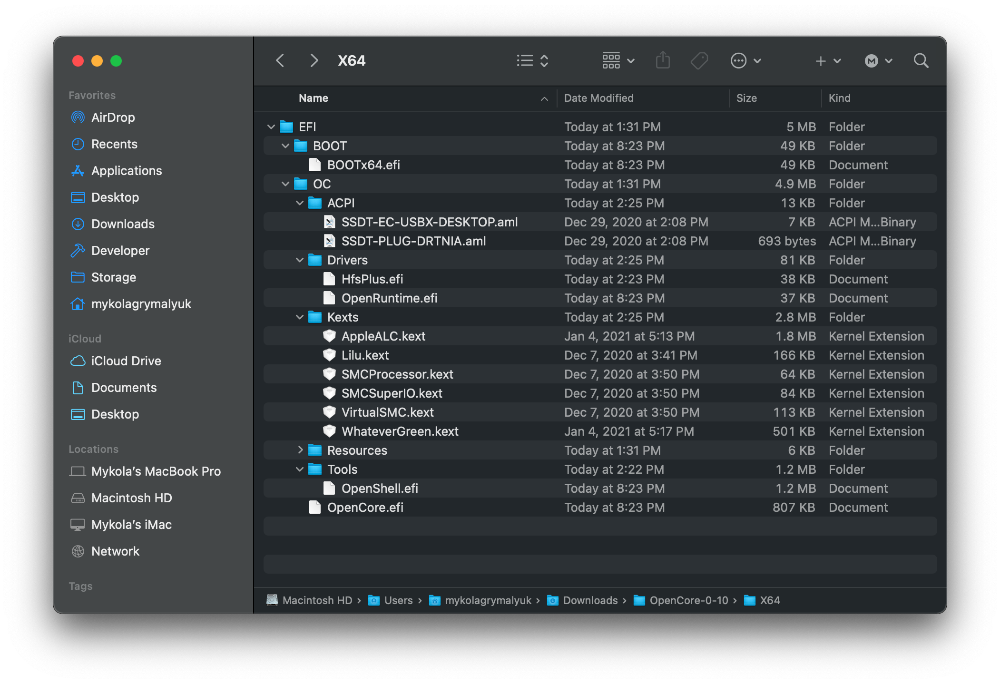

# config.plist 設定

現在，我們收集了所有需要的 Kext (.kext)、SSDT (.aml) 和韌體驅動程式 (.efi)，你的 USB 隨身碟應該開始看起來像這樣：

* **注意**：你的隨身碟**看起來可能會與上圖有所不同**，不同的系統都會有不同的需求。

## 建立你的 config.plist

首先，我們要取得 `Sample.plist`，這個檔案在 [OpenCorePkg](https://github.com/acidanthera/OpenCorePkg/releases)的 `Docs` 資料夾之下：

接下來，我們將它移動到隨身碟的 EFI 磁碟區（在 Windows 上稱為 BOOT）under `EFI/OC/`, 並將其重新命名為 config.plist：

## 加入你需要的 SSDT、Kexts 和韌體驅動程式

在本指南接下來的部分，你需要某種形式的 plist 編輯。在本指南中，我們將使用 ProperTree 和 GenSMBIOS 來幫助自動化一些乏味的工作：

* [ProperTree](https://github.com/corpnewt/ProperTree)
  * 通用的 plist 編輯器
* [GenSMBIOS](https://github.com/corpnewt/GenSMBIOS)
  * 用於生成 SMBIOS 資料

接下來，打開 ProperTree 並編輯我們的 config.plist：

* `ProperTree.command`
  * 適用於 macOS
  * 提示：在 Scripts 資料夾中有一個 buildapp.command 工具程式，可讓你在 macOS 中將 ProperTree 轉換為獨立的應用程式
* `ProperTree.bat`
  * 適用於 Windows

當 ProperTree 運行後, 通過按下 **Cmd/Ctrl + O** 開啟在隨身碟的的 config.plist。

在配置檔案打開後，按 **Cmd/Ctrl + Shift + R** 並將其指向你的 EFI/OC 資料夾來執行「清理快照」：

* 這將從 config.plist 中刪除所有條目，然後將所有 SSDT、kext 和韌體驅動程式的條目新增至配置檔案中
* **Cmd/Ctrl + R** is another option that will add all your files as well but will leave entries disabled if they were set like that before, useful for when you're troubleshooting but for us not needed right now
* 另一個做法是 **Cmd/Ctrl + R**，它也會將你所有的檔案條目新增至配置檔案，但如果它們之前已被停用，則會維持原狀。這對你進行故障排除很有用，但對我們目前來說並不需要

Once done, you'll see your SSDTs, Kexts and firmware drivers populated in the config.plist:

* **Note:** If you get a pop up "Disable the following kexts with Duplicate CFBundleIdentifiers?", press "Yes". This is to ensure you don't have duplicate kexts being injected, as some kexts may have some of the same plugins(ie. VoodooInput is in both VoodooPS2 and VoodooI2C's plugin folder)

If you wish to clean up the file a bit, you can remove the `#WARNING` entries. Though they cause no issues staying there, so up to personal preference.

::: danger
The config.plist **must** match the contents of the EFI folder. If you delete a file but leave it listed in the Config.plist, OpenCore will error and stop booting.

If you make any modifications, you can use the OC snapshot tool (**Cmd/Ctrl + R**) in ProperTree to update the config.plist.
:::

## Selecting your platform

Now comes the important part, selecting the configuration path. Each platform has their own unique quirks that you need to account for so knowing your hardware is super important. See below for what to follow:

### Intel Desktop

* Note: Intel's NUC series are considered mobile hardware, for these situations we recommend following the [Intel Laptop Section](#intel-laptop)

| Code Name | Series | Release |
| :--- | :--- | :--- |
| [Yonah, Conroe and Penryn](../config.plist/penryn.md) | E8XXX, Q9XXX, [etc 1](https://en.wikipedia.org/wiki/Yonah_(microprocessor)), [etc 2](https://en.wikipedia.org/wiki/Penryn_(microarchitecture)) | 2006-2009 era |
| [Lynnfield and Clarkdale](../config.plist/clarkdale.md) | 5XX-8XX | 2010 era |
| [Sandy Bridge](../config.plist/sandy-bridge.md) | 2XXX | 2011 era |
| [Ivy Bridge](../config.plist/ivy-bridge.md) | 3XXX | 2012 era |
| [Haswell](../config.plist/haswell.md) | 4XXX | 2013-2014 era |
| [Skylake](../config.plist/skylake.md) | 6XXX | 2015-2016 era |
| [Kaby Lake](../config.plist/kaby-lake.md) | 7XXX | 2017 era |
| [Coffee Lake](../config.plist/coffee-lake.md) | 8XXX-9XXX | 2017-2019 era |
| [Comet Lake](../config.plist/comet-lake.md) | 10XXX | 2020 era |

### Intel Laptop

| Code Name | Series | Release |
| :--- | :--- | :--- |
| [Clarksfield and Arrandale](../config-laptop.plist/arrandale.md) | 3XX-9XX | 2010 era |
| [Sandy Bridge](../config-laptop.plist/sandy-bridge.md) | 2XXX | 2011 era |
| [Ivy Bridge](../config-laptop.plist/ivy-bridge.md) | 3XXX | 2012 era |
| [Haswell](../config-laptop.plist/haswell.md) | 4XXX | 2013-2014 era |
| [Broadwell](../config-laptop.plist/broadwell.md) | 5XXX | 2014-2015 era |
| [Skylake](../config-laptop.plist/skylake.md) | 6XXX | 2015-2016 era |
| [Kaby Lake and Amber Lake](../config-laptop.plist/kaby-lake.md) | 7XXX | 2017 era |
| [Coffee Lake and Whiskey Lake](../config-laptop.plist/coffee-lake.md) | 8XXX | 2017-2018 era |
| [Coffee Lake Plus and Comet Lake](../config-laptop.plist/coffee-lake-plus.md) | 9XXX-10XXX | 2019-2020 era |
| [Ice Lake](../config-laptop.plist/icelake.md) | 10XXX | 2019-2020 era |

### Intel HEDT

This section includes both enthusiast and server based hardware.

| Code Name | Series | Release |
| :--- | :--- | :--- |
| [Nehalem and Westmere](../config-HEDT/nehalem.md) | 9XX, X3XXX, X5XXX, [etc 1](https://en.wikipedia.org/wiki/Nehalem_(microarchitecture)), [2](https://en.wikipedia.org/wiki/Westmere_(microarchitecture)) | 2008-2010 era |
| [Sandy/Ivy Bridge-E](../config-HEDT/ivy-bridge-e.md) | 3XXX, 4XXX | 2011-2013 era |
| [Haswell-E](../config-HEDT/haswell-e.md) | 5XXX | 2014 era |
| [Broadwell-E](../config-HEDT/broadwell-e.md) | 6XXX | 2016 era |
| [Skylake/Cascade Lake-X/W](../config-HEDT/skylake-x.md) | 7XXX, 9XXX, 10XXX | 2017-2019 era |

### AMD

| Code Name | Series | Release |
| :--- | :--- | :--- |
| [Bulldozer/Jaguar](../AMD/fx.md) | [It's weird](https://en.wikipedia.org/wiki/List_of_AMD_processors#Bulldozer_architecture;_Bulldozer,_Piledriver,_Steamroller,_Excavator_(2011%E2%80%932017)) | [AMD was really bad with naming back then](https://en.wikipedia.org/wiki/List_of_AMD_processors#Bulldozer_architecture;_Bulldozer,_Piledriver,_Steamroller,_Excavator_(2011%E2%80%932017)) |
| [Zen](../AMD/zen.md) | 1XXX, 2XXX, 3XXX, 5XXX | 2017-2020 era |

* Note: ~~Threadripper 3rd gen(39XX) are not supported, 1st and 2nd gen however are supported~~
  * Latest BIOS and OpenCore version has resolved this issue, all Threadripper platforms are now supported
