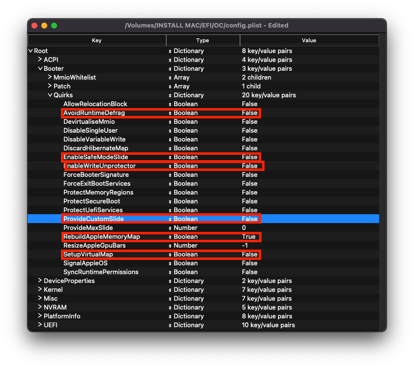

# Booter

此部分允許對操作系統開機程式（主要是 Apple 開機程式 (boot.efi)）套用不同類型的 UEFI 修改。這些修改目前為不同的韌體類型提供了各種修補和環境更改。其中一些功能最初是作為現已不再維護的 [AptioMemoryFix.efi](https://github.com/acidanthera/AptioFixPkg) 的一部分實現的。

Booter 修改會循以下順序執行：

* 處理 `Quirks`
* 處理 `Patch`

請注意，大多數情況下，“MmioWhitelist” 允許將通常被忽略的空間傳遞到 macOS，與 “DevirtualiseMmio” 配合使用時非常有用。詳細訊息請參閱閱[這裡](https://dortania.github.io/OpenCore-Install-Guide/extras/kaslr-fix.html#using-devirtualisemmio)

## MmioWhitelist

這個章節允許將通常被忽略的空間傳送予 macOS，與 `DevirtualiseMmio` 配合使用時會很有用。

## Quirks

::: tip 資訊
* **AvoidRuntimeDefrag**: YES
  * 修復 UEFI 執行期服務，如日期、時間、NVRAM、電源控制等
  * 使用傳統 BIOS 的電腦應該停用這個選項
* **DevirtualiseMmio**: YES
  * 減少被盜記憶體佔用，擴展 `slide=N` 值的選項，並對修復 Z390 上的記憶體分配問題非常有幫助。需要 Icelake 和 Z390 Coffee Lake 系統，並啟用 `ProtectUefiServices`。
* **EnableSafeModeSlide**: YES
  * 允許 Slide 變量在安全模式下使用。但這個選項只適用於使用 UEFI 的電腦。
* **EnableWriteUnprotector**: YES
  * 需要從 UEFI 平台的 CR0 寄存器中移除寫入保護。
  * 在 Coffee Lake 和更新的平台中，你應啟用 RebuildAppleMemoryMap 選項而停用本選項，因為兩個選項在新平台中經常有衝突。
  * 然而，由於 OEM 沒有使用最新的 EDKII 版本，您可能會發現上述組合將導致早期啟動失敗。這是由於缺少 `MEMORY_ATTRIBUTE_TABLE` 而引起。如發生這種情況，我们建議停用 RebuildAppleMemoryMap 並啟用 EnableWriteUnprotector。更多訊息請參見[故障診斷部分](/troubleshooting/extended/kernel-issues.md#stuck-on-eb-log-exitbs-start)。
* **ProtectMemoryRegions**: NO
  * Patches memory region types for incorrectly mapped CSM/MMIO regions.
  * 所有使用 coreboot UEFI 韌體的 Chromebook 都需要啟用這個選項。
* **ProtectUefiServices**: NO
  * 保護 UEFI 服務不被韌體覆蓋，主要與 VM、Icelake 和 Z390 系統有關。
  * 在 Z390 系統中，**請啟用這個選項**。
* **ProvideCustomSlide**: YES
  * 用於 Slide 變量計算。然而，這個選項的必要性取決於除錯日誌中是否出現 `OCABC: Only N/256 slide values are usable!` 訊息。如果在日誌中顯示 `OCABC: All slides are usable! You can disable ProvideCustomSlide!` 訊息，你可以停用 `ProvideCustomSlide`。
* **RebuildAppleMemoryMap**: YES
  * 生成與 macOS 相容的記憶體映射，可能會在一些筆記型電腦 OEM 韌體上崩潰，如果你因此而收到早期開機失敗，請停用此功能。
  * 在 Kaby Lake 和更舊的平台中，你應啟用 EnableWriteUnprotector 選項而停用本選項。
* **ResizeAppleGpuBars**: -1
  * 啟動 macOS 時，如果設定為 `0` ，將減少 GPU PCI 條的大小，設定為 `-1` 則停用
  * 使用此選項可以設定其他 PCI Bar 值，但可能導致不穩定
  * 只有在韌體中啟用了對 Resizable BAR 的支援時，才需要將此屬性設定為 0。
* **SetupVirtualMap**: YES
  * 修復了 SetVirtualAddresses 對虛擬地址的調用問題，Gigabyte 主板需要啟用這個選項來解決早期內核錯誤
  * 但是，此選項在 Comet Lake 因其記憶體保護而無法工作。ASUS，Gigabyte 和 AsRock 主板無法在本選項啟用的情況下開機。
* **SyncRuntimePermissions**: YES
  * 修正了與 MAT 表的對齊，並要求使用 MAT 表啟動 Windows 和 Linux，也推薦用於 macOS。主要適用於重建蘋果記憶體映射用戶。
:::

接下來，請根據平台進行設定。

### 通用

#### 啟動 OS X 10.4 至 10.6 的系統

請進行以下設定：

| 選項值 | 是否啟用 | 說明 |
| :--- | :--- | :--- |
| RebuildAppleMemoryMap | YES | |

#### 使用 coreboot UEFI 韌體的 Chromebook

請進行以下設定：

| 選項值 | 是否啟用 | 說明 |
| :--- | :--- | :--- |
| ProtectMemoryRegions | YES | Fixes shutdown/restart on some Chromebooks that would otherwise result in a AppleEFINVRAM kernel panic. |

### Intel 桌面平台

| 傳統 BIOS | UEFI |
| :--- | :--- |
|  |  |

#### 傳統 BIOS 系統（Yonah, Conroe, Penryn）

請進行以下設定：

| 選項值 | 是否啟用 | 說明 |
| :--- | :--- | :--- |
| AvoidRuntimeDefrag | NO | Big Sur 可能需要啟用這個選項值 |
| EnableSafeModeSlide | NO | |
| EnableWriteUnprotector | NO | |
| ProvideCustomSlide | NO | |
| SetupVirtualMap | NO | |

#### Coffee Lake

請進行以下設定：

| 選項值 | 是否啟用 | 說明 |
| :--- | :--- | :--- |
| DevirtualiseMmio | YES | |
| EnableWriteUnprotector | NO | |
| ProtectUefiServices | YES | 在 Z390 系統上需要啟用 |
| RebuildAppleMemoryMap | YES | |
| ResizeAppleGpuBars | -1 | 如果你的韌體支援增加 GPU Bar 大小（可調整大小的 BAR 的支援），請將其設定為 `0` |
| SyncRuntimePermissions | YES | |

#### Comet Lake

請進行以下設定：

| 選項值 | 是否啟用 | 說明 |
| :--- | :--- | :--- |
| DevirtualiseMmio | YES | |
| EnableWriteUnprotector | NO | |
| ProtectUefiServices | YES | |
| RebuildAppleMemoryMap | YES | |
| ResizeAppleGpuBars | -1 | 如果你的韌體支援增加 GPU Bar 大小（可調整大小的 BAR 的支援），請將其設定為 `0` |
| SetupVirtualMap | NO | |
| SyncRuntimePermissions | YES | |

#### 其他（未列出）UEFI 系統

這些選項對這些系統沒有作用，請保留預設值。

### Intel 高端桌面平台（HEDT）

#### Nehalem 和 Westmere

請進行以下設定：

| 選項值 | 是否啟用 | 說明 |
| :--- | :--- | :--- |
| AvoidRuntimeDefrag | NO | Big Sur 可能需要啟用這個選項值 |
| EnableSafeModeSlide | NO | |
| EnableWriteUnprotector | NO | |
| ProvideCustomSlide | NO | |
| SetupVirtualMap | NO | |

#### Skylake-X/W 和 Cascade Lake-X/W

請進行以下設定：

| 選項值 | 是否啟用 | 說明 |
| :--- | :--- | :--- |
| DevirtualiseMmio | YES | |
| EnableWriteUnprotector | NO | |
| RebuildAppleMemoryMap | YES | |
| SetupVirtualMap | YES | |
| SyncRuntimePermissions | YES | |

#### 其他（未列出）系統

這些選項對這些系統沒有作用，請保留預設值。

### Intel 筆記型電腦平台

#### Clarksfield 和 Arrandale

請進行以下設定：

| 選項值 | 是否啟用 | 說明 |
| :--- | :--- | :--- |
| AvoidRuntimeDefrag | NO | Big Sur 可能需要啟用這個選項值 |
| EnableSafeModeSlide | NO | |
| EnableWriteUnprotector | NO | |
| ProvideCustomSlide | NO | |
| SetupVirtualMap | NO | |

#### Coffee Lake 和 Whiskey Lake

請進行以下設定：

| 選項值 | 是否啟用 | 說明 |
| :--- | :--- | :--- |
| EnableWriteUnprotector | NO | |
| RebuildAppleMemoryMap | YES | |
| SyncRuntimePermissions | YES | |

#### Coffee Lake Plus 和 Comet Lake

請進行以下設定：

| 選項值 | 是否啟用 | 說明 |
| :--- | :--- | :--- |
| DevirtualiseMmio | YES | |
| EnableWriteUnprotector | NO | |
| ProtectUefiServices | YES | |
| RebuildAppleMemoryMap | YES | |
| SyncRuntimePermissions | YES | |

#### 其他（未列出）UEFI 系統

這些選項對這些系統沒有作用，請保留預設值。

### AMD 平台

#### Bulldozer(15h) 和 Jaguar(16h)

這些選項對這些系統沒有作用，請保留預設值。

#### Ryzen 和 Threadripper（17h and 19h）

請進行以下設定：

| 選項值 | 是否啟用 | 說明 |
| :--- | :--- | :--- |
| DevirtualiseMmio | NO | 如果你使用的是 TRx40 系統，請啟用這個選項並遵循以下說明： https://eason329.github.io/OpenCore-Install-Guide/extras/kaslr-fix.html |
| EnableWriteUnprotector | NO | |
| RebuildAppleMemoryMap | YES | |
| ResizeAppleGpuBars | -1 | 如果你的韌體支援增加 GPU Bar 大小（可調整大小的 BAR 的支援），請將其設定為 `0` |
| SetupVirtualMap | YES | X570、B550、A520、TRx40，及更新至 2020 年度後期 BIOS 的 X470、B450 主板則可能需要停用 |
| SyncRuntimePermissions | YES | |

# 完成此部分後，請[編輯 DeviceProperties 部分](device-properties.md)
