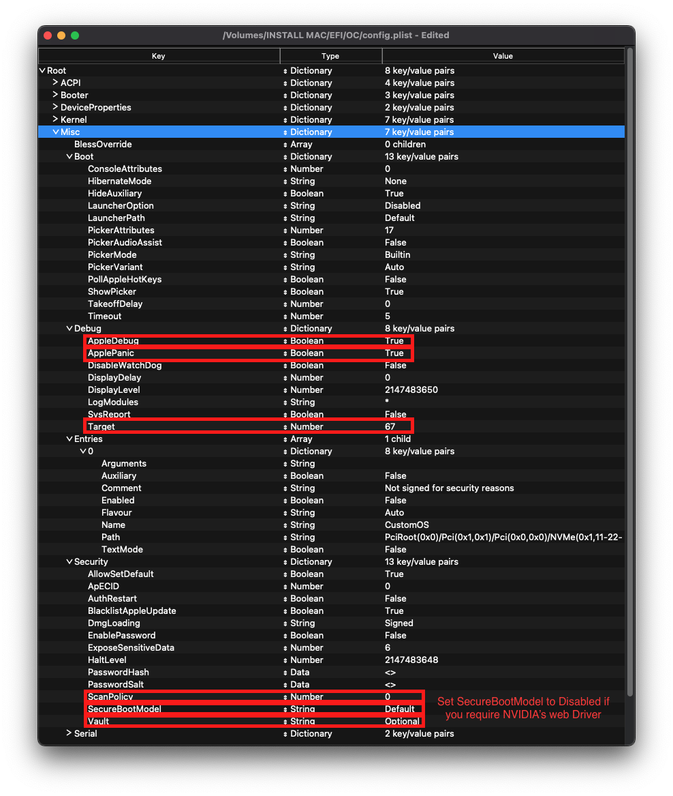

# 桌面平台的 Lynnfield 和 Clarkdale

| 支援 | 版本 |
| :--- | :--- |
| 最初支援的 macOS 版本 | OS X 10.6.3, Snow Leopard |
| 最後支援的版本 | macOS 12 Monterey |
| 備註 1 | 有關 Ventura 的資訊，請參閱 [macOS 13 Ventura](../extras/ventura.md#dropped-cpu-support) |
| 備註 2 | macOS 不支援桌面平台的 Iron Lake iGPU |
| 備註 3 | 多數支援 Lynnfield 和 Clarkdale 的主板都不支援 UEFI |

## 起點

製作一個 config.plist 看起來可能很難，其實不然，只是需要一些時間。本指南將告訴您如何設定所有內容，您不會被冷落。這也意味著如果你有問題，你需要檢查你的配置設定以確保它們是正確的。設定 OpenCore 時需要注意的主要事項：

* **所有屬性均必須定義**，OpenCore 不設任何預設的回退值，因此**除非明確地告訴你可以刪除，否則不要刪除任何章節**。如果指南沒有提到該選項，請將其保留為預設值。
* **Sample.plist 不能按原樣使用**，你必須根據自己的系統進行配置
* **不要使用配置器**, 這些配置器很少遵守 OpenCore 的配置設定，甚至一些像 Mackie 製作的配置器還會增加 Clover 屬性和破壞 plist！

現在，我們來快速回顧一下我們需要的工具

* [ProperTree](https://github.com/corpnewt/ProperTree)
  * 通用的 plist 編輯器
* [GenSMBIOS](https://github.com/corpnewt/GenSMBIOS)
  * 用於生成 SMBIOS 資料
* [Sample/config.plist](https://github.com/acidanthera/OpenCorePkg/releases)
  * 參閱上一章節了解如何取得：[config.plist 設定](../config.plist/README.md)

::: warning

在設定 OpenCore 之前，請多次閱讀本指南，並確保你已正確設定。請注意，圖片並不總是最新的，所以請閱讀圖片下面的文字，如果沒有提到，那麼請將其保持為預設值。

:::

## ACPI


### Add

::: tip 資訊

這裡是你將為系統加入 SSDT 的地方，它們對**啟動 macOS** 非常重要，且有許多用途，如 [USB 映射](https://eason329.github.io/OpenCore-Post-Install/usb/), [停用不支援的 GPU](../extras/spoof.md) 等。在我們的系統中, **甚至需要這些才可以啟動**. 你可以在 [**ACPI 入門教學**](https://eason329.github.io/Getting-Started-With-ACPI/)了解如何製作 SSDT

對於我們來說，我們需要一些 SSDT 來帶回 Clover 提供的功能：

| 需要的 SSDT | 描述 |
| :--- | :--- |
| **[SSDT-EC](https://dortania.github.io/Getting-Started-With-ACPI/)** | 修復嵌入式控制器，參見 [ACPI 入門教學](https://eason329.github.io/Getting-Started-With-ACPI/)了解更多詳細資訊。 |

請注意，你**不應該**在這裡加入您生成的 DSDT.aml，它已經在你的韌體中了。因此，如果存在的話，請刪除 config plist 和 EFI/OC/ACPI 下的相關條目。

對於那些想要更深入地傾印你的 DSDT、如何製作這些 SSDT 及編譯它們的人，請參閱 [**ACPI 入門教學**](https://eason329.github.io/Getting-Started-With-ACPI/) **页面**。編譯後的 SSDT 會有一個 **.aml** 副檔名（已編譯）並會放入 `EFI/OC/ACPI` 資料夾，且**必須**在你的配置檔案裡的 `ACPI -> Add` 下指定。

:::

### Delete

這裡將阻止載入某些 ACPI 表，對於我們來說，我們可以略過它。

### Patch

這個章節允許我們通過 OpenCore 動態修改 ACPI 部分内容（DSDT、SSDT 等）。對我們來說，我們的修補程式將由我們的 SSDT 處理。這是一個更簡潔的解決方案，因為這將允許我們使用 OpenCore 啟動 Windows 和其他操作系統。


### Quirks

與 ACPI 相關的設定，請將所有內容保留為預設值，我們不需要這些選項值。

## Booter

| 傳統 BIOS | UEFI
| :--- | :--- |
|  |  |

這個章節專門討論利用選項值並配合 OpenRuntime（AptioMemoryFix.efi 的替代品）修補 boot.efi 時的相關問題。

### MmioWhitelist

這個章節允許將通常被忽略的空間傳送予 macOS，與 `DevirtualiseMmio` 配合使用時會很有用。

### Quirks

::: tip 資訊
與修補 boot.efi 及修復韌體相關的設定（取決於你的主板是否支援 UEFI），按照你的主板支援的韌體，你將有兩個選項：


#### 傳統 BIOS 設定

| Quirk | 是否啟用 | 說明 |
| :--- | :--- | :--- |
| AvoidRuntimeDefrag | No | Big Sur 可能需要啟用這個選項值 |
| EnableSafeModeSlide | No | |
| EnableWriteUnprotector | No | |
| ProvideCustomSlide | No | |
| RebuildAppleMemoryMap | Yes | 這個選項值在啟動 OS X 10.4 至 10.6 時是必須的 |
| SetupVirtualMap | No | |

#### UEFI 設定

| Quirk | 是否啟用 | 說明 |
| :--- | :--- | :--- |
| RebuildAppleMemoryMap | Yes | 這個選項值在啟動 OS X 10.4 至 10.6 時是必須的 |

:::
::: details 更深入的資訊

* **AvoidRuntimeDefrag**: NO
  * 修復 UEFI 執行期服務，如日期、時間、NVRAM、電源控制等；
  * 但 macOS Big Sur 會要求提供 APIC 表，否則會導致內核出現早期錯誤，因此建議這些用戶啟用這個選項值。
* **EnableSafeModeSlide**: YES
  * 允許 Slide 變量在安全模式下使用。
* **EnableWriteUnprotector**: NO
  * 需要從 UEFI 平台的 CR0 寄存器中移除寫入保護。
* **ProvideCustomSlide**: YES
  * 用於 Slide 變量計算。然而，這個選項的必要性取決於除錯日誌中是否出現 `OCABC: Only N/256 slide values are usable!` 訊息。如果在日誌中顯示 `OCABC: All slides are usable! You can disable ProvideCustomSlide!` 訊息，你可以停用 `ProvideCustomSlide`。
* **RebuildAppleMemoryMap**: YES
  * 解決 10.6 及更低版本的早期內存內核錯誤問題。
* **SetupVirtualMap**: YES
  * 修復了 SetVirtualAddresses 對虛擬地址的調用問題

:::

## DeviceProperties


### Add

從映射中設定裝置屬性。

預設情況下，Sample.plist 已經加入了音訊部分的設定，我們將通過在 boot-args 部分設定 Layout ID 來設置音訊，因此建議從 `Add` 章節中刪除 `PciRoot(0x0)/Pci(0x1b,0x0)`。

### Delete

這裡將移除某些裝置屬性，對於我們來說，我們可以略過它。

## Kernel


### Add

在這裡，我們將指定要載入哪些 kext，載入的次序，及 kext 適用的架構。預設情況下，我們建議保留 ProperTree 所做的操作，但對於 32 位元 CPU，請參見以下内容：

::: details 更深入的資訊

你需要記住的主要事項：

* 載入次序
  * 請記住，任何插件都應該在其依賴項**以後**才載入
  * 這意味著像 Lilu 這樣的 kext 必須出現在 VirtualSMC、AppleALC、WhateverGreen 等插件之前

提醒：[ProperTree](https://github.com/corpnewt/ProperTree) 用戶可以執行 **Cmd/Ctrl + Shift + R** 以正確的次序加入所有 kext 而無需手動輸入。

* **Arch**
  * Kext 支援的架構
  * 目前支援的值包括 `Any`、`i386`（32 位元）及 `x86_64`（64位元）
* **BundlePath**
  * Kext 的名稱
  * 例：`Lilu.kext`
* **Enabled**
  * 不必多做解釋了，就是啟用或停用 kext
* **ExecutablePath**
  * 隱藏在 kext 中的實際可執行文件的路徑，您可以通過點擊右鍵並選擇`顯示套裝內容`來查看 kext 的路徑。它們一般都是 `Contents/MacOS/Kext`，但有些 kext 將可執行文件隱藏在 `Plugin` 資料夾下。注意，只包含 plist 的 kext 不需要填寫該屬性。
  * 例：`Contents/MacOS/Lilu`
* **MinKernel**
  * Kext 可被注入的最低内核版本，有關可用的值，請參見下表
  * 例：`12.00.00`（OS X 10.8）
* **MaxKernel**
  * Kext 可被注入的最高内核版本，有關可用的值，請參見下表
  * 例：`11.99.99`（OS X 10.7）
* **PlistPath**
  * 隱藏在 kext 中的 info.Plist 的路徑
  * 例：`Contents/Info.plist`

::: details Kernel 版本號列表

| OS X 版本 | MinKernel | MaxKernel |
| :--- | :--- | :--- |
| 10.4 | 8.0.0 | 8.99.99 |
| 10.5 | 9.0.0 | 9.99.99 |
| 10.6 | 10.0.0 | 10.99.99 |
| 10.7 | 11.0.0 | 11.99.99 |
| 10.8 | 12.0.0 | 12.99.99 |
| 10.9 | 13.0.0 | 13.99.99 |
| 10.10 | 14.0.0 | 14.99.99 |
| 10.11 | 15.0.0 | 15.99.99 |
| 10.12 | 16.0.0 | 16.99.99 |
| 10.13 | 17.0.0 | 17.99.99 |
| 10.14 | 18.0.0 | 18.99.99 |
| 10.15 | 19.0.0 | 19.99.99 |
| 11 | 20.0.0 | 20.99.99 |
| 12 | 21.0.0 | 21.99.99 |
| 13 | 22.0.0 | 22.99.99 |

:::

### Emulate

用於隱藏不支援的 CPU 的資訊（如：Pentium 和 Celeron）來欺騙系統

* **Cpuid1Mask**：不用填寫
* **Cpuid1Data**：不用填寫

### Force

用於從系統磁碟區中載入 kext，只適用於某些在緩存中沒有特定 kext 的老舊操作系統（如：10.16 中的 IONetworkingFamily）。

對於我們來說，我們可以略過它。

### Block

這裡將阻止載入某些 kext，而我們目前無需理會這裡。

### Patch

同時修補內核和 kext。

### Quirks

::: tip 資訊

與內核相關的設定，我們將啟用以下功能：

| 選項值 | 是否啟用 | 說明 |
| :--- | :--- | :--- |
| AppleCpuPmCfgLock | YES | 如果在 BIOS 中停用了 `CFG-Lock` 則可以停用 |
| DisableIoMapper | YES | 如果在 BIOS 中停用了 `VT-D` 則可以停用 |
| LapicKernelPanic | NO | HP 品牌電腦則需要啟用這個選項 |
| PanicNoKextDump | YES | |
| PowerTimeoutKernelPanic | YES | |
| XhciPortLimit | YES | 11.3 及更新版本則需要停用 |

:::

::: details 更深入的資訊

* **AppleCpuPmCfgLock**: YES
  * 只有無法從 BIOS 停用 CFG-Lock 的時候才需要
  * 只適用於 Ivy Bridge 或更老舊平台
    * 註：Broadwell 或更老舊平台在運行 10.10 或更老舊版本時需要啟用
* **AppleXcpmCfgLock**: NO
  * 只有無法從 BIOS 停用 CFG-Lock 的時候才需要
  * 只適用於 Haswell 或更老舊平台
    * 註：Ivy Bridge-E 平台也包括在內，因為該平台支援 XCPM
* **CustomSMBIOSGuid**: NO
  * 在 UpdateSMBIOSMode 設為 `Custom` 時進行 GUID 修補。通常與 Dell 筆記型電腦有關
  * 在 UpdateSMBIOSMode 自訂模式下啟用此選項時，可以同時將 SMBIOS 注入到「非蘋果」操作系統的功能停用，但我們不支持這種方法，因為它會破壞了 Bootcamp 的相容性。使用風險自負
* **DisableIoMapper**: YES
  * 如果在 BIOS 中無法停用或其他操作系統需要啟用 VT-D，則需要繞過 VT-D，這是比 `dart=0` 更好的替代方案，因為 SIP 可以在 Catalina 維持啟用
* **DisableLinkeditJettison**: YES
  * 允許 Lilu 和其他 kext 在不需要 `keepsyms=1` 的情況下擁有更可靠的性能
* **DisableRtcChecksum**: NO
  * 防止 AppleRTC 寫入主校驗碼 (0x58-0x59)，這對於接收到 BIOS 重置或在重新開機/關機後進入安全模式的用戶是必需的,
* **ExtendBTFeatureFlags** NO
  * 對於那些非蘋果或非 fenvi 卡有連接問題的人很有幫助
* **LapicKernelPanic**: NO
  * 在 AP 核心 lapic 中斷上停用內核錯誤，一般 HP 系統需要啟用。相當於 Clover 的 Kernel LAPIC
* **LegacyCommpage**: NO
  * 解決了 macOS 中 64 位元 CPU 的 SSSE3 要求，主要適用於 64 位元 Pentium 4 CPU（即 Prescott）
* **PanicNoKextDump**: YES
  * 允許在發生內核嚴重故障時讀取內核嚴重故障日誌
* **PowerTimeoutKernelPanic**: YES
  * 幫助修復 macOS Catalina 中與蘋果驅動程式權限變化相關的內核錯誤，尤其是與數字音訊有關的問題。
* **SetApfsTrimTimeout**: `-1`
  * 為 SSD 上的 APFS 檔案系統設定以微秒為單位的 TRIM 超時時間，只適用於 macOS 10.14 及更新版本和有相關問題的 SSD。
* **XhciPortLimit**: YES
  * 這是 15 個連接埠限制的修補程式，不要依賴它，因為它不是一個保證修復 USB 連接埠的解決方案。如果可以的話，請建立一個[USB 映射表](https://dortania.github.io/OpenCore-Post-Install/usb/)。
  * 在 macOS 11.3 及更新版本中, [XhciPortLimit 可能無法正常工作](https://github.com/dortania/bugtracker/issues/162)。我們建議用戶在升級前停用此選項值並進行映射，或是[從 Windows 映射](https://github.com/USBToolBox/tool)。你也可以安裝 macOS 11.2.3 或更舊的版本。

:::

### Scheme

與傳統 BIOS 開機（如：10.4-10.6）相關的設定，大多數的用戶都可以略過。但對於計劃啟動老舊操作系統的人，你可以查看以下内容：

::: details 更深入的資訊

* **FuzzyMatch**: True
  * 用於略過 kernelcache 的校驗碼，而不是選擇可用的最新緩存。可以幫助提高許多使用 10.6 系統的電腦的啟動性能
* **KernelArch**: x86_64
  * 設定內核的架構類型, 你可以在 `Auto`, `i386`（32 位元）和 `x86_64`（64 位元）之間選擇。
  * 如果你要啟動需要 32 位元的舊版操作系統（如：10.4 和 10.5），我們建議將其設置為 `Auto`，讓 macOS 根據您的 SMBIOS 決定。支援的值請見下表：
    * 10.4-10.5 — `x86_64`, `i386` 或 `i386-user32`
      * `i386-user32` 代表 32 位元用戶空間，32 位元（或缺少 SSSE3 支援）的 CPU 必須使用這個
      * `x86_64` 仍然使用 32 位元內核空間，但在 10.4/5 中會保留 64 位元用戶空間
    * 10.6 — `i386`, `i386-user32`, 或 `x86_64`
    * 10.7 — `i386` 或 `x86_64`
    * 10.8 或更新 — `x86_64`
* **KernelCache**: Auto
  * 設定內核緩存類型，主要用於除錯，因此我們建議使用 `Auto` 以取得最佳支援

:::

## Misc



### Boot

::: tip Info

| Quirk | Enabled | Comment |
| :--- | :--- | :--- |
| HideAuxiliary | YES | Press space to show macOS recovery and other auxiliary entries |

:::

::: details More in-depth Info

* **HideAuxiliary**: YES
  * This option will hide supplementary entries, such as macOS recovery and tools, in the picker. Hiding auxiliary entries may increase boot performance on multi-disk systems. You can press space at the picker to show these entries

:::

### Debug

::: tip Info

Helpful for debugging OpenCore boot issues(We'll be changing everything *but* `DisplayDelay`):

| Quirk | Enabled |
| :--- | :--- |
| AppleDebug | YES |
| ApplePanic | YES |
| DisableWatchDog | YES |
| Target | 67 |

:::

::: details More in-depth Info

* **AppleDebug**: YES
  * Enables boot.efi logging, useful for debugging. Note this is only supported on 10.15.4 and newer
* **ApplePanic**: YES
  * Attempts to log kernel panics to disk
* **DisableWatchDog**: YES
  * Disables the UEFI watchdog, can help with early boot issues
* **DisplayLevel**: `2147483650`
  * Shows even more debug information, requires debug version of OpenCore
* **SysReport**: NO
  * Helpful for debugging such as dumping ACPI tables
  * Note that this is limited to DEBUG versions of OpenCore
* **Target**: `67`
  * Shows more debug information, requires debug version of OpenCore

These values are based of those calculated in [OpenCore debugging](../troubleshooting/debug.md)

:::

### Security

::: tip Info

Security is pretty self-explanatory, **do not skip**. We'll be changing the following:

| Quirk | Enabled | Comment |
| :--- | :--- | :--- |
| AllowSetDefault | YES | |
| BlacklistAppleUpdate | YES | |
| ScanPolicy | 0 | |
| SecureBootModel | Default | Leave this as `Default` for OpenCore to automatically set the correct value corresponding to your SMBIOS. The next page goes into more detail about this setting. |
| Vault | Optional | This is a word, it is not optional to omit this setting. You will regret it if you don't set it to Optional, note that it is case-sensitive |

:::

::: details More in-depth Info

* **AllowSetDefault**: YES
  * Allow `CTRL+Enter` and `CTRL+Index` to set default boot device in the picker
* **ApECID**: 0
  * Used for netting personalized secure-boot identifiers, currently this quirk is unreliable due to a bug in the macOS installer so we highly encourage you to leave this as default.
* **AuthRestart**: NO
  * Enables Authenticated restart for FileVault 2 so password is not required on reboot. Can be considered a security risk so optional
* **BlacklistAppleUpdate**: YES
  * Used for blocking firmware updates, used as extra level of protection as macOS Big Sur no longer uses `run-efi-updater` variable

* **DmgLoading**: Signed
  * Ensures only signed DMGs load
* **ExposeSensitiveData**: `6`
  * Shows more debug information, requires debug version of OpenCore
* **Vault**: `Optional`
  * We won't be dealing vaulting so we can ignore, **you won't boot with this set to Secure**
  * This is a word, it is not optional to omit this setting. You will regret it if you don't set it to `Optional`, note that it is case-sensitive
* **ScanPolicy**: `0`
  * `0` allows you to see all drives available, please refer to [Security](https://dortania.github.io/OpenCore-Post-Install/universal/security.html) section for further details. **Will not boot USB devices with this set to default**
* **SecureBootModel**: Default
  * Controls Apple's secure boot functionality in macOS, please refer to [Security](https://dortania.github.io/OpenCore-Post-Install/universal/security.html) section for further details.
  * Note: Users may find upgrading OpenCore on an already installed system can result in early boot failures. To resolve this, see here: [Stuck on OCB: LoadImage failed - Security Violation](/troubleshooting/extended/kernel-issues.md#stuck-on-ocb-loadimage-failed-security-violation)

:::

### Serial

Used for serial debugging (Leave everything as default).

### Tools

Used for running OC debugging tools like the shell, ProperTree's snapshot function will add these for you.

### Entries

Used for specifying irregular boot paths that can't be found naturally with OpenCore.

Won't be covered here, see 8.6 of [Configuration.pdf](https://github.com/acidanthera/OpenCorePkg/blob/master/Docs/Configuration.pdf) for more info

## NVRAM


### Add

::: tip 4D1EDE05-38C7-4A6A-9CC6-4BCCA8B38C14

Used for OpenCore's UI scaling, default will work for us. See in-depth section for more info

:::

::: details More in-depth Info

Booter Path, mainly used for UI modification

* **DefaultBackgroundColor**: Background color used by boot.efi
  * `00000000`: Syrah Black
  * `BFBFBF00`: Light Gray

:::

::: tip 4D1FDA02-38C7-4A6A-9CC6-4BCCA8B30102

OpenCore's NVRAM GUID, mainly relevant for RTCMemoryFixup users

:::

::: details More in-depth Info

* **rtc-blacklist**: <>
  * To be used in conjunction with RTCMemoryFixup, see here for more info: [Fixing RTC write issues](https://dortania.github.io/OpenCore-Post-Install/misc/rtc.html#finding-our-bad-rtc-region)
  * Most users can ignore this section

:::

::: tip 7C436110-AB2A-4BBB-A880-FE41995C9F82

System Integrity Protection bitmask

* **General Purpose boot-args**:

| boot-args | Description |
| :--- | :--- |
| **-v** | This enables verbose mode, which shows all the behind-the-scenes text that scrolls by as you're booting instead of the Apple logo and progress bar. It's invaluable to any Hackintosher, as it gives you an inside look at the boot process, and can help you identify issues, problem kexts, etc. |
| **debug=0x100** | This disables macOS's watchdog which helps prevents a reboot on a kernel panic. That way you can *hopefully* glean some useful info and follow the breadcrumbs to get past the issues. |
| **keepsyms=1** | This is a companion setting to debug=0x100 that tells the OS to also print the symbols on a kernel panic. That can give some more helpful insight as to what's causing the panic itself. |
| **alcid=1** | Used for setting layout-id for AppleALC, see [supported codecs](https://github.com/acidanthera/applealc/wiki/supported-codecs) to figure out which layout to use for your specific system. More info on this is covered in the [Post-Install Page](https://dortania.github.io/OpenCore-Post-Install/) |

* **GPU-Specific boot-args**:

| boot-args | Description |
| :--- | :--- |
| **agdpmod=pikera** | Used for disabling board ID checks on some Navi GPUs (RX 5000 & 6000 series), without this you'll get a black screen. **Don't use if you don't have Navi** (ie. Polaris and Vega cards shouldn't use this) |
| **-radcodec** | Used for allowing officially unsupported AMD GPUs (spoofed) to use the Hardware Video Encoder |
| **radpg=15** | Used for disabling some power-gating modes, helpful for properly initializing AMD Cape Verde based GPUs |
| **unfairgva=1** | Used for fixing hardware DRM support on supported AMD GPUs |
| **nvda_drv_vrl=1** | Used for enabling NVIDIA's Web Drivers on Maxwell and Pascal cards in macOS Sierra and High Sierra |

* **csr-active-config**: `00000000`
  * Settings for 'System Integrity Protection' (SIP). It is generally recommended to change this with `csrutil` via the recovery partition.
  * csr-active-config by default is set to `00000000` which enables System Integrity Protection. You can choose a number of different values but overall we recommend keeping this enabled for best security practices. More info can be found in our troubleshooting page: [Disabling SIP](../troubleshooting/extended/post-issues.md#disabling-sip)

* **run-efi-updater**: `No`
  * This is used to prevent Apple's firmware update packages from installing and breaking boot order; this is important as these firmware updates (meant for Macs) will not work.

* **prev-lang:kbd**: <>
  * Needed for non-latin keyboards in the format of `lang-COUNTRY:keyboard`, recommended to keep blank though you can specify it(**Default in Sample config is Russian**):
  * American: `en-US:0`(`656e2d55533a30` in HEX)
  * Full list can be found in [AppleKeyboardLayouts.txt](https://github.com/acidanthera/OpenCorePkg/blob/master/Utilities/AppleKeyboardLayouts/AppleKeyboardLayouts.txt)
  * Hint: `prev-lang:kbd` can be changed into a String so you can input `en-US:0` directly instead of converting to HEX
  * Hint 2: `prev-lang:kbd` can be set to a blank variable (eg. `<>`) which will force the Language Picker to appear instead at first boot up.

| Key | Type | Value |
| :--- | :--- | :--- |
| prev-lang:kbd | String | en-US:0 |

:::

### Delete

::: tip Info

Forcibly rewrites NVRAM variables, do note that `Add` **will not overwrite** values already present in NVRAM so values like `boot-args` should be left alone. For us, we'll be changing the following:

| Quirk | Enabled |
| :--- | :--- |
| WriteFlash | YES |

:::

::: details More in-depth Info

* **LegacySchema**
  * Used for assigning NVRAM variables, used with `OpenVariableRuntimeDxe.efi`. Only needed for systems without native NVRAM

* **WriteFlash**: YES
  * Enables writing to flash memory for all added variables.

:::

## PlatformInfo


::: tip Info

For setting up the SMBIOS info, we'll use CorpNewt's [GenSMBIOS](https://github.com/corpnewt/GenSMBIOS) application.

For this Clarkdale example, we'll chose the iMac11,2 SMBIOS - this is done intentionally for compatibility's sake. There are 3 main SMBIOS used for Clarkdale:

| SMBIOS | Hardware |
| :--- | :--- |
| iMac11,1 | Lynnfield SMBIOS |
| iMac11,2 | Clarkdale SMBIOS |
| MacPro6,1 |  Mojave and newer SMBIOS |

* If you plan to later run macOS 10.14, Mojave or newer, MacPro6,1 will be the recommended SMBIOS and the iGPU must be disabled in the BIOS due to no longer being supported

Run GenSMBIOS, pick option 1 for downloading MacSerial and Option 3 for selecting out SMBIOS.  This will give us an output similar to the following:

```sh
  #######################################################
 #               iMac11,2 SMBIOS Info                  #
#######################################################

Type:         iMac11,2
Serial:       C02KCYZLDNCW
Board Serial: C02309301QXF2FRJC
SmUUID:       A154B586-874B-4E57-A1FF-9D6E503E4580
```

The `Type` part gets copied to Generic -> SystemProductName.

The `Serial` part gets copied to Generic -> SystemSerialNumber.

The `Board Serial` part gets copied to Generic -> MLB.

The `SmUUID` part gets copied to Generic -> SystemUUID.

We set Generic -> ROM to either an Apple ROM (dumped from a real Mac), your NIC MAC address, or any random MAC address (could be just 6 random bytes, for this guide we'll use `11223300 0000`. After install follow the [Fixing iServices](https://dortania.github.io/OpenCore-Post-Install/universal/iservices.html) page on how to find your real MAC Address)

**Reminder that you need an invalid serial! When inputting your serial number in [Apple's Check Coverage Page](https://checkcoverage.apple.com), you should get a message such as "Unable to check coverage for this serial number."**

**Automatic**: YES

* Generates PlatformInfo based on Generic section instead of DataHub, NVRAM, and SMBIOS sections

:::

### Generic

::: details More in-depth Info

* **AdviseFeatures**: NO
  * Used for when the EFI partition isn't first on the Windows drive

* **MaxBIOSVersion**: NO
  * Sets BIOS version to Max to avoid firmware updates in Big Sur+, mainly applicable for genuine Macs.

* **ProcessorType**: `0`
  * Set to `0` for automatic type detection, however this value can be overridden if desired. See [AppleSmBios.h](https://github.com/acidanthera/OpenCorePkg/blob/master/Include/Apple/IndustryStandard/AppleSmBios.h) for possible values

* **SpoofVendor**: YES
  * Swaps vendor field for Acidanthera, generally not safe to use Apple as a vendor in most case

* **SystemMemoryStatus**: Auto
  * Sets whether memory is soldered or not in SMBIOS info, purely cosmetic and so we recommend `Auto`

* **UpdateDataHub**: YES
  * Update Data Hub fields

* **UpdateNVRAM**: YES
  * Update NVRAM fields

* **UpdateSMBIOS**: YES
  * Updates SMBIOS fields

* **UpdateSMBIOSMode**: Create
  * Replace the tables with newly allocated EfiReservedMemoryType, use `Custom` on Dell laptops requiring `CustomSMBIOSGuid` quirk
  * Setting to `Custom` with `CustomSMBIOSGuid` quirk enabled can also disable SMBIOS injection into "non-Apple" OSes however we do not endorse this method as it breaks Bootcamp compatibility. Use at your own risk

:::

## UEFI


**ConnectDrivers**: YES

* Forces .efi drivers, change to NO will automatically connect added UEFI drivers. This can make booting slightly faster, but not all drivers connect themselves. E.g. certain file system drivers may not load.

### Drivers

Add your .efi drivers here.

Only drivers present here should be:

* HfsPlusLegacy.efi
* OpenRuntime.efi
* OpenUsbKbDxe.efi(If your firmware does not support UEFI)

::: details More in-depth Info

| Key | Type | Description |
| :--- | :--- | :--- |
| Path | String | Path of the file from `OC/Drivers` directory |
| LoadEarly | Boolean | Load the driver early before NVRAM setup, should only be enabled for `OpenRuntime.efi` and `OpenVariableRuntimeDxe.efi` if using legacy NVRAM |
| Arguments | String | Some drivers accept additional arguments which are specified here. |

:::

### APFS

By default, OpenCore only loads APFS drivers from macOS Big Sur and newer. If you are booting macOS Catalina or earlier, you may need to set a new minimum version/date.
Not setting this can result in OpenCore not finding your macOS partition!

macOS Sierra and earlier use HFS instead of APFS. You can skip this section if booting older versions of macOS.

::: tip APFS Versions

Both MinVersion and MinDate need to be set if changing the minimum version.

| macOS Version | Min Version | Min Date |
| :------------ | :---------- | :------- |
| High Sierra (`10.13.6`) | `748077008000000` | `20180621` |
| Mojave (`10.14.6`) | `945275007000000` | `20190820` |
| Catalina (`10.15.4`) | `1412101001000000` | `20200306` |
| No restriction | `-1` | `-1` |

:::

### Audio

Related to AudioDxe settings, for us we'll be ignoring(leave as default). This is unrelated to audio support in macOS.

* For further use of AudioDxe and the Audio section, please see the Post Install page: [Add GUI and Boot-chime](https://dortania.github.io/OpenCore-Post-Install/)

### Input

::: tip Info

Related to boot.efi keyboard passthrough used for FileVault and Hotkey support, leave everything here as default besides:

| Quirk | Value | Comment |
| :--- | :--- | :--- |
| KeySupport | NO | Enable if your BIOS supports UEFI |

:::

### Output

Relating to OpenCore's visual output, leave everything here as default as we have no use for these quirks.

::: details More in-depth Info

| Output | Value | Comment |
| :--- | :--- | :--- |
| UIScale | `0` | `0` will automatically set based on resolution<br/>`-1` will leave it unchanged<br/>`1` for 1x scaling, for normal displays<br/>`2` for 2x scaling, for HiDPI displays |

:::

### ProtocolOverrides

Mainly relevant for Virtual machines, legacy macs and FileVault users. See here for more details: [Security and FileVault](https://dortania.github.io/OpenCore-Post-Install/)

### Quirks

::: tip Info
Relating to quirks with the UEFI environment, for us we'll be changing the following:

| Quirk | Enabled | Comment |
| :--- | :--- | :--- |
| IgnoreInvalidFlexRatio | YES | |
| UnblockFsConnect | NO | Needed mainly by HP motherboards |

:::

::: details More in-depth Info

* **IgnoreInvalidFlexRatio**: YES
  * Fix for when MSR_FLEX_RATIO (0x194) can't be disabled in the BIOS, required for all pre-Skylake based systems

* **DisableSecurityPolicy**: NO
  * Disables platform security policy in firmware, recommended for buggy firmwares where disabling Secure Boot does not allow 3rd party firmware drivers to load.
  * If running a Microsoft Surface device, recommended to enable this option

* **RequestBootVarRouting**: YES
  * Redirects AptioMemoryFix from `EFI_GLOBAL_VARIABLE_GUID` to `OC_VENDOR_VARIABLE_GUID`. Needed for when firmware tries to delete boot entries and is recommended to be enabled on all systems for correct update installation, Startup Disk control panel functioning, etc.

* **UnblockFsConnect**: NO
  * Some firmware block partition handles by opening them in By Driver mode, which results in File System protocols being unable to install. Mainly relevant for HP systems when no drives are listed

:::

### ReservedMemory

Used for exempting certain memory regions from OSes to use, mainly relevant for Sandy Bridge iGPUs or systems with faulty memory. Use of this quirk is not covered in this guide

## Cleaning up

And now you're ready to save and place it into your EFI under EFI/OC.

For those having booting issues, please make sure to read the [Troubleshooting section](../troubleshooting/troubleshooting.md) first and if your questions are still unanswered we have plenty of resources at your disposal:

* [r/Hackintosh Subreddit](https://www.reddit.com/r/hackintosh/)
* [r/Hackintosh Discord](https://discord.gg/2QYd7ZT)

## Intel BIOS settings

* Note: Most of these options may not be present in your firmware, we recommend matching up as closely as possible but don't be too concerned if many of these options are not available in your BIOS

### Disable

* Fast Boot
* Secure Boot
* Serial/COM Port
* Parallel Port
* VT-d (can be enabled if you set `DisableIoMapper` to YES)
* Compatibility Support Module (CSM) (**Must be off in most cases, GPU errors/stalls like `gIO` are common when this option is enabled**)
* Thunderbolt (For initial install, as Thunderbolt can cause issues if not setup correctly)
* Intel SGX
* Intel Platform Trust
* CFG Lock (MSR 0xE2 write protection)(**This must be off, if you can't find the option then enable `AppleCpuPmCfgLock` under Kernel -> Quirks. Your hack will not boot with CFG-Lock enabled**)

### Enable

* VT-x
* Above 4G Decoding
* Hyper-Threading
* Execute Disable Bit
* EHCI/XHCI Hand-off
* OS type: Windows 8.1/10 UEFI Mode (some motherboards may require "Other OS" instead)
* DVMT Pre-Allocated(iGPU Memory): 32MB or higher
* SATA Mode: AHCI

# Once done here, we need to edit a couple extra values. Head to the [Apple Secure Boot Page](../config.plist/security.md)
