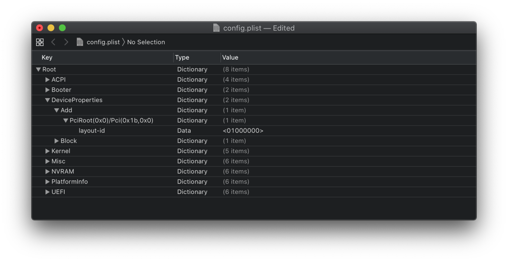

# DeviceProperties

裝置配置通過一個名為 `EfiDevicePathPropertyDatabase` 的專用緩衝區提供給 macOS。此緩衝區是 DevicePaths 到屬性名稱及其值的映射的序列化映射。

裝置屬性是 macOS I/O 註冊表的 `IODeviceTree (gIODT)` 平面的一部分。此平面有幾個與平台初始化相關的建造階段。雖然早期構建階段是由 XNU 內核在 `IODeviceTreeAlloc` 方法中執行的，但大部分構建是由平台專家執行的，並在`AppleACPIPlatformExpert.kext` 中實現。

我們將主要使用此部分來修補 Intel CPU 的 iGPU。 請不要嘗試注入你不知道的值。

[[toc]]

::: warning 注意
下面列出的大多數影格緩衝修補是讓 iGPU 和硬體加速正常工作的最低配置。如果你的顯示輸出無法正常工作，你可能需要更改 `AAPL,ig-platform-id` 和／或使用 Hackintool 加入顯示連接器數據並遵循一般的[影格緩衝修補指南](https://www.tonymacx86.com/threads/guide-general-framebuffer-patching-guide-hdmi-black-screen-problem.269149/)。

有關更多影格緩衝選項，請參閱 WhateverGreen 的 [**Intel HD 常見問題解答**](https://github.com/acidanthera/WhateverGreen/blob/master/Manual/FAQ.IntelHD.en.md)。但請注意，這些常見問題解答中的影格緩衝資料是以 Big Endian 形式提供的，因此你不能按原樣使用它 – 你必須首先[**將其轉換為 Little Endian**](https://www.save-editor.com/tools/wse_hex.html#littleendian)！

:::

## Add

從映射中設定裝置屬性。請根據你使用的平台進行設定。

### 通用

::: tip PciRoot(0x0)/Pci(0x1b,0x0)

`layout-id`

* 用於 AppleALC 的音訊硬體資訊的注入，你需要找出你的主板使用的編解碼器，並將其與 AppleALC 的佈局匹配。[查看 AppleALC 支援的編解碼器](https://github.com/acidanthera/AppleALC/wiki/Supported-codecs).
* 你可以直接刪除這個屬性，因為目前我們還沒有需要使用它

對於我們來說，我們將使用開機參數 `alcid=xxx` 來完成此操作。`alcid` 將覆蓋所有其他 layout-ID。更多訊息請參閱[安裝後完善指南](https://eason329.github.io/OpenCore-Post-Install/)

:::

### Intel 桌面平台

#### Yonah, Conroe 和 Penryn

::: tip PciRoot(0x0)/Pci(0x2,0x0)

這些平台的 iGPU 設定由[另一個指南](https://eason329.github.io/OpenCore-Post-Install/gpu-patching/legacy-intel/)指供。這些用戶應該暫時略過這裡。

:::

#### Lynnfield 和 Clarkdale

::: tip PciRoot(0x0)/Pci(0x2,0x0)

不幸地，macOS 不支援這些平台使用的 Iron Lake iGPU。這些用戶應該略過這裡。

:::

#### Sandy Bridge

::: tip PciRoot(0x0)/Pci(0x2,0x0)

macOS 使用 `AAPL,snb-platform-id` 來確定 iGPU 驅動程式如何與我們的系統交互，可以選擇的兩個值如下：

| AAPL,snb-platform-id | 說明 |
| :--- | :--- |
| **`10000300`** | 以桌面 iGPU 來驅動顯示器時使用 |
| **`00000500`** | 以桌面 iGPU 來進行計算任務而不驅動顯示器時使用 |

我們還需要一個支援的 device-id，就像上面的表一樣，你需要與你的硬體配置匹配：

| device-id | 說明 |
| :--- | :--- |
| **`26010000`** | 以桌面 iGPU 來驅動顯示器時使用 |
| **`02010000`** | 以桌面 iGPU 來進行計算任務而不驅動顯示器時使用 |

最後，你應該有類似下表的內容：

| Key | Type | Value |
| :--- | :--- | :--- |
| AAPL,snb-platform-id | Data | `00000500` |
| device-id | Data | `26010000` |

（這是一個桌面平台的 HD 3000，並使用 dGPU 作為輸出的例子）

:::

::: tip PciRoot(0x0)/Pci(0x16,0x0)

如果你在 7 系列主板（如：B75, Q75, Z75, H77, Q77, Z77）使用 Sandy Bridge CPU 的話便需要設定這個屬性。因為需要利用 IMEI 裝置代碼來欺騙系統，使你的硬體組合可被支援。無論有沒有 SSDT-IMEI，你也必須要設定本屬性。

| Key | Type | Value |
| :--- | :--- | :--- |
| device-id | Data | `3A1C0000` |

**註**：如果你使用 6 系列主板（如：H61, B65, Q65, P67, H67, Q67, Z68）則無需加入

:::

#### Ivy Bridge

::: tip PciRoot(0x0)/Pci(0x2,0x0)

我們會使用以下的 `AAPL,ig-platform-id`：

| AAPL,ig-platform-id | 說明 |
| :--- | :--- |
| **`0A006601`** | 以桌面 iGPU 來驅動顯示器時使用 |
| **`07006201`** | 以桌面 iGPU 來進行計算任務而不驅動顯示器時使用 |

示例：

| Key | Type | Value |
| :--- | :--- | :--- |
| AAPL,ig-platform-id | Data | `0A006601` |

（這是一個桌面平台的 HD 4000，而沒有使用 dGPU 的例子）

:::

::: tip PciRoot(0x0)/Pci(0x16,0x0)

如果你在 6 系列主板（如：H61, B65, Q65, P67, H67, Q67, Z68）使用 Ivy Bridge CPU 的話便需要設定這個屬性。因為需要利用 IMEI 裝置代碼來欺騙系統，使你的硬體組合可被支援。無論有沒有 SSDT-IMEI，你也必須要設定本屬性。

| Key | Type | Value |
| :--- | :--- | :--- |
| device-id | Data | `3A1E0000` |

**註**：如果你使用 7 系列主板（如：B75, Q75, Z75, H77, Q77, Z77）則無需加入

:::

#### Haswell 和 Broadwell

::: tip PciRoot(0x0)/Pci(0x2,0x0)

我們可以按需要，使用以下其中一個的 `AAPL,ig-platform-id`：

| AAPL,ig-platform-id | 說明 |
| :--- | :--- |
| **`0300220D`** | 以桌面 Haswell iGPU 來驅動顯示器時使用 |
| **`04001204`** | 以桌面 Haswell iGPU 來進行計算任務而不驅動顯示器時使用 |
| **`07002216`** | 以桌面 Broadwell iGPU 來驅動顯示器時使用 |

對於使用 macOS 不支援的 HD 4600 用戶，你需要加入以下 device-id：

| device-id | 說明 |
| :--- | :--- |
| **`12040000`** | 使用 macOS 不支援的 HD 4600 時使用 |

我們還增加了另外 3 個屬性，`framebuffer-patch-enable`、`framebuffer-stolenmem` 和 `framebuffer-fbmem`。第一種是通過 WhateverGreen.kext 進行修補，第二種是將最小被盜記憶體設定為 19MB，第三種是將 framebuffer 記憶體設定為 9MB。這通常是不必要的，因為可以在 BIOS 中設定（建議 64MB），但當你無法在 BIOS 設定時便必須在這裡設定。

* **注意**：Headless framebuffer（使用 dGPU 驅動顯示器）不需要設定 `framebuffer-patch-enable`, `framebuffer-stolenmem` 和 `framebuffer-fbmem`

最後，你應該有類似下表的內容：

| Key | Type | Value |
| :--- | :--- | :--- |
| AAPL,ig-platform-id | Data | `0300220D` |
| framebuffer-patch-enable | Data | `01000000` |
| framebuffer-stolenmem | Data | `00003001` |
| framebuffer-fbmem | Data | `00009000` |
| device-id | Data | `12040000` |

（這是一個桌面平台的 HD 4400，沒有使用 dGPU，和未在 BIOS 設定 iGPU 記憶體的例子）

| Key | Type | Value |
| :--- | :--- | :--- |
| AAPL,ig-platform-id | Data | `07002216` |
| framebuffer-patch-enable | Data | `01000000` |
| framebuffer-stolenmem | Data | `00003001` |
| framebuffer-fbmem | Data | `00009000` |

（這是一個桌面平台的 Iris Pro 6200，和未在 BIOS 設定 iGPU 記憶體的例子）

:::

#### Skylake

::: tip PciRoot(0x0)/Pci(0x2,0x0)

我們可以按需要，使用以下其中一個的 `AAPL,ig-platform-id`：

| AAPL,ig-platform-id | 說明 |
| :--- | :--- |
| **`00001219`** | 以桌面 iGPU 來驅動顯示器時使用 |
| **`01001219`** | 以桌面 iGPU 來進行計算任務而不驅動顯示器時使用 |

對於使用 macOS 不支援的 P530 用戶，你需要加入以下 device-id：

| device-id | 說明 |
| :--- | :--- |
| **`1B190000`** | 使用 macOS 不支援的 P530 時使用 |

我們還增加了另外 3 個屬性，`framebuffer-patch-enable`、`framebuffer-stolenmem` 和 `framebuffer-fbmem`。第一種是通過 WhateverGreen.kext 進行修補，第二種是將最小被盜記憶體設定為 19MB，第三種是將 framebuffer 記憶體設定為 9MB。這通常是不必要的，因為可以在 BIOS 中設定（建議 64MB），但當你無法在 BIOS 設定時便必須在這裡設定。

* **注意**：Headless framebuffer（使用 dGPU 驅動顯示器）不需要設定 `framebuffer-patch-enable`, `framebuffer-stolenmem` 和 `framebuffer-fbmem`

最後，你應該有類似下表的內容：

| Key | Type | Value |
| :--- | :--- | :--- |
| AAPL,ig-platform-id | Data | `00001219` |
| framebuffer-patch-enable | Data | `01000000` |
| framebuffer-stolenmem | Data | `00003001` |
| framebuffer-fbmem | Data | `00009000` |
| device-id | Data | `1B190000` |

（這是一個桌面平台的 HD P530，沒有使用 dGPU，和未在 BIOS 設定 iGPU 記憶體的例子）

:::

#### Kaby Lake

::: tip PciRoot(0x0)/Pci(0x2,0x0)

我們可以按需要，使用以下其中一個的 `AAPL,ig-platform-id`：

| AAPL,ig-platform-id | 說明 |
| :--- | :--- |
| **`00001259`** | 以桌面 iGPU 來驅動顯示器時使用 |
| **`03001259`** | 以桌面 iGPU 來進行計算任務而不驅動顯示器時使用 |

我們還增加了另外 2 個屬性，`framebuffer-patch-enable` 和 `framebuffer-stolenmem`。第一種是通過 WhateverGreen.kext 進行修補，第二種是將最小被盜記憶體設定為 19MB。這通常是不必要的，因為可以在 BIOS 中設定（建議 64MB），但當你無法在 BIOS 設定時便必須在這裡設定。

* **注意**：Headless framebuffer（使用 dGPU 驅動顯示器）不需要設定 `framebuffer-patch-enable` 和 `framebuffer-stolenmem`

最後，你應該有類似下表的內容：

| Key | Type | Value |
| :--- | :--- | :--- |
| AAPL,ig-platform-id | Data | `00001259` |
| framebuffer-patch-enable | Data | `01000000` |
| framebuffer-stolenmem | Data | `00003001` |

（這是一個桌面平台的 HD 630，沒有使用 dGPU，和未在 BIOS 設定 iGPU 記憶體的例子）

:::

#### Coffee Lake

::: tip PciRoot(0x0)/Pci(0x2,0x0)

**如果你使用的是帶 `-F` 後綴的 CPU，則你的 CPU 沒有 iGPU。因此，你可以略過這裡。**

我們可以按需要，使用以下其中一個的 `AAPL,ig-platform-id`：

| AAPL,ig-platform-id | 說明 |
| :--- | :--- |
| **`07009B3E`** | 以桌面 iGPU 來驅動顯示器時使用 |
| **`00009B3E`** | `07009B3E` 無法正常工作時的替代 |
| **`0300913E`** | 以桌面 iGPU 來進行計算任務而不驅動顯示器時使用 |

* **Note**: 在 macOS 10.15.5 和更新版本中，`07009B3E` 可能會導致黑畫面問題，如果你遇到相似問題，則可以嘗試轉用 `00009B3E`

我們還增加了另外 2 個屬性，`framebuffer-patch-enable` 和 `framebuffer-stolenmem`。第一種是通過 WhateverGreen.kext 進行修補，第二種是將最小被盜記憶體設定為 19MB。這通常是不必要的，因為可以在 BIOS 中設定（建議 64MB），但當你無法在 BIOS 設定時便必須在這裡設定。

* **注意**：Headless framebuffer（使用 dGPU 驅動顯示器）不需要設定 `framebuffer-patch-enable` 和 `framebuffer-stolenmem`

最後，你應該有類似下表的內容：

| Key | Type | Value |
| :--- | :--- | :--- |
| AAPL,ig-platform-id | Data | `07009B3E` |
| framebuffer-patch-enable | Data | `01000000` |
| framebuffer-stolenmem | Data | `00003001` |

（這是一個桌面平台的 UHD 630，沒有使用 dGPU，和未在 BIOS 設定 iGPU 記憶體的例子）

:::

#### Comet Lake

::: tip PciRoot(0x0)/Pci(0x2,0x0)

**如果你使用的是帶 `-F` 後綴的 CPU，則你的 CPU 沒有 iGPU。因此，你可以略過這裡。**

我們可以按需要，使用以下其中一個的 `AAPL,ig-platform-id`：

| AAPL,ig-platform-id | 說明 |
| :--- | :--- |
| **`07009B3E`** | 以桌面 iGPU 來驅動顯示器時使用 |
| **`00009B3E`** | `07009B3E` 無法正常工作時的替代 |
| **`0300913E`** | 以桌面 iGPU 來進行計算任務而不驅動顯示器時使用 |

* **Note**: 在 macOS 10.15.5 和更新版本中，`07009B3E` 可能會導致黑畫面問題，如果你遇到相似問題，則可以嘗試轉用 `00009B3E`

我們還增加了另外 2 個屬性，`framebuffer-patch-enable` 和 `framebuffer-stolenmem`。第一種是通過 WhateverGreen.kext 進行修補，第二種是將最小被盜記憶體設定為 19MB。這通常是不必要的，因為可以在 BIOS 中設定（建議 64MB），但當你無法在 BIOS 設定時便必須在這裡設定。

* **注意**：Headless framebuffer（使用 dGPU 驅動顯示器）不需要設定 `framebuffer-patch-enable` 和 `framebuffer-stolenmem`

最後，你應該有類似下表的內容：

| Key | Type | Value |
| :--- | :--- | :--- |
| AAPL,ig-platform-id | Data | `07009B3E` |
| framebuffer-patch-enable | Data | `01000000` |
| framebuffer-stolenmem | Data | `00003001` |

（這是一個桌面平台的 UHD 630，沒有使用 dGPU，和未在 BIOS 設定 iGPU 記憶體的例子）

:::

### Intel 高端桌面平台（HEDT）

#### Nehalem 和 Westmere

::: tip PciRoot(0x0)/Pci(0x2,0x0)

不幸地，macOS 似乎不支援這些平台使用的 iGPU。這些用戶應該略過這裡。

:::

#### Sandy Bridge-E 和 Ivy Bridge-E

::: tip PciRoot(0x0)/Pci(0x1,0x1)/Pci(0x0,0x0)

這一條目是關於可在許多 Intel 和 Supermicro 服務器主板，以及一些 Intel 服務器 PCIe 適配器找到的 Intel I350 控制器。這裡我們要做的就是讓蘋果的 I210 驅動程式支援我們的 I350 網絡控制器：

| Key | Type | Value |
| :--- | :--- | :--- |
| device-id | Data | `33150000` |

* **備註 1**：如果你的主板沒有內置I350 NIC，則不需要加入此條目。
* **備註 2**：如果 AppleIntelI210Ethernet kext 出現內核錯誤，或者不是所有的適配器都顯示出來，你可能需要為每個適配器編輯或加入額外的 PciRoot 屬性。

:::

::: tip PciRoot(0x0)/Pci(0x2,0x0)

不幸地，macOS 似乎不支援這些平台使用的 iGPU。這些用戶應該略過這裡。

:::

### Intel 筆記型電腦平台

### AMD 平台

## Delete

這裡將移除某些裝置屬性。

# 完成此部分後，請[編輯 Kernel 部分](kernel.md)
