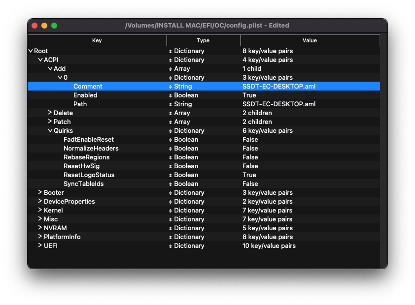
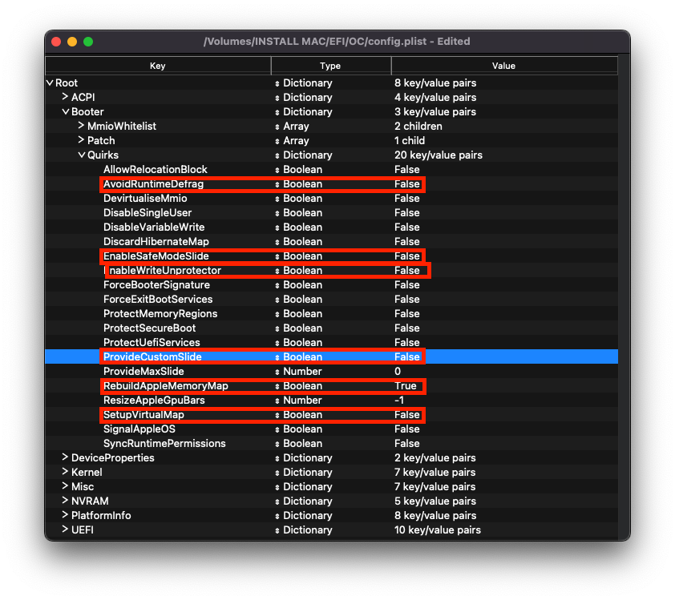
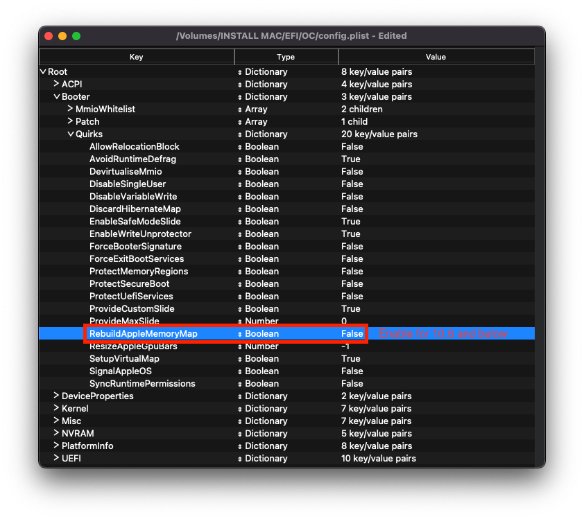
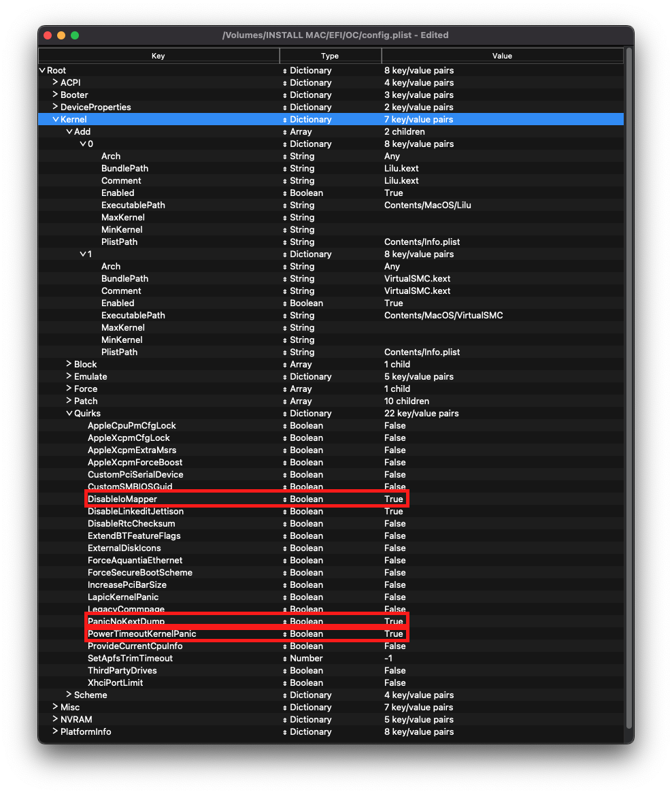
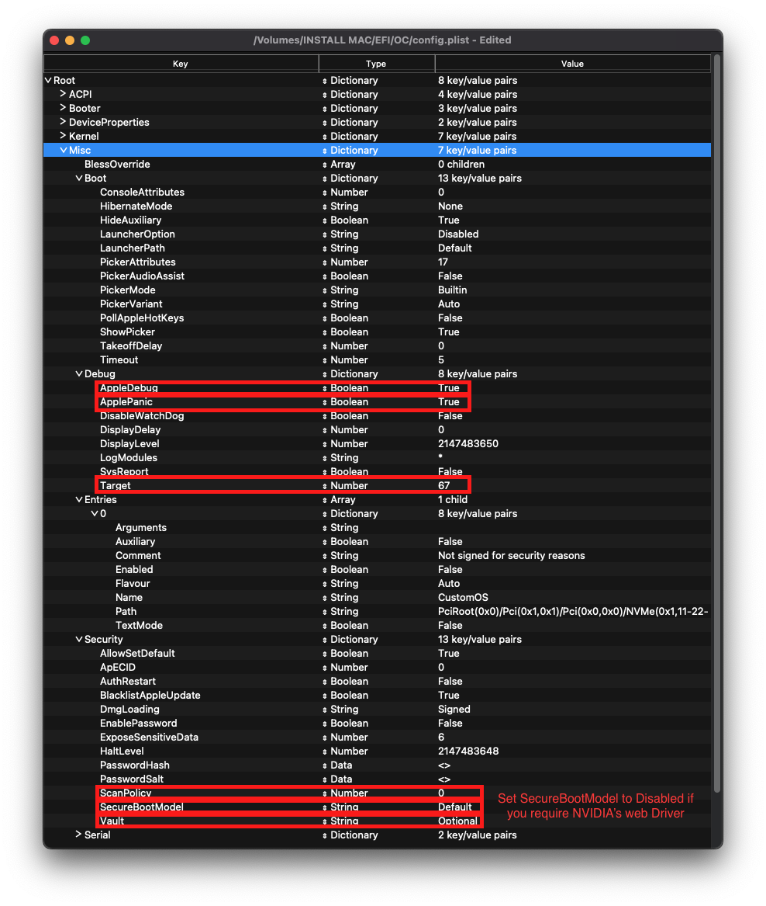
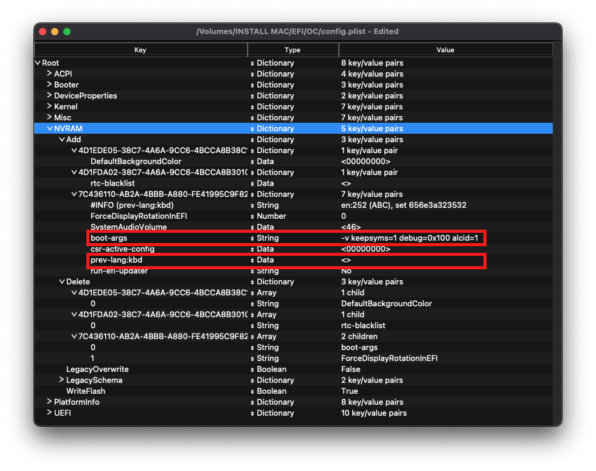
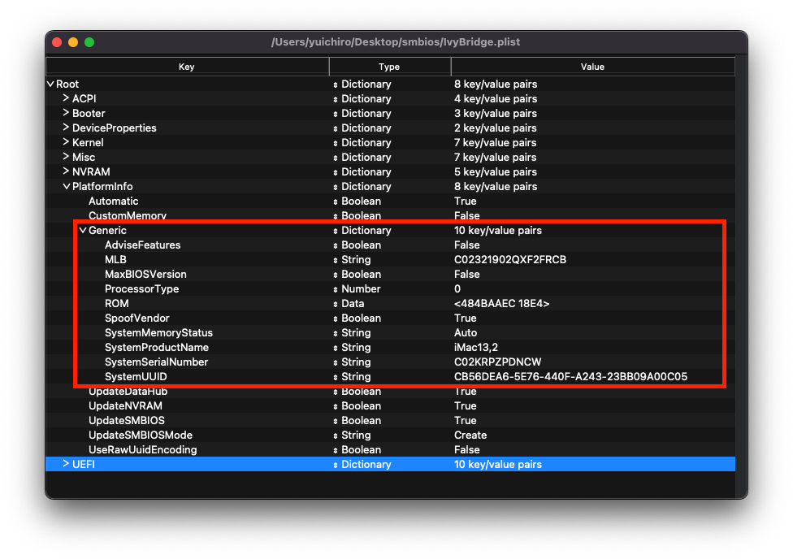
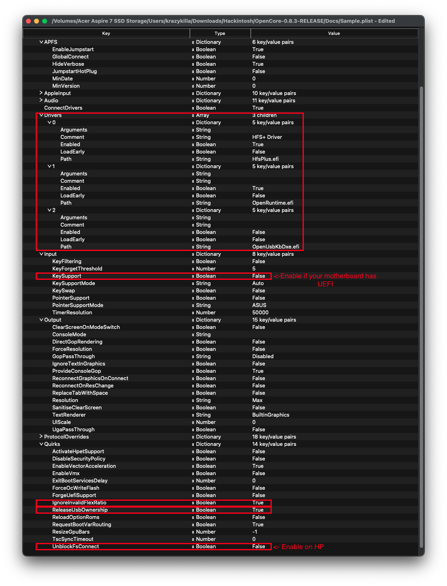

# 桌面平台的 Yonah, Conroe and Penryn

| 支援 | 版本 |
| :--- | :--- |
| 最初支援的 macOS 版本：Penryn | OS X 10.4.10, Tiger |
| 最後支援的版本: Penryn | macOS 10.13.6 High Sierra |
| 備註 | iGPU 支援不會在本指南中介紹，請參閱：[GMA 的修補](https://sumingyd.github.io/OpenCore-Post-Install/gpu-patching/)|
| 備註 2 | 啟動 macOS 10.12 Sierra 及更新版本需要 SSE4，因此不支援 Conroe 及更老舊的硬體 |

## 起點

製作一個 config.plist 看起來可能很難，其實不然，只是需要一些時間。本指南將告訴您如何設定所有內容，您不會被冷落。這也意味著如果你有問題，你需要檢查你的配置設定以確保它們是正確的。設定 OpenCore 時需要注意的主要事項：

* **所有屬性均必須定義**，OpenCore 不設任何預設的回退值，因此**除非明確地告訴你可以刪除，否則不要刪除任何章節**。如果指南沒有提到該選項，請將其保留為預設值。
* **Sample.plist 不能按原樣使用**，你必須根據自己的系統進行配置
* **不要使用配置器**, 這些配置器很少遵守 OpenCore 的配置設定，甚至一些像 Mackie 製作的配置器還會增加 Clover 屬性和破壞 plist！

現在，我們來快速回顧一下我們需要的工具

* [ProperTree](https://github.com/corpnewt/ProperTree)
  * 通用的 plist 編輯器
* [GenSMBIOS](https://github.com/corpnewt/GenSMBIOS)
  * 用於生成 SMBIOS 資料
* [Sample/config.plist](https://github.com/acidanthera/OpenCorePkg/releases)
  * 參閱上一章節了解如何取得：[config.plist 設定](../config.plist/README.md)

::: warning

在設定 OpenCore 之前，請多次閱讀本指南，並確保你已正確設定。請注意，圖片並不總是最新的，所以請閱讀圖片下面的文字，如果沒有提到，那麼請將其保持為預設值。

:::

## ACPI



### Add

::: tip 資訊

這裡是你將為系統加入 SSDT 的地方，它們對**啟動 macOS** 非常重要，且有許多用途，如 [USB 映射](https://eason329.github.io/OpenCore-Post-Install/usb/), [停用不支援的 GPU](../extras/spoof.md) 等。在我們的系統中, **甚至需要這些才可以啟動**. 你可以在 [**ACPI 入門教學**](https://eason329.github.io/Getting-Started-With-ACPI/)了解如何製作 SSDT

對於我們來說，我們需要一些 SSDT 來帶回 Clover 提供的功能：

| 需要的 SSDT | 描述 |
| :--- | :--- |
| **[SSDT-EC](https://eason329.github.io/Getting-Started-With-ACPI/)** | 修復嵌入式控制器，參見 [ACPI 入門教學](https://eason329.github.io/Getting-Started-With-ACPI/)瞭解更多詳細資訊。 |

請注意，你**不應該**在這裡加入您生成的 DSDT.aml，它已經在你的韌體中了。因此，如果存在的話，請刪除 config plist 和 EFI/OC/ACPI 下的相關條目。

對於那些想要更深入地傾印你的 DSDT、如何製作這些 SSDT 及編譯它們的人，請參閱 [**ACPI 入門教學**](https://eason329.github.io/Getting-Started-With-ACPI/) **页面**。編譯後的 SSDT 會有一個 **.aml** 副檔名（已編譯）並會放入 `EFI/OC/ACPI` 資料夾，且**必須**在你的配置檔案裡的 `ACPI -> Add` 下指定。

:::

### Delete

這裡將阻止載入某些 ACPI 表，對於我們來說，我們可以略過它。

### Patch

這個章節允許我們通過 OpenCore 動態修改 ACPI 部分内容（DSDT、SSDT 等）。對我們來說，我們的修補程式將由我們的 SSDT 處理。這是一個更簡潔的解決方案，因為這將允許我們使用 OpenCore 啟動 Windows 和其他操作系統。

### Quirks

與 ACPI 相關的設定，請將所有內容保留為預設值，我們不需要這些選項值。

## Booter

| 傳統 BIOS | UEFI
| :--- | :--- |
|  |  |

這個章節專門討論利用選項值並配合 OpenRuntime（AptioMemoryFix.efi 的替代品）修補 boot.efi 時的相關問題。

### MmioWhitelist

這個章節允許將通常被忽略的空間傳送予 macOS，與 `DevirtualiseMmio` 配合使用時會很有用。

### Quirks

::: tip 資訊
與修補 boot.efi 及修復韌體相關的設定（取決於你的主板是否支援 UEFI），按照你的主板支援的韌體，你將有兩個選項：

#### 傳統 BIOS 設定

| Quirk | 是否啟用 | 說明 |
| :--- | :--- | :--- |
| AvoidRuntimeDefrag | No | Big Sur 可能需要啟用這個選項值 |
| EnableSafeModeSlide | No | |
| EnableWriteUnprotector | No | |
| ProvideCustomSlide | No | |
| RebuildAppleMemoryMap | Yes | 這個選項值在啟動 OS X 10.4 至 10.6 時是必須的 |
| SetupVirtualMap | No | |

#### UEFI 設定

| Quirk | 是否啟用 | 說明 |
| :--- | :--- | :--- |
| RebuildAppleMemoryMap | Yes | 這個選項值在啟動 OS X 10.4 至 10.6 時是必須的 |

:::
::: details 更深入的資訊

* **AvoidRuntimeDefrag**: NO
  * 修復 UEFI 執行期服務，如日期、時間、NVRAM、電源控制等；
  * 但 macOS Big Sur 會要求提供 APIC 表，否則會導致內核出現早期錯誤，因此建議這些用戶啟用這個選項值。
* **EnableSafeModeSlide**: YES
  * 允許 Slide 變量在安全模式下使用。
* **EnableWriteUnprotector**: NO
  * 需要從 UEFI 平台的CR0寄存器中移除寫入保護。
* **ProvideCustomSlide**: YES
  * 用於 Slide 變量計算。然而，這個選項的必要性取決於除錯日誌中是否出現 `OCABC: Only N/256 slide values are usable!` 訊息。如果在日誌中顯示 `OCABC: All slides are usable! You can disable ProvideCustomSlide!` 訊息，你可以停用 `ProvideCustomSlide`。
* **RebuildAppleMemoryMap**: YES
  * 解決 10.6 及更低版本的早期內存內核錯誤問題。
* **SetupVirtualMap**: YES
  * 在 UEFI 主板上修復了 SetVirtualAddresses 對虛擬地址的調用問題

:::

## DeviceProperties


### Add

從映射中設定裝置屬性。

預設情況下，Sample.plist 已經加入了音訊部分的設定，我們將通過在 boot-args 部分設定 Layout ID 來設置音訊，因此建議從 `Add` 章節中刪除 `PciRoot(0x0)/Pci(0x1b,0x0)`。在其他平台上，本章節也用於設定 iGPU，但在 Penryn 上則由[另一個指南](https://eason329.github.io/OpenCore-Post-Install/gpu-patching/legacy-intel/)中提供教學。

### Delete

這裡將移除某些裝置屬性，對於我們來說，我們可以略過它。

## Kernel



### Add

在這裡，我們將指定要載入哪些 kext，載入的次序，及 kext 適用的架構。預設情況下，我們建議保留 ProperTree 所做的操作，但對於 32 位元 CPU，請參見以下内容：

::: details 更深入的資訊

你需要記住的主要事項:

* 載入次序
  * 請記住，任何插件都應該在其依賴項**以後**才載入
  * 這意味著像 Lilu 這樣的 kext 必須出現在 VirtualSMC、AppleALC、WhateverGreen 等插件之前

提醒：[ProperTree](https://github.com/corpnewt/ProperTree) 用戶可以執行 **Cmd/Ctrl + Shift + R** 以正確的次序加入所有 kext 而無需手動輸入。

* **Arch**
  * Kext 支援的架構
  * 目前支援的值包括 `Any`、`i386`（32 位元）及 `x86_64`（64位元）
* **BundlePath**
  * Kext 的名稱
  * 例：`Lilu.kext`
* **Enabled**
  * 不必多做解釋了，就是啟用或停用 kext
* **ExecutablePath**
  * 隱藏在 kext 中的實際可執行文件的路徑，您可以通過點擊右鍵並選擇`顯示套裝內容`來查看 kext 的路徑。它們一般都是 `Contents/MacOS/Kext`，但有些 kext 將可執行文件隱藏在 `Plugin` 資料夾下。注意，只包含 plist 的 kext 不需要填寫該屬性。
  * 例：`Contents/MacOS/Lilu`
* **MinKernel**
  * Kext 可被注入的最低内核版本，有關可用的值，請參見下表
  * 例：`12.00.00`（OS X 10.8）
* **MaxKernel**
  * Kext 可被注入的最高内核版本，有關可用的值，請參見下表
  * 例：`11.99.99`（OS X 10.7）
* **PlistPath**
  * 隱藏在 kext 中的 info.Plist 的路徑
  * 例：`Contents/Info.plist`
  
::: details Kernel 版本號列表

| OS X 版本 | MinKernel | MaxKernel |
| :--- | :--- | :--- |
| 10.4 | 8.0.0 | 8.99.99 |
| 10.5 | 9.0.0 | 9.99.99 |
| 10.6 | 10.0.0 | 10.99.99 |
| 10.7 | 11.0.0 | 11.99.99 |
| 10.8 | 12.0.0 | 12.99.99 |
| 10.9 | 13.0.0 | 13.99.99 |
| 10.10 | 14.0.0 | 14.99.99 |
| 10.11 | 15.0.0 | 15.99.99 |
| 10.12 | 16.0.0 | 16.99.99 |
| 10.13 | 17.0.0 | 17.99.99 |
| 10.14 | 18.0.0 | 18.99.99 |
| 10.15 | 19.0.0 | 19.99.99 |
| 11 | 20.0.0 | 20.99.99 |
| 12 | 21.0.0 | 21.99.99 |
| 13 | 22.0.0 | 22.99.99 |

:::

### Emulate

用於隱藏不支援的 CPU 的資訊（如：Pentium 和 Celeron）來欺騙系統

* **Cpuid1Mask**：不用填寫
* **Cpuid1Data**：不用填寫

### Force

用於從系統磁碟區中載入 kext，只適用於某些在緩存中沒有特定 kext 的老舊操作系統（如：10.16 中的 IONetworkingFamily）。

對於我們來說，我們可以略過它。

### Block

這裡將阻止載入某些 kext，而我們目前無需理會這裡。

### Patch

同時修補內核和 kext。

### Quirks

::: tip 資訊

與內核相關的設定，我們將啟用以下功能：

| 選項值 | 是否啟用 | 說明 |
| :--- | :--- | :--- |
| DisableIoMapper | YES | 如果在 BIOS 中停用了 `VT-D` 則可以停用 |
| LapicKernelPanic | NO | HP 品牌電腦則需要啟用這個選項 |
| PanicNoKextDump | YES | 10.12 及更新版本則不需要啟用 |
| PowerTimeoutKernelPanic | YES | 10.14 及更新版本則不需要啟用 |
| XhciPortLimit | YES | 11.3 及更新版本則需要停用 |

:::

::: details 更深入的資訊

* **AppleCpuPmCfgLock**: NO
  * Penryn 平台沒有 CFG-Lock 問題，因此無需啟用這個選項值
* **AppleXcpmCfgLock**: NO
  * Penryn 平台沒有 CFG-Lock 問題，因此無需啟用這個選項值
* **CustomSMBIOSGuid**: NO
  * 在 UpdateSMBIOSMode 設為 `Custom` 時進行 GUID 修補。通常與 Dell 筆記型電腦有關
  * 在 UpdateSMBIOSMode 自訂模式下啟用此選項時，可以同時將 SMBIOS 注入到「非蘋果」操作系統的功能停用，但我們不支持這種方法，因為它會破壞了 Bootcamp 的相容性。使用風險自負
* **DisableIoMapper**: YES
  * 如果在 BIOS 中無法停用或其他操作系統需要啟用 VT-D，則需要繞過 VT-D，這是比 `dart=0` 更好的替代方案，因為 SIP 可以在 Catalina 維持啟用
* **DisableLinkeditJettison**: YES
  * 允許 Lilu 和其他 kext 在不需要 `keepsyms=1` 的情況下擁有更可靠的性能
* **DisableRtcChecksum**: NO
  * 防止 AppleRTC 寫入主校驗碼 (0x58-0x59)，這對於接收到 BIOS 重置或在重新開機/關機後進入安全模式的用戶是必需的,
* **ExtendBTFeatureFlags** NO
  * 對於那些非蘋果或非 fenvi 卡有連接問題的人很有幫助
* **LapicKernelPanic**: NO
  * 在 AP 核心 lapic 中斷上停用內核錯誤，一般 HP 系統需要啟用。相當於 Clover 的 Kernel LAPIC
* **LegacyCommpage**: NO
  * 解決了 macOS 中 64 位元 CPU 的 SSSE3 要求，主要適用於 64 位元 Pentium 4 CPU（即 Prescott）
* **PanicNoKextDump**: YES
  * 允許在發生內核嚴重故障時讀取內核嚴重故障日誌
* **PowerTimeoutKernelPanic**: YES
  * 幫助修復 macOS Catalina 中與蘋果驅動程式權限變化相關的內核錯誤，尤其是與數字音訊有關的問題。
* **SetApfsTrimTimeout**: `-1`
  * 為 SSD 上的 APFS 檔案系統設定以微秒為單位的 TRIM 超時時間，只適用於 macOS 10.14 及更新版本和有相關問題的 SSD。
* **XhciPortLimit**: YES
  * 這是 15 個連接埠限制的修補程式，不要依賴它，因為它不是一個保證修復 USB 連接埠的解決方案。如果可以的話，請建立一個[USB 映射表](https://dortania.github.io/OpenCore-Post-Install/usb/)。
  * 在 macOS 11.3 及更新版本中, [XhciPortLimit 可能無法正常工作](https://github.com/dortania/bugtracker/issues/162)。我們建議用戶在升級前停用此選項值並進行映射，或是[從 Windows 映射](https://github.com/USBToolBox/tool)。你也可以安裝 macOS 11.2.3 或更舊的版本。

:::

### Scheme

與傳統 BIOS 開機（如：10.4-10.6）相關的設定，大多數的用戶都可以略過。但對於計劃啟動老舊操作系統的人，你可以查看以下内容：

::: details 更深入的資訊

* **FuzzyMatch**: True
  * 用於略過 kernelcache 的校驗碼，而不是選擇可用的最新緩存。可以幫助提高許多使用 10.6 系統的電腦的啟動性能
* **KernelArch**: x86_64
  * 設定內核的架構類型, 你可以在 `Auto`, `i386`（32 位元）和 `x86_64`（64 位元）之間選擇。
  * 如果你要啟動需要 32 位元的舊版操作系統（如：10.4 和 10.5），我們建議將其設置為 `Auto`，讓 macOS 根據您的 SMBIOS 決定。支援的值請見下表：
    * 10.4-10.5 — `x86_64`, `i386` 或 `i386-user32`
      * `i386-user32` 代表 32 位元用戶空間，32 位元（或缺少 SSSE3 支援）的 CPU 必須使用這個
      * `x86_64` 仍然使用 32 位元內核空間，但在 10.4/5 中會保留 64 位元用戶空間
    * 10.6 — `i386`, `i386-user32`, 或 `x86_64`
    * 10.7 — `i386` 或 `x86_64`
    * 10.8 或更新 — `x86_64`

* **KernelCache**: Auto
  * 設定內核緩存類型，主要用於除錯，因此我們建議使用 `Auto` 以取得最佳支援

:::

## Misc



### Boot

::: tip 資訊

| 選項值 | 是否啟用 | 說明 |
| :--- | :--- | :--- |
| HideAuxiliary | YES | 按空格鍵來顯示 macOS 恢復模式及其他輔助條目 |

:::

::: details 更深入的資訊

* **HideAuxiliary**: YES
  * 此選項將輔助條目（如：macOS 恢復模式和其他工具）從選擇器中隱藏。隱藏輔助條目可以提高多磁碟系統的啟動性能。你可以在選擇器按空格鍵來顯示輔助條目

:::

### Debug

::: tip 資訊

有助我們對 OpenCore 開機問題進行除錯（除了`DisplayDelay`，我們將更改所有內容）：

| 選項值 | 是否啟用 |
| :--- | :--- |
| AppleDebug | YES |
| ApplePanic | YES |
| DisableWatchDog | YES |
| Target | 67 |

:::

::: details 更深入的資訊

* **AppleDebug**: YES
  * 啟用 boot.efi 的日誌記錄，用於除錯。注意：只有 10.15.4 及更高版本支援這個功能
* **ApplePanic**: YES
  * 嘗試將內核崩潰記錄到磁碟
* **DisableWatchDog**: YES
  * 停用 UEFI watchdog，可以幫助解決早期開機問題
* **DisplayLevel**: `2147483650`
  * 顯示更多的除錯訊息，需要 DEBUG 版本的 OpenCore
* **SysReport**: NO
  * 有助我們進行除錯（如：傾印 ACPI 表）
  * 注意：只限於 DEBUG 版本的 OpenCore
* **Target**: `67`
  * 顯示更多的除錯訊息，需要 DEBUG 版本的 OpenCore

這些值是基於在[對 OpenCore 進行除錯](../troubleshooting/debug.md)過程中計算得出的。

:::

### Security

::: tip 資訊

安全性不用多說了吧，**不要跳過**。我們將修改以下內容：

| 選項值 | 是否啟用 | 說明 |
| :--- | :--- | :--- |
| AllowSetDefault | YES | |
| BlacklistAppleUpdate | YES | |
| ScanPolicy | 0 | |
| SecureBootModel | Default | 將這個值設定為 `Default`，以便 OpenCore 自動設定為與您的 SMBIOS 對應的正確值。下一頁將詳細介紹這個設定。 |
| Vault | Optional | 你不能略過這個設定。如果你不把它設定為 Optional，你會後悔的，注意：它是區分大小寫的 |

:::

::: details 更深入的資訊

* **AllowSetDefault**: YES
  * 允許在選擇器中按 `CTRL+Enter` 和 `CTRL+Index` 設定預設啟動條目
* **ApECID**: 0
  * 用於獲得個性化的安全啟動標識字符，由於 macOS 安裝程式中的一個 bug，這種方式目前是不可靠的，因此我們強烈建議您保留預設設置。
* **AuthRestart**: NO
  * 為 FileVault 2 啟用身份認證重啟，因此在重新開機時不需要密碼。由於被認為是一個安全風險，因此這是可選的
* **BlacklistAppleUpdate**: YES
  * 用於阻止韌體更新，由於 macOS Big Sur 不再使用 `run-efi-updater` 變量，這可作為額外的保護
* **DmgLoading**: Signed
  * 確保只加載經過簽名的 DMG
* **ExposeSensitiveData**: `6`
  * 顯示更多的除錯訊息，需要 DEBUG 版本的 OpenCore
* **Vault**: `Optional`
  * 我們目前不會處理 Vault 功能，所以我們可以略過它，**如果你現在把這個選項設定為 Secure，你將無法開機**
  * 這是一個字，你不能略過這個設定。如果你不把它設定為 Optional，你會後悔的，注意：它是區分大小寫的
* **ScanPolicy**: `0`
  * `0` 允許您查看所有可用的磁碟，請參閱[安全](https://eason329.github.io/OpenCore-Post-Install/universal/security.html) 部分了解更多詳細訊息。**如果保留為預設值，將不能從 USB 裝置啟動**
* **SecureBootModel**: Default
  * 控制 macOS 中的蘋果安全啟動功能，請參閱[安全](https://dortania.github.io/OpenCore-Post-Install/universal/security.html)部分了解更多詳細訊息。
  * 注意：用戶可能會發現在已經安裝 macOS 的系統上升級 OpenCore 可能會導致早期開機失敗。要解決這個問題，請參見：[卡在 OCB: LoadImage failed - Security Violation](/troubleshooting/extended/kernel-issues.md#stuck-on-ocb-loadimage-failed-security-violation)

:::

### Serial

用于序列除錯（保留為預設值）。

### Tools

用於執行 OC 除錯工具（如：shell），ProperTree 的快照功能將為您加入這些工具。

### Entries

用於指定 OpenCore 無法自然找到的不規則的開機路徑。

這裡不會介紹，更多信息請參見 [Configuration.pdf](https://github.com/acidanthera/OpenCorePkg/blob/master/Docs/Configuration.pdf) 第 8.6 節

## NVRAM



### Add

::: tip 4D1EDE05-38C7-4A6A-9CC6-4BCCA8B38C14

用於 OpenCore 的 UI 縮放，保留預設值就可以了。更多訊息請參閱下方的更深入資訊

:::

::: details 更深入的資訊

開機程式路徑，主要用於修改 UI

* **DefaultBackgroundColor**：boot.efi 使用的背景顏色
  * `00000000`: Syrah Black
  * `BFBFBF00`: Light Gray

:::

::: tip 4D1FDA02-38C7-4A6A-9CC6-4BCCA8B30102

OpenCore 的 NVRAM GUID，主要針對 RTCMemoryFixup 用戶

:::

::: details 更深入的資訊

* **rtc-blacklist**: <>
  * 與 RTCMemoryFixup 一起使用，請參閱這裡以取得更多訊息: [修復 RTC 寫入問題](https://dortania.github.io/OpenCore-Post-Install/misc/rtc.html#finding-our-bad-rtc-region)
  * 大多數用戶可以略過這一節

:::

::: tip 7C436110-AB2A-4BBB-A880-FE41995C9F82

系統完整性保護位元遮罩碼

* **一般的 boot-args**：

| boot-args | 說明 |
| :--- | :--- |
| **-v** | 啟用詳細模式，在你啟動時以滾動方式顯示所有後台文字，而不是蘋果 logo 和進度條。它對任何黑蘋果用戶來說都是無價的，因為它可以讓你深入了解開機過程，並可以幫助你識別問題、找出問題 kext 等等。 |
| **debug=0x100** | 停用 macOS 的 watchdog 功能，它有助於防止在內核出現嚴重錯誤時重新啟動。這樣你就*有希望*收集到一些有用的訊息並按照提示來解決問題。 |
| **keepsyms=1** | 這是 debug=0x100 的配套設定，它告訴操作系統在內核出現故障時也打印出這些符號。這可以提供一些更有用的見解，以瞭解造成錯誤的成因。 |
| **alcid=1** | 用於設定 AppleALC 的 layout-id，請參閱[支援的編解碼器](https://github.com/acidanthera/applealc/wiki/supported-codecs)，以確定針對你的系統會使用到的布局。更多訊息會在[安裝後完善指南](https://dortania.github.io/OpenCore-Post-Install/)提供 |

* **GPU 專用 boot-args**:

| boot-args | 說明 |
| :--- | :--- |
| **agdpmod=pikera** | 用於在一些 Navi GPU（RX 5000 & 6000 系列）上停用 board ID 檢查，否則將會出現黑屏。**如果你沒有 Navi 顯示卡，請不要使用**（如：Polaris 和 Vega 顯示卡就不應使用這個參數） |
| **-radcodec** | 用於允許官方不支援的 AMD GPU（以欺騙方式）使用硬體視訊編碼器 |
| **radpg=15** | 用於停用一些電源開關模式，有助於正確初始化基於 Cape Verde 的 AMD GPU |
| **unfairgva=1** | 用於在支援的 AMD GPU 上修復硬體 DRM 支援 |
| **nvda_drv_vrl=1** | 讓 Maxwell 和 Pascal 顯示卡在 macOS Sierra 和 High Sierra 上啟用 NVIDIA 的 Web 驅動程式 |

* **csr-active-config**: `00000000`
  * 「系統完整性保護」 (SIP) 的設定。通常建議通過恢復模式使用 `csrutil` 進行更改。
  * 預設情況下，csr-active-config 會設定為 `00000000`，以啓用系統完整性保護。你可以選擇許多不同的值，但總的來說，為了最佳安全實踐，我們建議啟用此選項。更多訊息可以在我們的除錯頁面中找到：[停用 SIP](../troubleshooting/extended/post-issues.md#disabling-sip)

* **run-efi-updater**: `No`
  * 這用於防止蘋果的韌體更新包安裝的時候破壞開機順序；這很重要，因為這些韌體更新（用於真正的 Mac）無法在黑蘋果電腦工作。

* **prev-lang:kbd**: <>
  * 用於非拉丁文鍵盤（格式為：`lang-COUNTRY:keyboard`），儘管你可以指定它，但建議保持空白（**示例配置檔案中的預設值是俄文**):
  * 繁體中文（使用倉頡鍵盤）：`zh-Hant:16899`（十六進制值是 `7a682d48616e743a3136383939`）
  * 繁體中文（使用注音鍵盤）：`zh-Hant:16900`（十六進制值是 `7a682d48616e743a3136393030`）
  * 完整列表可前往 [AppleKeyboardLayouts.txt](https://github.com/acidanthera/OpenCorePkg/blob/master/Utilities/AppleKeyboardLayouts/AppleKeyboardLayouts.txt)
  * 提示：`prev-lang:kbd` 可以被轉換成字串，所以你可以直接輸入 `en-US:0`，而不需要轉換至十六進制值
  * 提示 2：`prev-lang:kbd` 可以設定為一個空白變量（eg：`<>`），這將強制在首次啟動時顯示語言選擇器。

| Key | Type | Value |
| :--- | :--- | :--- |
| prev-lang:kbd | String | zh-Hant:16900 |

:::

### Delete

::: tip 資訊

強制重寫 NVRAM 變量，請注意，`Add` **不會覆蓋** NVRAM 中已經存在的值，所以像 `boot-args` 這樣的值應該保持不變。對我們來說，我們將更改以下內容：

| 選項值 | 是否啟用 |
| :--- | :--- |
| WriteFlash | YES |

:::

::: details 更深入的資訊

* **LegacySchema**
  * 用於賦予 NVRAM 變量，與 `OpenVariableRuntimeDxe.efi` 一起使用。只適用於沒有原生 NVRAM 的系統

* **WriteFlash**: YES
  * 允許所有新增的變量寫入快閃記憶體。

:::

## PlatformInfo



::: tip 資訊

為了設定 SMBIOS 訊息，我們將使用 CorpNewt 的 [GenSMBIOS](https://github.com/corpnewt/GenSMBIOS) 應用程式。

在這個 Penryn 示例中，我們選擇 iMac10,1 SMBIOS —— 這樣做是為了相容性。這裡有 4 個主要用於傳統硬體的 SMBIOS：

| SMBIOS | 硬體 | OS 支援 |
| :--- | :--- | :--- |
| iMac4,1 | Yonah SMBIOS(32-bit) | 10.4 至 10.6.8 |
| iMac7,1 | Conroe SMBIOS(64-Bit, SSE3) | 10.4 至 10.11.6 |
| iMac10,1 | Penryn SMBIOS(64-Bit, SSE4) | 10.6 至 10.13.6 |
| MacPro6,1 | Mojave 和更新的 SMBIOS | 10.9 至 12.6.4 |

* 如果你打算稍後執行 macOS 10.14、Mojave 或更新版本，那麼推薦使用 MacPro6,1 這個 SMBIOS。但請注意，你將需要 [telemetrap.kext](https://forums.macrumors.com/threads/mp3-1-others-sse-4-2-emulation-to-enable-amd-metal-driver.2206682/page-4?post=28447707#post-28447707) 來解決安裝問題

執行 GenSMBIOS，選擇選項 1 下載 MacSerial，選擇選項 3 下載 SMBIOS。這將給我們一個類似於下面的輸出：

```sh
  #######################################################
 #               iMac10,1 SMBIOS Info                  #
#######################################################

Type:         iMac10,1
Serial:       C02KCYZLDNCW
Board Serial: C02309301QXF2FRJC
SmUUID:       A154B586-874B-4E57-A1FF-9D6E503E4580
```

將 `Type` 部分複製到 Generic -> SystemProductName。

將 `Serial` 部分複製到 Generic -> SystemSerialNumber。

將 `Board Serial` 部分複製到 Generic -> MLB。

將 `SmUUID` 部分複製到 Generic -> SystemUUID。

我們將 Generic -> ROM 設定為蘋果 ROM（從真正的 Mac 中傾印），你的網路卡 MAC 地址，或任何隨機的 MAC 地址的其中之一 （可以是 6 個隨機位元組，在本指南中我們將使用 `11223300 0000`。安裝後，請跟隨[修復 iServices](https://eason329.github.io/OpenCore-Post-Install/universal/iservices.html) 頁面了解如何找到你的真實 MAC 地址）

**提醒：你需要一個無效的序列號！當你在蘋果的[查看裝置保固範圍](https://checkcoverage.apple.com)頁面中輸入你的序列號時，你會得到一條訊息，如「請輸入有效的序號」。**

**Automatic**: YES

* 基於 Generic 章節而不是 DataHub、NVRAM 和 SMBIOS 節來生成 PlatformInfo

:::

### Generic

::: details 更深入的資訊

* **AdviseFeatures**: NO
  * 當 EFI 分割不是 Windows 磁碟上的第一個分割時使用

* **MaxBIOSVersion**: NO
  * 設定 BIOS 版本為 Max，以避免在 Big Sur 及以上版本進行韌體更新，主要適用於正版 Mac。

* **ProcessorType**: `0`
  * 設定為 `0` 以用於自動類型檢測，但是如果需要，這個值可以被覆蓋。參見 [AppleSmBios.h](https://github.com/acidanthera/OpenCorePkg/blob/master/Include/Apple/IndustryStandard/AppleSmBios.h) 取得可能的值

* **SpoofVendor**: YES
  * 將供應商欄位替換為 Acidanthera，在大多數情況下使用蘋果作為供應商通常不安全

* **SystemMemoryStatus**: Auto
  * 在 SMBIOS 訊息中設定記憶體是否焊接，純粹用於修飾，因此我們建議使用 `Auto`

* **UpdateDataHub**: YES
  * 更新 Data Hub 欄位

* **UpdateNVRAM**: YES
  * 更新 NVRAM 欄位

* **UpdateSMBIOS**: YES
  * 更新 SMBIOS 欄位

* **UpdateSMBIOSMode**: Create
  * 用新分配的 EfiReservedMemoryType 替換表, 在需要 `CustomSMBIOSGuiduse` 的 Dell 筆記型電腦上使用 `Custom`
  * 設定為 `Custom` 並啟用 `CustomSMBIOSGuid` 也可以阻止 SMBIOS 注入到「非蘋果」作業系統，但是我們不支持這種方法，因為它破壞了 Bootcamp 的相容性。使用風險自負

:::

## UEFI



**ConnectDrivers**: YES

* Forces .efi drivers, change to NO will automatically connect added UEFI drivers. This can make booting slightly faster, but not all drivers connect themselves. E.g. certain file system drivers may not load.

### Drivers

Add your .efi drivers here.

Only drivers present here should be:

* HfsPlusLegacy.efi
* OpenRuntime.efi
* OpenUsbKbDxe.efi(If your firmware does not support UEFI)

::: details More in-depth Info

| Key | Type | Description |
| :--- | :--- | :--- |
| Path | String | Path of the file from `OC/Drivers` directory |
| LoadEarly | Boolean | Load the driver early before NVRAM setup, should only be enabled for `OpenRuntime.efi` and `OpenVariableRuntimeDxe.efi` if using legacy NVRAM |
| Arguments | String | Some drivers accept additional arguments which are specified here. |

:::

### APFS

By default, OpenCore only loads APFS drivers from macOS Big Sur and newer. If you are booting macOS Catalina or earlier, you may need to set a new minimum version/date.
Not setting this can result in OpenCore not finding your macOS partition!

macOS Sierra and earlier use HFS instead of APFS. You can skip this section if booting older versions of macOS.

::: tip APFS Versions

Both MinVersion and MinDate need to be set if changing the minimum version.

| macOS Version | Min Version | Min Date |
| :------------ | :---------- | :------- |
| High Sierra (`10.13.6`) | `748077008000000` | `20180621` |
| Mojave (`10.14.6`) | `945275007000000` | `20190820` |
| Catalina (`10.15.4`) | `1412101001000000` | `20200306` |
| No restriction | `-1` | `-1` |

:::

### Audio

Related to AudioDxe settings, for us we'll be ignoring(leave as default). This is unrelated to audio support in macOS.

* For further use of AudioDxe and the Audio section, please see the Post Install page: [Add GUI and Boot-chime](https://dortania.github.io/OpenCore-Post-Install/)

### Input

::: tip Info

Related to boot.efi keyboard passthrough used for FileVault and Hotkey support, leave everything here as default besides:

| Quirk | Value | Comment |
| :--- | :--- | :--- |
| KeySupport | NO | Enable if your BIOS supports UEFI |

:::

### Output

Relating to OpenCore's visual output, leave everything here as default as we have no use for these quirks.

::: details More in-depth Info

| Output | Value | Comment |
| :--- | :--- | :--- |
| UIScale | `0` | `0` will automatically set based on resolution<br/>`-1` will leave it unchanged<br/>`1` for 1x scaling, for normal displays<br/>`2` for 2x scaling, for HiDPI displays |

:::

### ProtocolOverrides

Mainly relevant for Virtual machines, legacy macs and FileVault users. See here for more details: [Security and FileVault](https://dortania.github.io/OpenCore-Post-Install/)

### Quirks

::: tip Info
Relating to quirks with the UEFI environment, for us we'll be changing the following:

| Quirk | Enabled | Comment |
| :--- | :--- | :--- |
| IgnoreInvalidFlexRatio | NO | Enable this if you have a UEFI BIOS |
| UnblockFsConnect | NO | Needed mainly by HP motherboards |

:::

::: details More in-depth Info

* **IgnoreInvalidFlexRatio**: NO
  * Fix for when MSR_FLEX_RATIO (0x194) can't be disabled in the BIOS, required for all pre-Skylake based systems
  * Only relevant on UEFI BIOS

* **DisableSecurityPolicy**: NO
  * Disables platform security policy in firmware, recommended for buggy firmwares where disabling Secure Boot does not allow 3rd party firmware drivers to load.
  * If running a Microsoft Surface device, recommended to enable this option

* **RequestBootVarRouting**: YES
  * Redirects AptioMemoryFix from `EFI_GLOBAL_VARIABLE_GUID` to `OC_VENDOR_VARIABLE_GUID`. Needed for when firmware tries to delete boot entries and is recommended to be enabled on all systems for correct update installation, Startup Disk control panel functioning, etc.

* **UnblockFsConnect**: NO
  * Some firmware block partition handles by opening them in By Driver mode, which results in File System protocols being unable to install. Mainly relevant for HP systems when no drives are listed
  
:::

### ReservedMemory

Used for exempting certain memory regions from OSes to use, mainly relevant for Sandy Bridge iGPUs or systems with faulty memory. Use of this quirk is not covered in this guide

## Cleaning up

And now you're ready to save and place it into your EFI under EFI/OC.

For those having booting issues, please make sure to read the [Troubleshooting section](../troubleshooting/troubleshooting.md) first and if your questions are still unanswered we have plenty of resources at your disposal:

* [r/Hackintosh Subreddit](https://www.reddit.com/r/hackintosh/)
* [r/Hackintosh Discord](https://discord.gg/2QYd7ZT)

## Intel BIOS settings

* Note: Most of these options may not be present in your firmware, we recommend matching up as closely as possible but don't be too concerned if many of these options are not available in your BIOS

### Disable

* Fast Boot
* Secure Boot
* Serial/COM Port
* Parallel Port
* VT-d (can be enabled if you set `DisableIoMapper` to YES)
* Compatibility Support Module (CSM) (**Must be off in most cases, GPU errors/stalls like `gIO` are common when this option is enabled**)
* Intel SGX
* Intel Platform Trust

### Enable

* VT-x
* Above 4G Decoding
* Hyper-Threading
* Execute Disable Bit
* EHCI/XHCI Hand-off
* OS type: Windows 8.1/10 UEFI Mode (some motherboards may require "Other OS" instead)
* DVMT Pre-Allocated(iGPU Memory): 32MB or higher
* SATA Mode: AHCI

# Once done here, we need to edit a couple extra values. Head to the [Apple Secure Boot Page](../config.plist/security.md)
