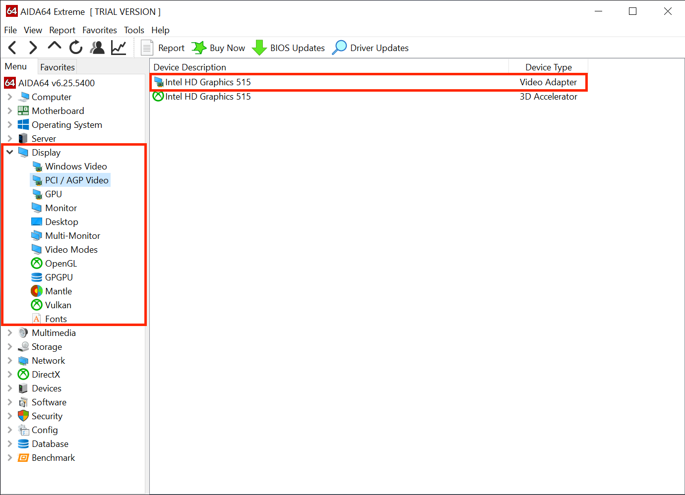
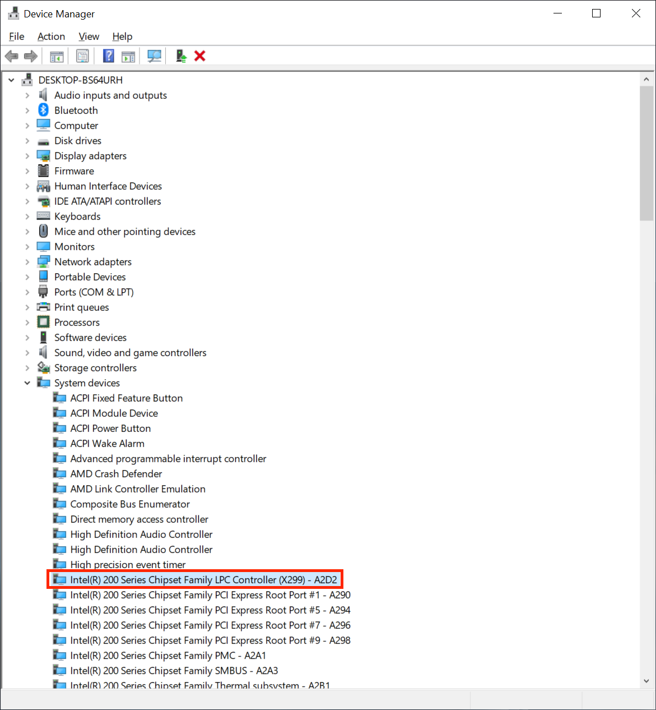
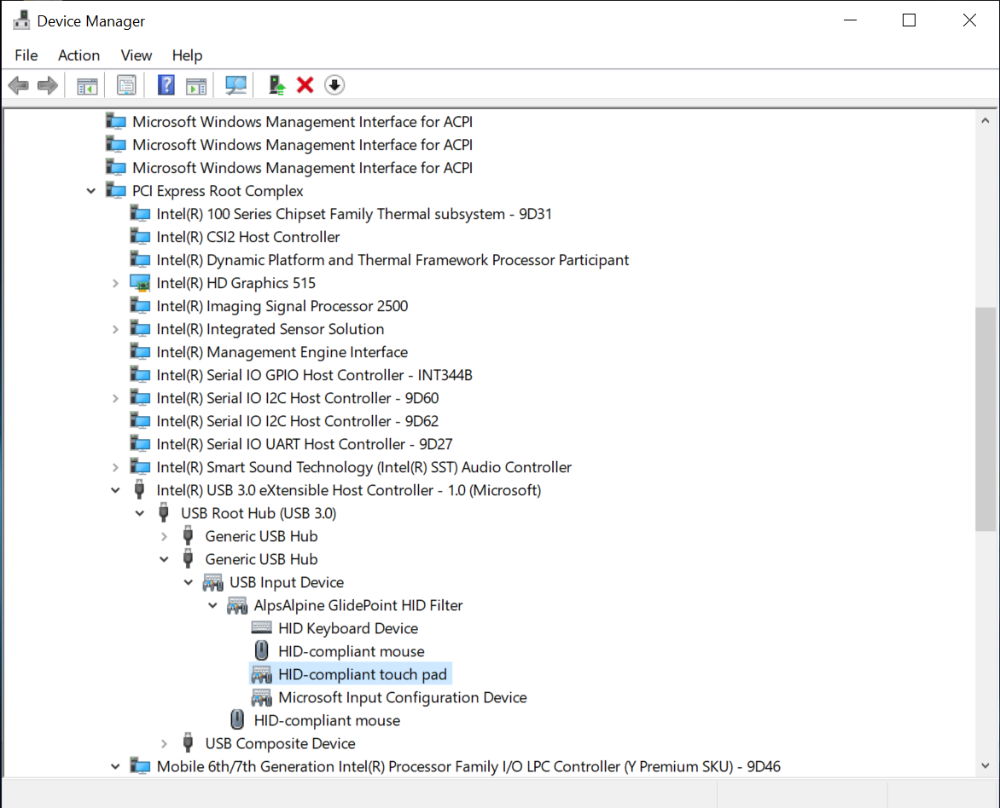

# 尋找你的硬體

本章主要講述如何尋找目前使用中的硬體的迷你指南；這主要與筆記型電腦和預先組裝電腦用戶有關，因為這些電腦的硬體規格比較難以取得。如果你已經知道你的電腦的硬體，你可以略過本頁，直接了解如何[製作 USB 開機隨身碟](./installer-guide/)。

我們假設你已經安裝了 Windows 或 Linux：

[[toc]]

## 使用 Windows 尋找硬體

我們主要有兩個選擇：

* Windows 内置的裝置管理員
* [AIDA64](https://www.aida64.com/downloads)

由於使用 GUI 更容易，我們建議下載及執行 AIDA64，因為它更容易取得規格。然而我們將向你展示這兩種取得硬體規格的方法。

### CPU 型號

| AIDA64                                                 | 裝置管理員                                                |
|:-------------------------------------------------------|:--------------------------------------------------------------|
|  |  |

### GPU 型號

| AIDA64                                                 | 裝置管理員                                                  |
|:-------------------------------------------------------|:--------------------------------------------------------------|
|  |  |

### 芯片組 型號

| AIDA64                                                     | 裝置管理員                                                      |
|:-----------------------------------------------------------|:------------------------------------------------------------------|
|  |  |

* 注意：Intel 基於 SOC 的 CPU 會在同一個芯片上擁有芯片組和其他功能而不是專用芯片。這意味著嘗試準確檢測芯片組時會有困難

### 鍵盤、觸控板和輕觸屏幕的連接類型

| 裝置管理員                                                      |
|:-------------------------------------------------------------------|
|  |

不幸的是，AIDA64 無法提供任何關於指標裝置的有用資訊，因此我們建議使用裝置管理員。

* 你可以找到以下這些裝置:
  * `人性化介面裝置`
  * `鍵盤`
  * `滑鼠及其他指標裝置`

* 要查看裝置確實的連接類型，請選擇指標裝置，然後按 ` 檢視 -> 裝置（依連線） `。這能確定裝置是否通過 PS2、I2C、SMBus 或 USB 等方式連接。

根據裝置的不同，它可能會顯示在多個名稱和連接方式之下。主要需要關注的是：
  
:::details SMBus
  
這些將顯示為獨立的 PCI 裝置，如 `Synaptics SMBus Driver` 或 `ELAN SMBus Driver`

* 輕觸式裝置將顯示在 PS2 下的 `Synaptics PS2 device`/`Synaptics Pointing Device` 和 PCI 的 `Synaptics SMBus Driver`


正如你所看到的，我們在左邊的圖片中有兩個 Synaptics 裝置，但是如果我們仔細地看，我們會看到頂部的裝置是 PS2，而底部的是 SMBus。雖然你可以在任何一種模式下使用觸控板，但 SMBus 通常提供更好的手勢支援和準確性。

:::

:::details USB

| Device by Type | Device by Connection |
| :--- | :--- |
|  | 

這些裝置會顯示為「`PS2 相容的觸控板`」。當我們將連接檢視表切換到 `**裝置（依連線）**` 時，亦會顯示在 USB之下

:::

:::details I2C


它們幾乎總是以微軟的 HID 裝置的形式顯示，不過也可能以其他觸控板的形式顯示。但它們總是在 I2C 下顯示。

:::
  
### 音訊編解碼器

| AIDA64                                                        | 裝置管理員                                                     |
|:--------------------------------------------------------------|:------------------------------------------------------------------|
|  |  |

由於某些 OEM 顯示裝置名稱的方式，你在裝置管理員取得的最準確資訊的方式是通過 PCI ID（例如 PCI 14F1,50F4）。這意味著你需要在 Google 搜尋 ID 並找出確實的裝置 ID；然而，AIDA64 可以正確地顯示名稱，這對終端用戶來說更容易理解。

### 網路介面控制器型號

| AIDA64                                                 | 裝置管理員                                                |
|:-------------------------------------------------------|:--------------------------------------------------------------|
|  |  |

由於某些 OEM 顯示裝置名稱的方式，你在裝置管理員取得的最準確資訊的方式是通過 PCI ID（例如 `PCI\VEN_14E4&DEV_43A0` 對應於 Vender ID `14E4` 和 裝置 ID `43A0`）。這意味著你需要在 Google 搜尋 ID 並找出確實的裝置 ID；然而，AIDA64 可以正確地顯示名稱，這對終端用戶來說更容易理解。

### 硬碟型號

| AIDA64                                                  | 裝置管理員                                                 |
|:--------------------------------------------------------|:---------------------------------------------------------------|
|  |  |

由於某些 OEM 不會提供有關硬碟的很多資訊，您將需要通過 Google 來確定與顯示名稱匹配的硬碟。

## 使用 Linux 尋找硬體

要使用 Linux 尋找硬體，我們將使用一些工具：

* `pciutils`
* `dmidecode`

下面是要在終端上執行的命令列表，幸運的是，大多數 Linux 發行版已經安裝了這些工具。如果沒有，您可以在您的發行版的軟體套件管理系統中找到它們。

### CPU 型號

```sh
grep -i "model name" /proc/cpuinfo
```

### GPU 型號

```sh
lspci | grep -i --color "vga\|3d\|2d"
```

### 芯片組 型號

```sh
dmidecode -t baseboard
```

### 鍵盤、觸控板和輕觸屏幕的連接類型

```sh
dmesg | grep -i input
```

### 音訊編解碼器

```sh
aplay -l
```

### 網路介面控制器型號

基本資訊：

```sh
lspci | grep -i network
```

更多深入的資訊：

```sh
lshw -class network
```

### 硬碟型號

```sh
lshw -class disk -class storage
```

## 使用 OCSysInfo 尋找硬體

有兩種取得和執行 OCSysInfo 的方法：

* [預編譯二進制檔案](https://github.com/KernelWanderers/OCSysInfo/releases)
* 手動克隆 [儲存庫](https://github.com/KernelWanderers/OCSysInfo)

:::tip 提示
我們建議您下載預編譯的二進制檔案，因為這是最簡單的方法。

如果您想了解關於手動克隆儲存庫的更多資訊，可以查看 OCSysInfo [迷你指南](https://github.com/KernelWanderers/OCSysInfo/tree/main/mini-guide)。
:::

### 探索硬體

::: warning 注意

我們建議筆記型電腦用戶在開始之前，斷開任何外部 USB 裝置，因為這可能會導致收集的資訊模棱兩可或沒有必要，可能使你感到困惑。

:::

成功安裝並執行應用程式後，你應該看到以下界面：


在這裡，你可以輸入 `d` 並按 `ENTER`/`RETURN`，然後，你應該會看到一個與下方類似的介面：


### CPU 型號


除了 CPU 型号，它還列出了 CPU 的世代、最高可支援的 SSE 版本和 SSSE3 的可用性。

### GPU 型號


在這種情況下，電腦有兩個 GPU：

* iGPU (Intel UHD Graphics 630)
* dGPU (AMD Radeon R9 390X)

除了型號名稱，它還列出了 GPU 的代號、ACPI 和 PCI 路徑。在你的 hackintosh 過程之中，你可能很快就會發現這些代碼很有用。

### 鍵盤和觸控板的連接類型

:::details SMBus 觸控板

觸控板：`SMBus` <br /> 鍵盤：`PS/2`

圖片來源：[ThatCopy](https://github.com/ThatCopy)
:::

:::details I2C 觸控板

觸控板：`I2C` <br /> 鍵盤：`PS/2`

圖片來源：[Mahas](https://github.com/Mahas1)
:::

:::details PS/2 觸控板

觸控板：`PS/2` <br /> 鍵盤：`PS/2`

圖片來源：[Tasty0](https://github.com/Tasty0)
:::

### 音訊編解碼器


### 網路介面控制器型號


### 硬碟型號


