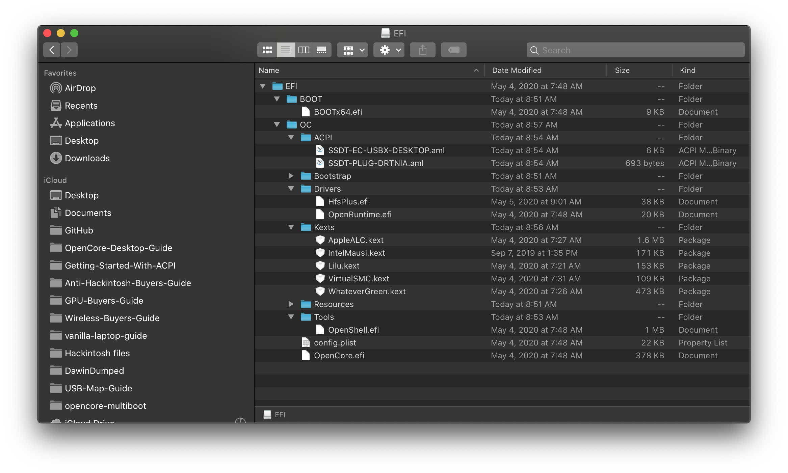
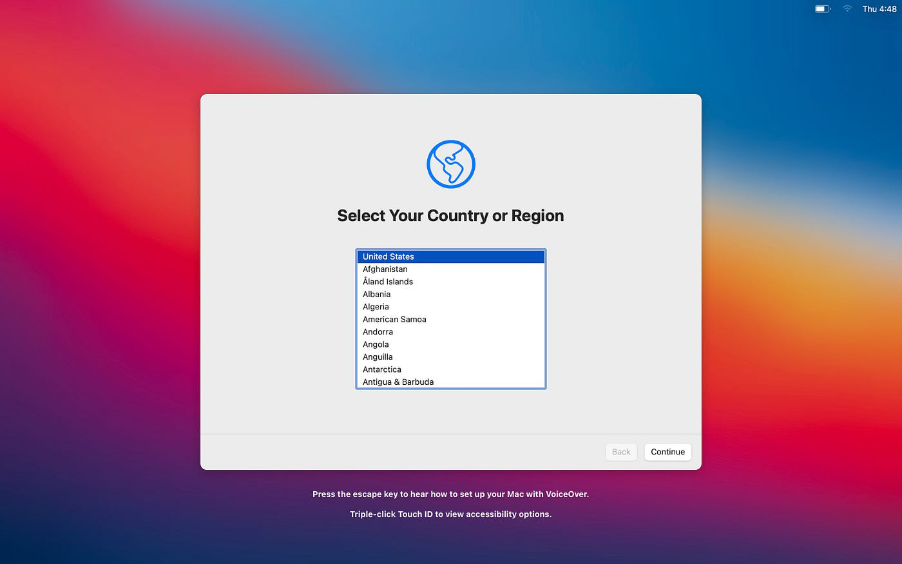

# 安裝程序

现在，你已經完成了 OpenCore 的設定，你終於能開始首次開機，需要記住的主要事情：

* 為 macOS 啟用最適當的設定
* 閱讀 [OpenCore 多系統開機指南](https://dortania.github.io/OpenCore-Multiboot/) 和[設定 LauncherOption](https://dortania.github.io/OpenCore-Post-Install/multiboot/bootstrap) 頁面
  * 主要適用於打算單磁碟多操作系統的用戶
* 在其他裝置開啟[通用故障診斷](../troubleshooting/troubleshooting.md)頁面
* 閱讀和了解 [macOS 開機過程](../troubleshooting/boot.md)
  * 可以幫助第一次安裝的用戶更好地了解他們可能在哪裡出現問題
* 大量耐性

## 再次檢查你的準備工作

在開機之前，讓我們再次檢查一下你的 EFI 設置：

良好的 EFI          |  不好的 EFI
:-------------------------:|:-------------------------:
  |  
EFI 資料夾能在 EFI 磁碟分割中找到 | 找不到 EFI 資料夾
ACPI 檔案都是已編譯的 (.aml) | 有 ACPI 檔案是未編譯的 (.dsl)
不包括 DSDT | 包含了 DSDT
已移除不需要的驅動程式 (.efi) | 保留預設的驅動程式
已移除不需要的工具程式 (.efi) | 保留預設的工具程式
kext 資料夾的所有檔案皆以 .kext 為副檔名 | 包含原始碼和資料夾
config.plist 在 EFI/OC 內 | 既沒有重新命名，也沒有將 .plist 放在正確位置
只保留需要的 kext | 下載了每一個列出的 kext

## 以 OpenCore USB 開機

現在，你終於準備好你的 USB 隨身碟並將其插入電腦啟動了。請注意，大多數電腦仍然會預設使用 Windows 的磁碟區開機，你將需要在 BIOS 開機選單中手動選擇 OpenCore。請查看主版說明書或使用 Google 找出如何進入 BIOS 和開機選單（如：Esc, F2, F10 或 F12）

啟動隨身碟後，你會看到類似下面的開機選項：

1. Windows
2. macOS Base System (External) / Install macOS Big Sur (External) / *USB drive name* (External)
3. OpenShell.efi
4. Reset NVRAM

::: warning

你可能需按下空格鍵才能看到安裝程式，因為 OpenCore 較後期的版本已預設啟用 `HideAuxiliary`。

:::

對我們來說，**選項 2** 就是我們想要的。根據安裝程式製作方式的不同，它可能會稱為 **"macOS Base System (External)"**、**"Install macOS *version name* (External)"** 或 **"*Your USB drive's name* (External)"**

你終於進入安裝程式的啟動過程，你可能會看到大量文字。這是「詳細模式」（Verbose Mode），這能幫助你解決開機過程中遇到的問題。如果你在這裡卡住了，請參閱[故障診斷指南](../troubleshooting/kernel-debugging.md)。

## macOS 安裝程式

當你看到畫面從詳細模式變成蘋果標誌的時候，你終於完成安裝程式的啟動過程！

現在你已經走到了這一步，需要記住的主要事情包括：

* 你的 SATA 或 NVME 控制器必須是 macOS 所支援的
  * AMD 原生的 FCH SATA Controller 就是其中一個不支援的控制器，即便你使用諸如 SATA-unsupported.kext 等等的插件也沒有用。如果你在 Linux 尋找硬體時只看到這個控制器，你可能要考慮安裝至外置硬碟或放棄了
* 你希望安装 macOS 的磁碟區 **必須** 是以 GUID 分割區配置表來格式化的 APFS 磁碟
  * 在機械硬碟（HDD）上安裝 High Sierra，和所有安裝 Sierra 及更舊的用戶應該使用 macOS 擴充格式 (HFS+)
* 磁碟 **必須** 有一個 200MB 的（EFI）分割
  * macOS 一般會在新磁碟中格式化一個 200MB 的分割
  * 參閱[多系統開機指南](https://eason329.github.io/OpenCore-Multiboot/) 了解有關分割一個已安裝 Windows 的磁碟的更多資訊

開始安裝後，請等待系統重新啟動，然後你將需要再次選擇以 OpenCore 隨身碟開機。不要選擇剛才的隨身碟安裝程式（標示為 External）或是 Recovery，而是要選擇硬碟上的 macOS Installer 來繼續安裝。在經過詳細模式後會出現蘋果標誌，幾分鐘後你會看到底部有計時器，並寫着「剩餘大約 x 分鐘」。這可能是休息或吃東西的好時機，因為這需要一段時間和數次的重新啟動。如果一切順利，它最終會把你帶到「設定你的 Mac」界面。

如果你看到這個畫面，你成功了！ 🎉
你可以瀏覽[安裝後完善指南](https://eason329.github.io/OpenCore-Post-Install/)來完成後續的系統設定。
