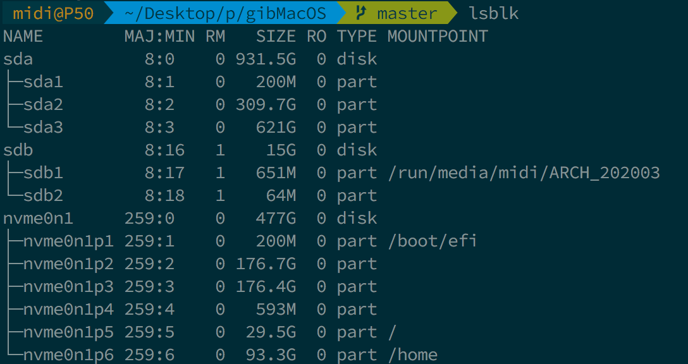
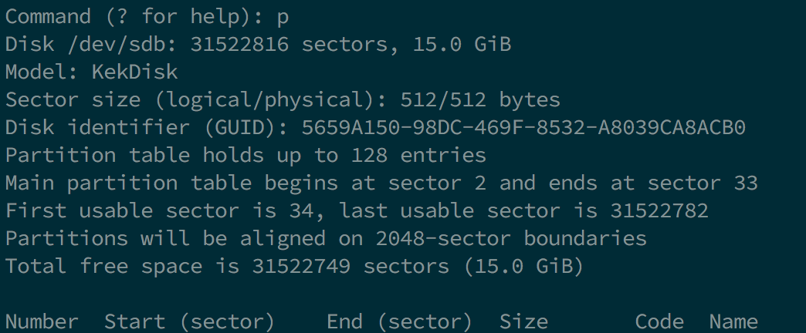
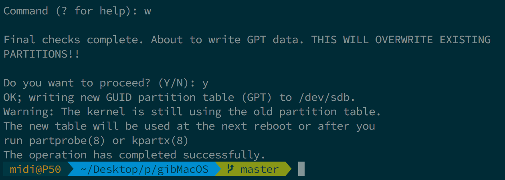

# 在 Linux 中製作安裝程式

雖然你不需要重新安裝 macOS 來使用 OpenCore，但一些用戶更喜歡升級開機管理器後帶來的全新體驗。

在開始之前，你需要準備以下東西：

* 4GB 的 USB 隨身碟
* [macrecovery.py](https://github.com/acidanthera/OpenCorePkg/releases)
  
## 下載 macOS

首先 cd 到[macrecovery 的資料夾](https://github.com/acidanthera/OpenCorePkg/releases) 並執行以下其中一個命令：


```sh
# Adjust below command to the correct folder
cd ~/Downloads/OpenCore-0/Utilities/macrecovery/
```

現在根據你想要的 macOS 版本執行以下其中一個命令：

```sh
# Lion (10.7):
python3 ./macrecovery.py -b Mac-2E6FAB96566FE58C -m 00000000000F25Y00 download
python3 ./macrecovery.py -b Mac-C3EC7CD22292981F -m 00000000000F0HM00 download

# Mountain Lion (10.8):
python3 ./macrecovery.py -b Mac-7DF2A3B5E5D671ED -m 00000000000F65100 download

# Mavericks (10.9):
python3 ./macrecovery.py -b Mac-F60DEB81FF30ACF6 -m 00000000000FNN100 download

# Yosemite (10.10):
python3 ./macrecovery.py -b Mac-E43C1C25D4880AD6 -m 00000000000GDVW00 download

# El Capitan (10.11):
python3 ./macrecovery.py -b Mac-FFE5EF870D7BA81A -m 00000000000GQRX00 download

# Sierra (10.12):
python3 ./macrecovery.py -b Mac-77F17D7DA9285301 -m 00000000000J0DX00 download

# High Sierra (10.13)
python3 ./macrecovery.py -b Mac-7BA5B2D9E42DDD94 -m 00000000000J80300 download
python3 ./macrecovery.py -b Mac-BE088AF8C5EB4FA2 -m 00000000000J80300 download

# Mojave (10.14)
python3 ./macrecovery.py -b Mac-7BA5B2DFE22DDD8C -m 00000000000KXPG00 download

# Catalina (10.15)
python3 ./macrecovery.py -b Mac-00BE6ED71E35EB86 -m 00000000000000000 download

# Big Sur (11)
python3 ./macrecovery.py -b Mac-42FD25EABCABB274 -m 00000000000000000 download

# Monterey (12)
python3 ./macrecovery.py -b Mac-FFE5EF870D7BA81A -m 00000000000000000 download

# 最新版本
# ie. Ventura (13)
python3 ./macrecovery.py -b Mac-4B682C642B45593E -m 00000000000000000 download
```

现在，在終端中執行上面其中一個命令，完成後你將得到類似於下面的內容:


* **注意**: 根據操作系統的不同，您將取得 BaseSystem 或 RecoveryImage 檔案。它們以相同的方式工作，所以當我們引用 BaseSystem 時，相同的資訊同時適用於 RecoveryImage

* **macOS 12 及以上版本注意**: 由於最新版本的 macOS 對 USB 堆棧進行了更改，因此在安裝 macOS 之前，強烈建議你使用 USBToolBox 來映射 USB 連接埠。
  * <span style="color:red"> 注意: </span> 在 macOS 11.3 及更新版本中，[XhciPortLimit 己經失效，導致開機循環](https://github.com/dortania/bugtracker/issues/162).
    * 如果你已[映射 USB 連接埠](https://sumingyd.github.io/OpenCore-Post-Install/usb/)且停用了 `XhciPortLimit`，你可以正常啟動 macOS 11.3+。

## 製作安裝程式

本章節的目標是在 USB 隨身碟中建立必要的分區。你可以使用你最喜歡的程式，例如 `gdisk` `fdisk` `parted` `gparted` 或 `gnome-disks`。本指南將重點介紹 `gdisk` ，因為它很好，可以在稍後更改分區類型，因為我們需要它來引導 macOS Recovery HD。（這裡使用的發行版是 Ubuntu 18.04，其他版本或發行版也可以）

感謝 [midi1996](https://github.com/midi1996) 為 [Internet 安裝指南](https://midi1996.github.io/hackintosh-internet-install-gitbook/) 所做的工作。

### 方法 1

在終端:

1. 執行 `lsblk` 並確定你的 USB 隨身碟區塊
  
2. 執行 `sudo gdisk /dev/<你的隨身碟區塊>`
   1. 如果你被問到使用什麼分區表，選擇 GPT。
      
   2. 輸入 `p` 來列出你的區塊的磁碟區（並驗證它是否為需要的磁碟區）
      
   3. 輸入 `o` 來清除分區表，並建立一個新的 GPT 表（如果不是空的）
      1. 輸入 `y` 確認
         
   4. 輸入 `n`
      1. `partition number`：預設為空
      2. `first sector`：預設為空
      3. `last sector`：整個磁碟保持空白
      4. `Hex code or GUID`：`0700`（Microsoft 基本資料分區類型）
   5. 輸入 `w`
      * 輸入 `y` 確認
      
      * 在某些罕有的情況下需要重啟電腦，但如果你想確定的話，重啟你的電腦。你也可以嘗試重新插入你的隨身碟。
   6. 輸入 `q` 來關閉 `gdisk`（通常它應該自已結束）
3. 使用 `lsblk` 來確定磁碟區的標識符
4. 執行 `sudo mkfs.vfat -F 32 -n "OPENCORE" /dev/<你的隨身碟區塊>` 格式化隨身碟為 FAT32 並命名為 OPENCORE
5. `cd` 到 `/OpenCore/Utilities/macrecovery/` 你應該得到一個 `.dmg` 和 `.chunklist` 檔案
   1. 輸入 `udisksctl`（`udisksctl mount -b /dev/<你的隨身碟區塊>`，在大多數情況下不需要 sudo）或 `mount` (`sudo mount /dev/<你的隨身碟區塊> /where/your/mount/stuff`，必需 sudo) 掛載您的隨身碟磁碟區
   2. `cd` 到你的 USB 隨身碟和在 FAT32 隨身碟磁碟區的根目錄下的 `mkdir com.apple.recovery.boot`
   3. 現在 `cp` 或 `rsync` 將 `BaseSystem.dmg` 和 `BaseSystem.chunklist` 放到 `com.apple.recovery.boot` 資料夾.

### 方法 2 (若方法 1 不起作用)

在終端:

1. 執行 `lsblk` 並確定你的 USB 隨身碟區塊
   
2. 執行 `sudo gdisk /dev/<你的隨身碟區塊>`
   1. 如果你被問到使用什麼分區表，選擇 GPT。
      
   2. 輸入 `p` 來列出你的區塊的磁碟區（並驗證它是否為需要的磁碟區）
      
   3. 輸入 `o` 來清除分區表，並建立一個新的 GPT 表（如果不是空的）
      1. 輸入 `y` 確認
         
   4. 輸入 `n`
      1. partition number：預設為空
      2. first sector：預設為空
      3. last sector：`+200M` 來建立一個 200MB 的磁碟區，稍後將命名為 OPENCORE
      4. Hex code or GUID：`0700`（Microsoft 基本資料分區類型）
      
   5. 輸入 `n`
      1. partition number: 預設為空
      2. first sector: 預設為空
      3. last sector: 保持預設（如果你想進一步劃分隨身碟的其餘部分，可以將其設為「+3G」）
      4. Hex code or GUID: `af00`（蘋果 HFS/HFS+ 分區類型）
      
   6. 輸入 `w`
      * 輸入 `y` 確認
      
      * 在某些罕有的情況下需要重啟電腦，但如果你想確定的話，重啟你的電腦。你也可以嘗試重新插入你的隨身碟。
   7. 輸入 `q` 來關閉 `gdisk`（通常它應該自已結束）
3. 再次使用 `lsblk` 來確定 200MB 磁碟區和其他磁碟區
   
4. 執行 `sudo mkfs.vfat -F 32 -n "OPENCORE" /dev/<你的 200MB 磁碟區塊>` 將 200MB 分區格式化為 FAT32，並命名為 OPENCORE
5. `cd` 到 `/OpenCore/Utilities/macrecovery/` 你應該得到一個 `.dmg` 和 `.chunklist` 檔案
   1. 輸入 `udisksctl`（`udisksctl mount -b /dev/<你的隨身碟區塊>`，在大多數情況下不需要 sudo）或 `mount` (`sudo mount /dev/<你的隨身碟區塊> /where/your/mount/stuff`，必需 sudo) 掛載您的隨身碟磁碟區
   2. `cd` 到你的隨身碟，並在你的隨身碟的 FAT32 磁碟區根目錄輸入 `mkdir com.apple.recovery.boot`
   3. 下載 `dmg2img`（在大多數發行版上可用）
   4. 執行 `dmg2img -l BaseSystem.dmg` 並確定哪個磁碟區區具有 `disk image` 屬性
      
   5. 執行 `sudo dmg2img -p <the partition number> BaseSystem.dmg /dev/<你的 3GB+ 磁碟區塊>` 來提取恢復映像並將其寫入磁碟區
      * 這需要一些時間。尤其是你用的是速度較慢的 USB（我用一個速度較快的 USB 2.0 隨身碟只花了不到 5 分鐘）。
      

## 現在，所有步驟都完成了，前往[設定 EFI](./opencore-efi.md) 來完成你的工作
