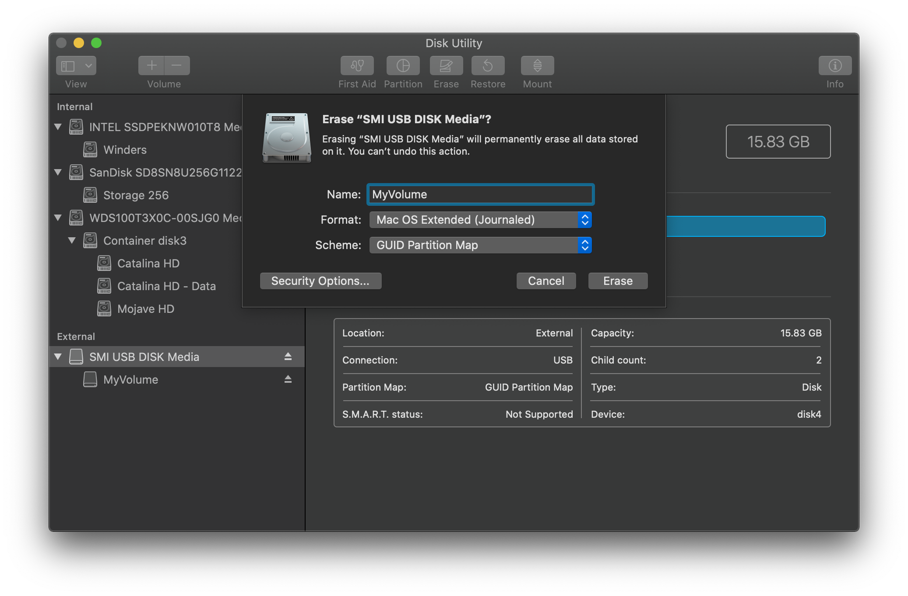
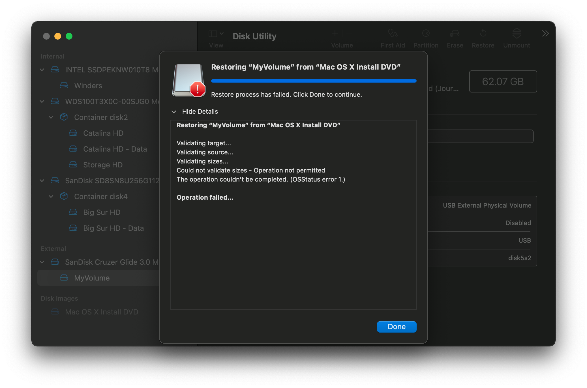

# 舊版 macOS：磁碟映像

此方法依賴於來自蘋果或 Acidanthera 伺服的映像，並恢復到你的磁碟上。

#### Acidanthera 的映像

以下安裝程式是從正版 Mac 電腦的恢復磁碟提取，並刪除它們的 SMBIOS 鎖，OS X 本身的內容沒有以任何方式修改。

* [OS X 10.4.10(8R4088)](https://archive.org/details/10.4.10-8-r-4088-acdt)[MEGA Mirror](https://mega.nz/folder/D3ASzLzA#7sjYXE2X09f6aGjol_C7dg)

* [OS X 10.5.7(9J3050)](https://archive.org/details/10.5.7-9-j-3050)[MEGA Mirror](https://mega.nz/folder/inRBTarD#zanf7fUbviwz3WHBU5xpCg)

* [OS X 10.6.7(10J4139)](https://archive.org/details/10.6.7-10j3250-disk-images)[MEGA Mirror](https://mega.nz/folder/z5YUhYTb#gA_IRY5KMuYpnNCg7kR3ug/file/ioQkTagI)

#### 蘋果的映像

請注意，這些映像需要您擁有 Apple Developer 帳戶才能存取。

* [OS X 10.5.0 Golden Master(9a581)](https://download.developer.apple.com/Mac_OS_X/mac_os_x_v10.5_leopard_9a581/leopard_9a581_userdvd.dmg)

* [OS X 10.6.0 Golden Master(10a432)](https://download.developer.apple.com/Mac_OS_X/mac_os_x_version_10.6_snow_leopard_build_10a432/mac_os_x_v10.6_build_10a432_user_dvd.dmg)

### 恢復你的磁碟

有趣的來了，您首先要打開剛剛下載的 dmg 檔案並掛載它。然後開啟磁碟工具程式，並將您的磁碟格式化為使用 GUID 分區表的 macOS 擴充格式（HFS+）：



接下來我們有兩個選擇：

* [ASR 恢復](#asr)（Apple Software Restore）
  * 基於命令列, SIP 啟用時仍可正常運作
* [磁碟工具程式恢復](#磁碟工具程式)
  * 在新版操作系統中可能需要停用 SIP
  
#### ASR

在這裡，你只需要打開終端並執行以下命令：

```sh
sudo asr restore -source /Volumes/Mac\ OS\ X\ Install\ DVD  -target /Volumes/MyVolume -erase -noverify
```

* **注意**：這可能與您的設定不一致，請相應更改：
  * 將 `/Volumes/Mac\ OS\ X\ Install\ DVD` 更改為您掛載的磁碟映像的名稱
  * 將 `/Volumes/MyVolume` 更改為您的（隨身碟）磁碟區的名稱

### 你完成這些步驟後, 可前往[設定 OpenCore 的 EFI 環境](./mac-install.md#設定-opencore-的-efi-環境)
  
#### 磁碟工具程式

由於磁盤工具的一些令人討厭的問題，如果啟用 SIP，許多恢復可能會失敗。如果您遇到問題，我們建議您使用 [ASR 方法](#asr) 或停用 SIP。

首先，打開「磁碟工具程式」，你應該會在側邊欄中看到你的 USB 隨身碟和磁碟映像。從這裡，選擇恢復


::: details 疑難排解

如果在恢復過程中出現類似這樣的錯誤：



這可能意味著需要停用 SIP，但我們建議改用 [ASR 方法](#asr)。

:::

### 當你完成這些步驟後, 你可前往[設定 OpenCore 的 EFI 環境](./mac-install.md#設定-opencore-的-efi-環境)
