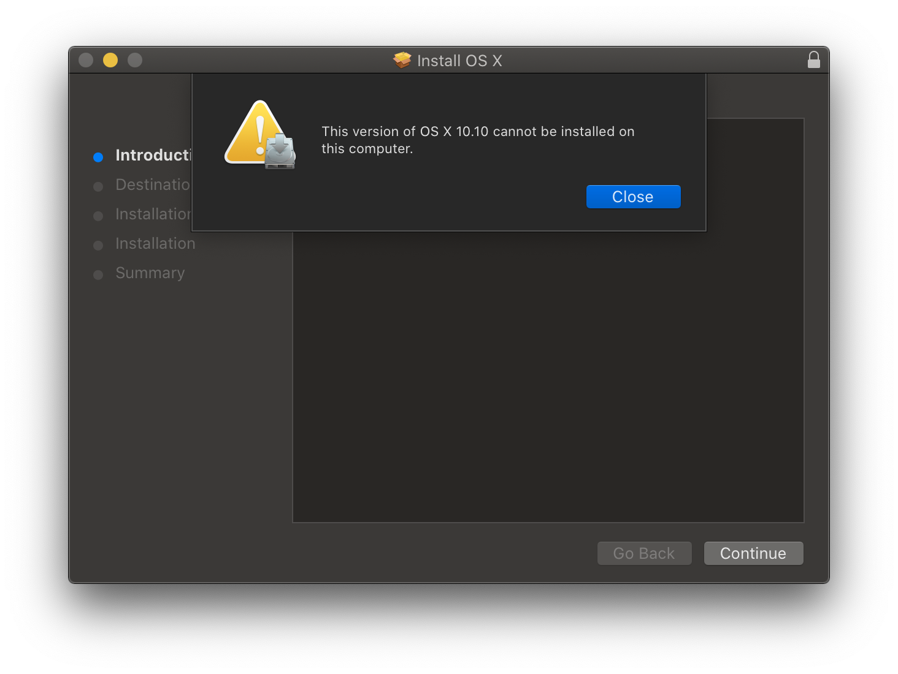

# 舊版 macOS：離線方法

此方法讓我們從蘋果下載完整的安裝程式。但是，這個方法只適用於以下 macOS 版本：

* Lion (10.7)
* Mountain Lion (10.8)
* Yosemite (10.10)
* El Capitan (10.11)
* Sierra (10.12)

::: tip

Mavericks (10.9) 無法使用這個方法。要下載這個版本，請參閱[舊版 macOS：線上方法](./mac-install-recovery.md)。

:::

首先，登入以下其中一個網站：

* [Mac OS X Lion Installer](https://support.apple.com/kb/DL2077)
* [Mac OS X Mountain Lion Installer](https://support.apple.com/kb/DL2076)
* [How to get old versions of macOS](https://support.apple.com/en-us/HT211683) (for 10.10 - 10.12 installers)

下載你想要的版本，應該提供一個 .dmg 檔案，而裡面應有一個 .pkg 檔案。

根據您使用的操作系統，你可以安裝此軟體包, 這將會給你一個 "Install (macOS version).app"（「安裝 (macOS 版本).app」）檔案。然後就可以前往[設定安裝程式](mac-install.html#設定安裝程式)；但是，如果你收到了這個錯誤：



代表你的 SMBIOS 太新，無法原生運行這個版本（即使你想為其他電腦製作隨身碟，工具仍然會檢查）。這代表我們將需要手動提取安裝程式。

### 提取安裝程式

首先，提取並掛載 InstallMacOSX/InstallOS.dmg：


然後，開啟終端機並把軟體包提取桌面的任意資料夾內。這需要一些時間。

* Lion 及 Mountain Lion:

```sh
cd ~/Desktop
pkgutil --expand-full "/Volumes/Install Mac OS X/InstallMacOSX.pkg" OSInstaller
```

* Yosemite 及 El Capitan:

```sh
cd ~/Desktop
pkgutil --expand-full "/Volumes/Install OS X/InstallMacOSX.pkg" OSInstaller
```

* Sierra:

```sh
cd ~/Desktop
pkgutil --expand-full "/Volumes/Install macOS/InstallOS.pkg" OSInstaller
```

接下來，（一次過）執行以下命令：

* Lion:

```sh
cd OSInstaller/InstallMacOSX.pkg
mv InstallESD.dmg "Payload/Install Mac OS X Lion.app/Contents/SharedSupport/"
mv "Payload/Install Mac OS X Lion.app" /Applications
```

* Mountain Lion:

```sh
cd OSInstaller/InstallMacOSX.pkg
mv InstallESD.dmg "Payload/Install OS X Mountain Lion.app/Contents/SharedSupport/"
mv "Payload/Install OS X Mountain Lion.app" /Applications
```

* Yosemite:

```sh
cd OSInstaller/InstallMacOSX.pkg
mv InstallESD.dmg "Payload/Install OS X Yosemite.app/Contents/SharedSupport/"
mv "Payload/Install OS X Yosemite.app" /Applications
```

* El Capitan:

```sh
cd OSInstaller/InstallMacOSX.pkg
mv InstallESD.dmg "Payload/Install OS X El Capitan.app/Contents/SharedSupport/"
mv "Payload/Install OS X El Capitan.app" /Applications
```

* Sierra:

```sh
cd OSInstaller/InstallOS.pkg
mv InstallESD.dmg "Payload/Install macOS Sierra.app/Contents/SharedSupport/"
mv "Payload/Install macOS Sierra.app" /Applications
```

### 當你完成這些步驟後, 你可前往[設定 OpenCore 的 EFI 環境](./mac-install.md#設定-opencore-的-efi-環境)
