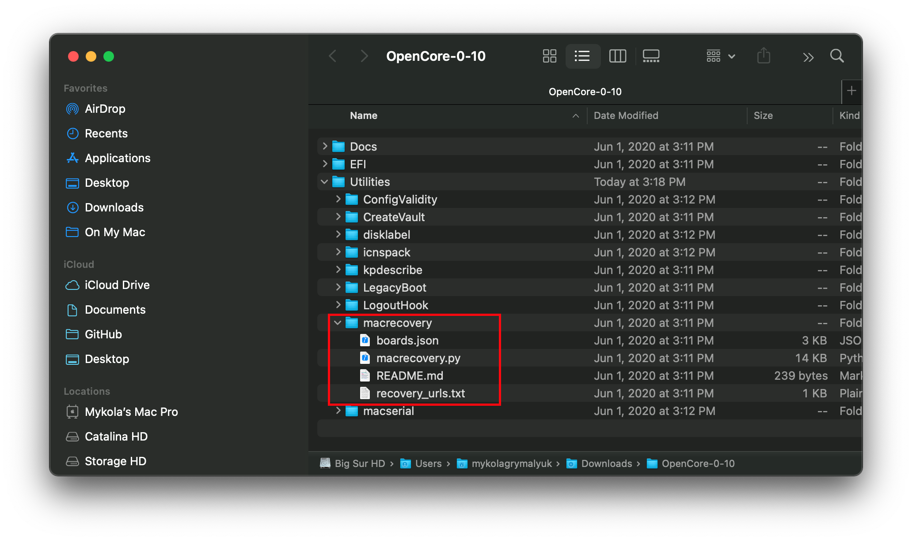

# 舊版 macOS：線上方法

此方法讓我們下載從 10.7 至目前最新的任意 macOS 版本，但它們只包含修復程式，因此需要網際網路連線才能安裝

首先，你要改為使用 macrecovery.py。此工具已經包括在 OpenCorePkg　之中：



工具的操作非常簡單，只要按你要下載的操作系統執行以下其中一個命令：

```sh
# Lion (10.7):
python3 ./macrecovery.py -b Mac-2E6FAB96566FE58C -m 00000000000F25Y00 download
python3 ./macrecovery.py -b Mac-C3EC7CD22292981F -m 00000000000F0HM00 download

# Mountain Lion (10.8):
python3 ./macrecovery.py -b Mac-7DF2A3B5E5D671ED -m 00000000000F65100 download

# Mavericks (10.9):
python3 ./macrecovery.py -b Mac-F60DEB81FF30ACF6 -m 00000000000FNN100 download

# Yosemite (10.10):
python3 ./macrecovery.py -b Mac-E43C1C25D4880AD6 -m 00000000000GDVW00 download

# El Capitan (10.11):
python3 ./macrecovery.py -b Mac-FFE5EF870D7BA81A -m 00000000000GQRX00 download

# Sierra (10.12):
python3 ./macrecovery.py -b Mac-77F17D7DA9285301 -m 00000000000J0DX00 download

# High Sierra (10.13)
python3 ./macrecovery.py -b Mac-7BA5B2D9E42DDD94 -m 00000000000J80300 download
python3 ./macrecovery.py -b Mac-BE088AF8C5EB4FA2 -m 00000000000J80300 download

# Mojave (10.14)
python3 ./macrecovery.py -b Mac-7BA5B2DFE22DDD8C -m 00000000000KXPG00 download

# Catalina (10.15)
python3 ./macrecovery.py -b Mac-00BE6ED71E35EB86 -m 00000000000000000 download

# Big Sur (11)
python3 ./macrecovery.py -b Mac-42FD25EABCABB274 -m 00000000000000000 download

# Monterey (12)
python3 ./macrecovery.py -b Mac-FFE5EF870D7BA81A -m 00000000000000000 download

# 最新版本
# ie. Ventura (13)
python3 ./macrecovery.py -b Mac-4B682C642B45593E -m 00000000000000000 download
```

* **macOS 12 及以上版本注意**: 由於最新版本的 macOS 對 USB 堆棧進行了更改，因此在安裝 macOS 之前，強烈建議你使用 USBToolBox 來映射 USB 連接埠。
  * <span style="color:red"> 注意: </span> 在 macOS 11.3 及更新版本中，[XhciPortLimit 己經失效，導致開機循環](https://github.com/dortania/bugtracker/issues/162).
    * 如果你已[映射 USB 連接埠](https://sumingyd.github.io/OpenCore-Post-Install/usb/)且停用了 `XhciPortLimit`，你可以正常啟動 macOS 11.3+。

現在，在終端機執行以上其中一個命令。完成後，你會取得類似下面圖片的輸出：


當完成後，將你的隨身碟以 GUID 磁碟分割方案格式化為 FAT32：


最後，在這個隨身碟的根目錄下建立一個名為 `com.apple.recovery.boot` 的資料夾，並將剛下載好的 BaseSystem/RecoveryImage 檔案放到該資料夾裡：


### 當你完成這些步驟後, 你可前往[設定 OpenCore 的 EFI 環境](./mac-install.md#設定-opencore-的-efi-環境)
