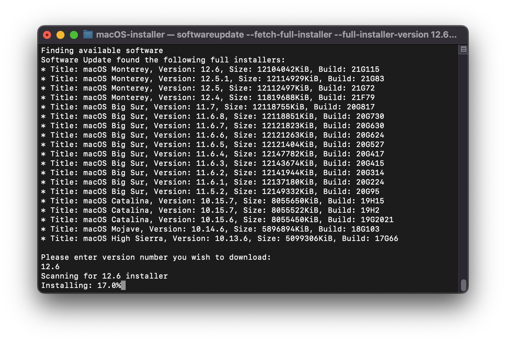
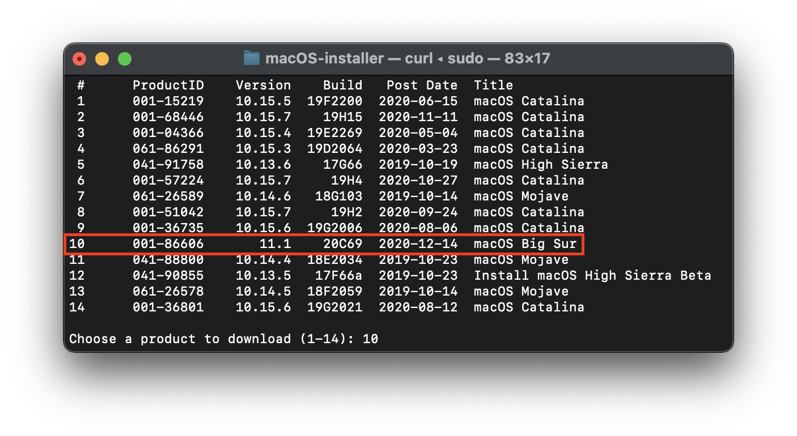
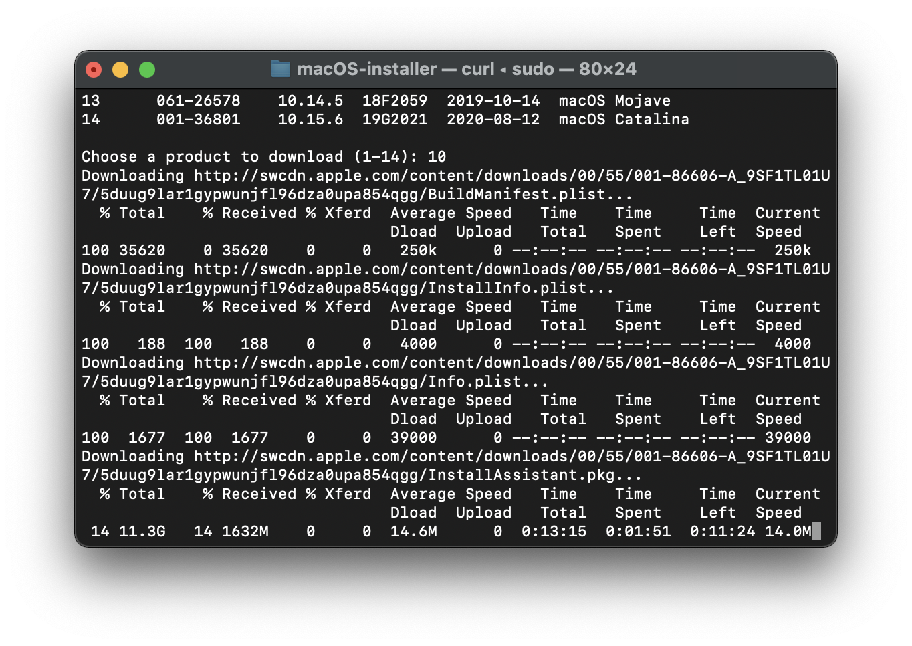
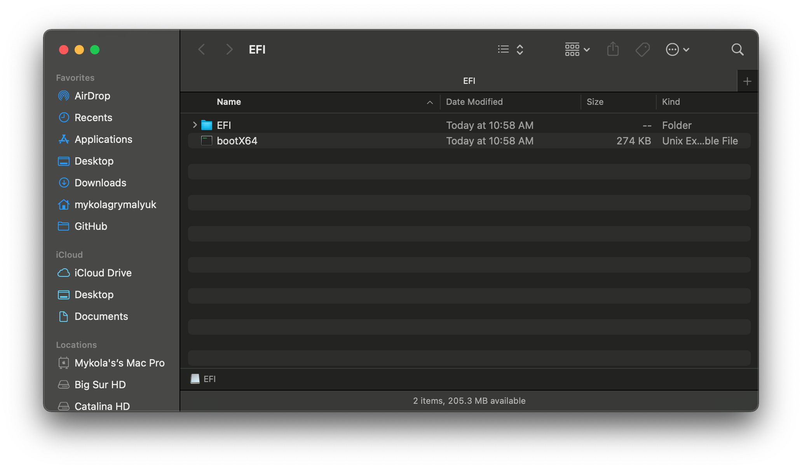

# 在 macOS 中製作安裝程式

雖然你不需要重新安裝 macOS 來使用 OpenCore，但一些用戶更喜歡升級開機管理器後帶來的全新體驗。

首先，我們要找一個 macOS 的副本。如果你只是製作一個可開機的 OpenCore 隨身碟，而不是安裝程式，你可以跳過這一步，直接格式化 USB。對於其他人來說，你可以從 App Store 下載 macOS，也可以使用 Munki 的腳本。

## 下載 macOS：現代 OS

此方法允許你下載 macOS 10.13 及更新版本，10.12 及更早版本請參見[下載 macOS：傳統 OS](#downloading-macos-legacy-os)。

* **macOS 12 及以上版本備註**：由於最新版本的 macOS 對 USB 堆棧進行了更改，因此在安裝 macOS 之前，強烈建議你映射 USB 連接埠（使用 USBToolBox）。
  * <span style="color:red"> 注意：</span> 在 macOS 11.3 及更新版本中，[XhciPortLimit 己經失效，導致開機循環](https://github.com/dortania/bugtracker/issues/162)。
    * 如果你已[映射 USB 連接埠](https://sumingyd.github.io/OpenCore-Post-Install/usb/)且停用了 `XhciPortLimit`，你可以正常啟動 macOS 11.3+。

在符合你想要安裝的 OS 版本要求的 macOS 電腦上，直接進入 App Store：

* [使用 App Store](#using-app-store)

對於需要特定操作系統版本或無法從 App Store 下載的電腦：

[[toc]]

## 使用 App Store

在符合你想要安裝的操作系統版本要求的 macOS 電腦上，直接進入 App Store 下載所需的操作系統版本，然後繼續[**設定安裝程式**](#設定安裝程式)。

## 命令列軟體更新工具程式

開啟一個終端窗口，然後複製並貼上下面的命令：

```sh
softwareupdate --list-full-installers;echo;echo "Please enter version number you wish to download:";read;$(if [ -n "$REPLY" ]; then; echo "softwareupdate --fetch-full-installer --full-installer-version "$REPLY; fi);
```



這將為你提供一個可供選擇的可用版本列表。
下載後，它將儲存在你的應用程式資料夾。
然後，你可以繼續[**設定安裝程式**](#設定安裝程式)。

## Munki 的 InstallInstallMacOS 工具程式

::: details 執行 macOS Monterey 12.3 或以上版本的用戶請注意

從 macOS Monterey 12.3 開始，蘋果移除了對 `python2.7` 的支援，如果沒有它，`installinstallmacos.py` 將出現以下錯誤：

```
This tool requires the Python xattr module. Perhaps run 'pip install xattr' to install it.
```

要解決這個問題，我們建議通過在終端中執行 `Xcode -select——install` 來安裝 `Xcode 命令列工具`，然後執行 `pip3 install xattr`

之後你可以使用 `python3` 而不是 `python` 來執行下面相同的命令：

```sh
mkdir -p ~/macOS-installer && cd ~/macOS-installer && curl https://raw.githubusercontent.com/munki/macadmin-scripts/main/installinstallmacos.py > installinstallmacos.py && sudo python3 installinstallmacos.py
```
  
:::

要執行它，只需要在終端窗口中複製並貼上下面的命令:

```sh
mkdir -p ~/macOS-installer && cd ~/macOS-installer && curl https://raw.githubusercontent.com/munki/macadmin-scripts/main/installinstallmacos.py > installinstallmacos.py && sudo python installinstallmacos.py
```



如你所見，我們得到了一個很好的 macOS 安裝程式列表。如果你需要某個特定版本的 macOS，可以通過在它旁邊輸入數字來選擇它。在這個例子中，我們選擇 10：



這將需要一段時間，因為我們正在下載一個 8GB 以上的 macOS 安裝程式，所以強烈建議你在等待的同時閱讀指南的其餘部分。

完成後，你會發現在你的 `~/macOS-Installer/` 資料夾中有一個包含 macOS 安裝程式的 DMG 檔案，名為 `Install_macOS_11.1-20C69.Dmg`。掛載它後，你就會找到安裝程式。

* 注意 1: 我們建議移動 安裝 macOS.app 到 `/Applications` 資料夾，因為我們將從那裡執行命令。
* 注意 2: 在 Finder 中執行 Cmd+Shift+G 可以讓你輕鬆跳轉到 `~/macOS-installer`


到了這裡，跳到[設定安裝程式](#設定安裝程式) 來完成你的工作。如果你想檢查下載的完整性，你可以查看[這個校驗儲存庫](https://github.com/notpeter/apple-installer-checksums)，不過請注意，這些校驗和是眾包的，可能不是檢查真實性的可靠方法。

## 下載 macOS：傳統 OS

* 此方法允許你下載 OS X 的更老版本，目前支援所有 OS X 的 Intel 版本（10.4到目前版本）

  * [舊版 macOS：離線方法](./mac-install-pkg.md)
    * 支援 10.7 - 10.12，不包括 10.9
  * [舊版 macOS：線上方法](./mac-install-recovery.md)
    * 支援 10.7 - 11
  * [舊版 macOS：磁碟映像](./mac-install-dmg.md)
    * 支援 10.4 - 10.6

## 設定安裝程式

現在我們將格式化 USB 來為 macOS 安裝程式和 OpenCore 做準備。我們希望使用帶有 GUID 分區映射的 macOS Extended (HFS+)。這將建立兩個磁碟區：主分區 `MyVolume` 和第二個名為 `EFI` 的分區，它用作開機磁碟區，韌體將在其中檢查引導檔案。

* 注意 1：通過格式化 USB 建立的 `EFI` 分區是隱藏的，除非你掛載它。稍後將在[設定 OpenCore 的 EFI 環境](#設定 OpenCore 的 EFI 環境)時掛載
* 注意 2：預設情况下，磁碟工具程式只會顯示分區 - 按 Cmd/Win+2 顯示所有設備（或是你可以按顯示方式按鈕）
* 注意 3：“傳統 macOS：線上方法”部分的用戶可以跳轉到[設定 OpenCore 的 EFI 環境](#設定 OpenCore 的 EFI 環境)


接下來執行[蘋果](https://support.apple.com/en-us/HT201372)提供的 `createinstallmedia` 命令。請注意，該命令是假設在為名稱為 `MyVolume` 的 USB 建立安裝程式：

```sh
sudo /Applications/Install\ macOS\ Big\ Sur.app/Contents/Resources/createinstallmedia --volume /Volumes/MyVolume
```

::: details 在 Apple Silicon 上安裝比 macOS Big Sur 更舊版本的用戶請注意

如果 `createinstallmedia` 以 `zsh:killed` 或 `killed:9` 提示失敗，那麼很可能是安裝程序的代碼簽名有問題。要解決這個問題，你可以執行以下命令：

```sh
cd /Applications/Install\ macOS\ Big\ Sur.app/Contents/Resources/
codesign -s - -f --deep /Applications/Install\ macOS\ Big\ Sur.app
```

你需要安裝 Xcode 命令列工具：

```sh
xcode-select --install
```

:::

這需要一些時間，所以你可能想要喝杯咖啡或繼續閱讀本指南（公平地說，你真的不應該在沒有閱讀完整內容之前一步步遵循本指南）。

你也可以將 `createinstallmedia` 路徑替換為安裝程序所在的路徑（與磁碟名稱相同）。

::: details 舊版本的 createinstallmedia 命令

來自蘋果官方網站：[為 macOS 製作可開機安裝磁碟](https://support.apple.com/zh-tw/HT201372)

```sh
# Ventura
sudo /Applications/Install\ macOS\ Ventura.app/Contents/Resources/createinstallmedia --volume /Volumes/MyVolume

# Monterey
sudo /Applications/Install\ macOS\ Monterey.app/Contents/Resources/createinstallmedia --volume /Volumes/MyVolume

# Big Sur
sudo /Applications/Install\ macOS\ Big\ Sur.app/Contents/Resources/createinstallmedia --volume /Volumes/MyVolume

# Catalina
sudo /Applications/Install\ macOS\ Catalina.app/Contents/Resources/createinstallmedia --volume /Volumes/MyVolume

# Mojave
sudo /Applications/Install\ macOS\ Mojave.app/Contents/Resources/createinstallmedia --volume /Volumes/MyVolume

# High Sierra
sudo /Applications/Install\ macOS\ High\ Sierra.app/Contents/Resources/createinstallmedia --volume /Volumes/MyVolume

# Sierra
sudo /Applications/Install\ macOS\ Sierra.app/Contents/Resources/createinstallmedia --volume /Volumes/MyVolume --applicationpath /Applications/Install\ macOS\ Sierra.app

# El Capitan
sudo /Applications/Install\ OS\ X\ El\ Capitan.app/Contents/Resources/createinstallmedia --volume /Volumes/MyVolume --applicationpath /Applications/Install\ OS\ X\ El\ Capitan.app

# Yosemite
sudo /Applications/Install\ OS\ X\ Yosemite.app/Contents/Resources/createinstallmedia --volume /Volumes/MyVolume --applicationpath /Applications/Install\ OS\ X\ Yosemite.app

# Mavericks
sudo /Applications/Install\ OS\ X\ Mavericks.app/Contents/Resources/createinstallmedia --volume /Volumes/MyVolume --applicationpath /Applications/Install\ OS\ X\ Mavericks.app --nointeraction
```

:::

## 傳統 BIOS 設定

對於不支援 UEFI 開機的系統，請參見以下內容:

::: details 傳統 BIOS 開機

首先，你需要以下檔案：

* BootInstall_IA32.tool 或 BootInstall_X64.tool
  * 可以在 OpenCorePkg 的 `/utilities/LegacyBoot/` 目錄下找到
* 安裝隨身碟（在前面建立的）

在你的 OpenCore build 資料夾中，前往 `Utilities/LegacyBoot`。在這裡你會找到一個名為 `BootInstall_ARCH.tool` 的檔案。這樣做的目的是將 DuetPkg 安裝到所需的磁碟。


现在**使用 sudo**在終端中執行此工具(否則此工具可能會失敗)：

```sh
# Replace X64 with IA32 if you have a 32-Bit CPU
sudo ~/Downloads/OpenCore/Utilities/legacyBoot/BootInstall_X64.tool
```


這將給你一個可用磁碟的列表，選擇你的磁碟，並提示你寫入一個新的 MBR。選擇 yes `[y]`，你就完成了。




這將為你提供一個包含 **bootia32** 或 **bootx64** 檔案的 EFI 分區

:::

## 設定 OpenCore 的 EFI 環境

設定 OpenCore 的 EFI 環境很簡單 - 你需要做的就是掛載我們的 EFI 系統分區。當我們使用 GUID 格式化時是會自動生成該分區，但預設是卸載的，這就是我們的朋友 [MountEFI](https://github.com/corpnewt/MountEFI) 發揮作用的地方：


你會注意到，打開 EFI 分區後，它是空的。這就是樂趣的開始。


## 現在，所有步驟都完成了，前往[設定 EFI](./opencore-efi.md) 來完成你的工作
