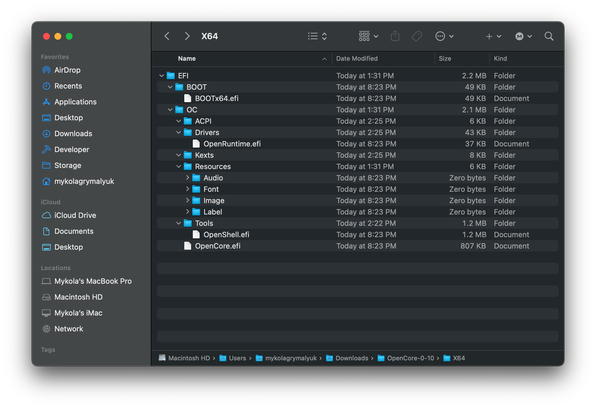

# 加入 OpenCore 的基礎檔案

要設定 OpenCore 的資料夾結構，你需要取得 [OpenCorePkg 的發行版](https://github.com/acidanthera/OpenCorePkg/releases/)中的 EFI 資料夾。注意，它們可能位於 IA32 或 X64 資料夾下，前者用於 32 位元韌體，後者用於 64 位元韌體：

關於 DEBUG 和 RELEASE 版本:

* **DEBUG**: 可以極大地幫助我們對啟動問題進行除錯，但是會增加一些明顯的啟動時間延遲（例如：3-5 秒後才進入選擇器)。安裝之後，你可以輕鬆地過渡到 RELEASE 版本
* **RELEASE**: 更快的啟動時間，但是在 OpenCore 中幾乎沒有提供有用的除錯訊息，這使得故障排除更加困難。

下載後，將 EFI 資料夾（來自 OpenCorePkg）放在 EFI 分區的根目錄：

**注意**:

* **Windows 用戶：** 你需要將 EFI 資料夾放到你之前建立的隨身碟的根目錄下
* **Linux 用戶：** 這是我們之前建立的 `OPENCORE` 磁碟區
  * 注意，方法 1 只建立 1 個分區，而方法 2 建立 2 個分區

現在讓我們打開 EFI 資料夾，看看裡面有什麼：

現在你會注意到它在 `Drivers` 和 `Tools` 資料夾中有一堆檔案，其中大部分都是我們不想要的：

* **保留以下内容於 Drivers 資料夾內**（如果適用）：

| 驅動 | 狀態 | 描述 |
| :--- | :--- | :--- |
| OpenUsbKbDxe.efi |  可選  | 非 UEFI 系統必須（2012 年前） |
| OpenPartitionDxe.efi | ^^ | 啟動 macOS 10.7-10.9 恢復程式時需要 |
| ResetNvramEntry.efi | ^^ | 重置系統的 NVRAM 時需要 |
| OpenRuntime.efi |  必須  | 用於正確操作 |

::: details 內附驅動程式的更多資訊

* AudioDxe.efi
  * 與 macOS 中的音訊支援無關
* CrScreenshotDxe.efi
  * 在 UEFI 中用於截圖，我們不需要
* HiiDatabase.efi
  * 用於修復 GUI 支援，像在 Sandy Bridge 和更老的平台使用 OpenShell.efi
  * 開機時不需要
* NvmExpressDxe.efi
  * 用於 Haswell 和更老的平台等沒有內置 NVMe 驅動程式的韌體
  * 除非你知道自己在做什麼，否則不要使用
* OpenCanopy.efi
  * 這是 OpenCore 的可選 GUI，我們將在[安裝後完善指南](https://sumingyd.github.io/OpenCore-Post-Install/cosmetic/gui.html) 中討論如何設定這個，所以現在刪除這個
* OpenHfsPlus.efi
  * 開源的 HFS+ 驅動程式，相當慢，所以我們建議不要使用，除非你知道你在做什麼。
* OpenPartitionDxe.efi
  * 在 OS X 10.7 到 10.9 上啓動恢復程式時需要
    * 注意：OpenDuet 用戶（例如：沒有 UEFI）會內置這個驅動程式，一段都不需要它
* OpenUsbKbDxe.efi
  * 這是讓**傳統 BIOS 系統**運行 OpenCore 選擇器，[不推薦，甚至在 Ivy Bridge 和更新的系統上有害](https://applelife.ru/threads/opencore-obsuzhdenie-i-ustanovka.2944066/page-176#post-856653)
* Ps2KeyboardDxe.efi + Ps2MouseDxe.efi
  * 當你需要它時便很明顯，USB 鍵盤和滑鼠用戶不需要它
  * 提醒：PS2 ≠ USB
* ResetNvramEntry.efi
  * 允許從啟動選擇器重置 NVRAM
* UsbMouseDxe.efi
  * 與 OpenUsbKbDxe 類似的想法，應該只需要在使用 DuetPkg 的傳統系統上
* XhciDxe.efi
  * 用於Sandy Bridge和更老的平台，這些電腦的韌體中沒有 XHCI 驅動程式，
  * 只有在舊電腦上使用 USB 3.0 擴展卡時才需要

:::

* **保留以下内容於 Tools 資料夾內：**

| 工具 | 狀態 | 描述 |
| :--- | :--- | :--- |
| OpenShell.efi |  可選  | 推薦使用，便於除錯 |

清理後的 EFI:

現在你可以將**你的**必要的韌體驅動程式(.efi)放在 _Drivers_ 資料夾中，將 kext／ACPI 放在它們各自的資料夾中。有關應該使用哪些檔案的更多資訊，請參閱[搜集檔案](../ktext.md)

* 請注意，來自 Clover 的 UEFI 驅動程式不支援 OpenCore！(EmuVariableUEFI, AptioMemoryFix, OsxAptioFixDrv,等)。請參閱 [Clover 韌體驅動程式轉換](https://github.com/dortania/OpenCore-Install-Guide/blob/master/clover-conversion/clover-efi.md) 瞭解更多支援的驅動程式和合併到 OpenCore 的驅動程式。

下面是構置過的 EFI **_可能_** 的樣子（你的可能會有所不同）：

**提醒**:

* 將 SSDT 和自訂 DSDT（`.aml`）放入 ACPI 資料夾
* 將 kext（`.kext`）放入 Kexts 資料夾
* 將韌體驅動程式（`.efi`）放入 Drivers 資料夾

# 現在，所有步驟都完成了，前往[搜集檔案](../ktext.md) 取得所需的 kext 和韌體驅動程式
