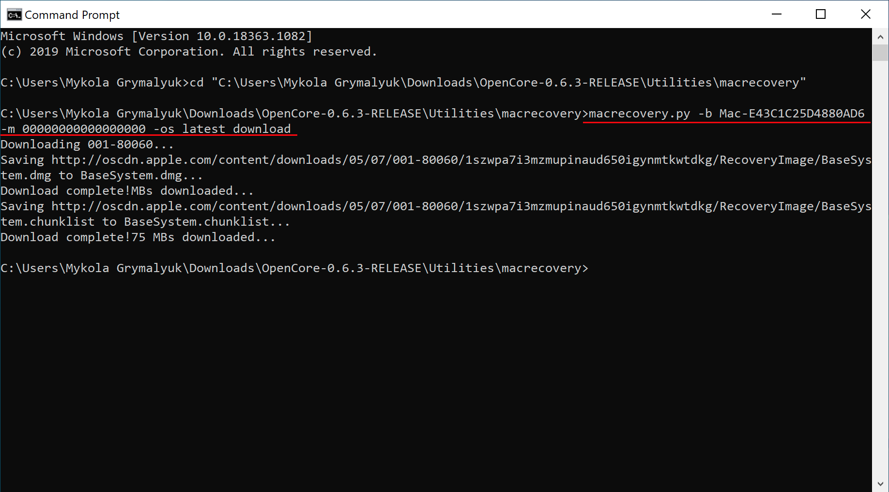
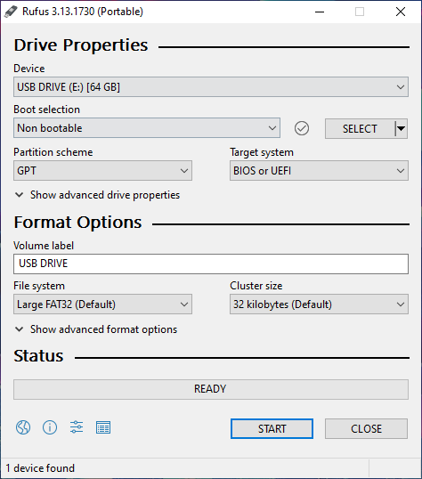
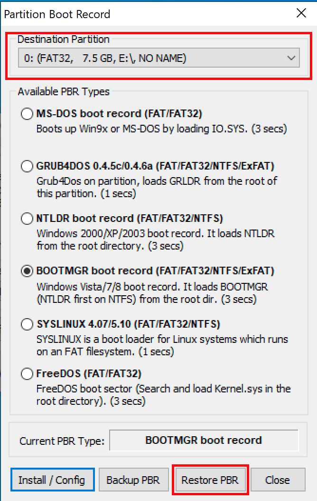

# 在 Windows 中製作安裝程式

雖然你不需要重新安裝 macOS 來使用 OpenCore，但一些用戶更喜歡升級開機管理器後帶來的全新體驗。

在開始之前，你需要準備以下東西：

* 4GB 的 USB 隨身碟

* 對於大於 16GB 的隨身碟，使用 [Rufus method](#rufus-method) 格式化成 FAT32。

* [macrecovery.py](https://github.com/acidanthera/OpenCorePkg/releases)
  * 這需要[安裝 Python 3](https://www.python.org/downloads/)

## 下載 macOS

要取得傳統的安裝程式非常容易，首先下載 [OpenCorePkg](https://github.com/acidanthera/OpenCorePkg/releases) 然後轉到 `/Utilities/macrecovery/`. 接下來，點擊目前資料夾路徑旁邊後輸入 `cmd`，就能在目前目錄中打開命令提示字符：


現在根據你想要的 macOS 版本執行以下其中一個命令（注意：這些腳本依賴於 [Python 3](https://www.python.org/downloads/) 的支援，如果你還沒有的話請先安裝）：

```sh
# Lion (10.7):
python3 macrecovery.py -b Mac-2E6FAB96566FE58C -m 00000000000F25Y00 download
python3 macrecovery.py -b Mac-C3EC7CD22292981F -m 00000000000F0HM00 download

# Mountain Lion (10.8):
python3 macrecovery.py -b Mac-7DF2A3B5E5D671ED -m 00000000000F65100 download

# Mavericks (10.9):
python3 macrecovery.py -b Mac-F60DEB81FF30ACF6 -m 00000000000FNN100 download

# Yosemite (10.10):
python3 macrecovery.py -b Mac-E43C1C25D4880AD6 -m 00000000000GDVW00 download

# El Capitan (10.11):
python3 macrecovery.py -b Mac-FFE5EF870D7BA81A -m 00000000000GQRX00 download

# Sierra (10.12):
python3 macrecovery.py -b Mac-77F17D7DA9285301 -m 00000000000J0DX00 download

# High Sierra (10.13)
python3 macrecovery.py -b Mac-7BA5B2D9E42DDD94 -m 00000000000J80300 download
python3 macrecovery.py -b Mac-BE088AF8C5EB4FA2 -m 00000000000J80300 download

# Mojave (10.14)
python3 macrecovery.py -b Mac-7BA5B2DFE22DDD8C -m 00000000000KXPG00 download

# Catalina (10.15)
python3 macrecovery.py -b Mac-00BE6ED71E35EB86 -m 00000000000000000 download

# Big Sur (11)
python3 macrecovery.py -b Mac-42FD25EABCABB274 -m 00000000000000000 download

# Monterey (12)
python3 macrecovery.py -b Mac-FFE5EF870D7BA81A -m 00000000000000000 download

# 最新版本
# ie. Ventura (13)
python3 macrecovery.py -b Mac-4B682C642B45593E -m 00000000000000000 download
```

* **macOS 12 及以上版本注意**: 由於最新版本的 macOS 對 USB 堆棧進行了更改，因此在安裝 macOS 之前，強烈建議你使用 USBToolBox 來映射 USB 連接埠。
  * <span style="color:red"> 注意: </span> 在 macOS 11.3 及更新版本中，[XhciPortLimit 己經失效，導致開機循環](https://github.com/dortania/bugtracker/issues/162).
    * 如果你已[映射 USB 連接埠](https://sumingyd.github.io/OpenCore-Post-Install/usb/)且停用了 `XhciPortLimit`，你可以正常啟動 macOS 11.3+。

這需要一些時間，命令執行完畢後，你應該會找到 BaseSystem 或 RecoveryImage 檔案：



| BaseSystem | RecoveryImage |
| :--- | :--- |
| |  |

現在安裝程式已經下載完畢，接下來我們要把隨身碟格式化。

## 製作安裝程式

在這裡，我們將格式化我們的 USB 隨身碟並將 macOS 檔案放進隨身碟裡，我們有三個選擇（實際上其中兩個使用了同一工具）：

* [磁碟管理方法](#磁碟管理方法)
  * 基於 GUI，最簡單的方式
  * 只支援 UEFI 系统（例如：2012+）
* [Rufus 方法](#Rufus-方法)
  * 基於 GUI，最簡單的方式
  * 適用於大容量的 USB 隨身碟（16GB 以上）
* [diskpart 方法](#diskpart-方法)
  * 基於命令列，更多的工作
  * 對舊版系統是必需的（如：非 UEFI、2012 年之前）

### 磁碟管理方法

只需打開磁碟管理，並將隨身碟格式化為 FAT32：

1. 右鍵點擊工作列上的「開始」按鈕並選擇“磁碟管理”。
2. 您應該會看到所有磁碟和磁碟區。在下半部分，你會看到你的裝置。找出你的隨身碟。
3. 你需要將隨身碟格式化為 FAT32 磁碟區。

* 如果你的隨身碟上有多個分區，右鍵點擊每個隨身碟的磁碟區並按移除磁碟區（這將刪除所有資料，請確保你已備份，只刪除 USB 的分區）
  * 之後，右鍵點擊未分配的空間,建立一個新的簡單磁碟區。請確保它是 FAT32，並且至少有 1GB 或 2GB 大。命名為「EFI」。
* 否則，鍵點擊隨身碟的磁碟區，按「格式化」，並設定為 FAT32。


接下來，在這個隨身碟的根目錄下建立一個名為 `com.apple.recovery.boot` 的資料夾。然後將下載的 baseSystem 或 RecoveryImage 檔案移動到這裡。請確保將 .dmg 和 .chunklist 檔案都複製到這個資料夾：


現在取得之前下載的 OpenCorePkg 並打開它：


這裡我們看到 IA32（32 位元 CPU）和 X64（64 位元 CPU）資料夾，根據你的硬體選擇一個最適合的，並打開它。接下来，取得裡面的 EFI 資料夾，並將其與 com.apple.recovery.boot 一起放在隨身碟的根目錄上。完成後，它看起來應該像這樣：


### Rufus 方法

1. 下載 [Rufus](https://rufus.ie/)
2. 將 BOOT 選項設置為「無引導」
3. 設定檔案系統為 Large FAT32
4. 按「開始」
5. 刪除隨身碟中所有「autorun」檔案



接下來，在這個隨身碟的根目錄下建立一個名為 `com.apple.recovery.boot` 的資料夾。然後將下載的 baseSystem 或 RecoveryImage 檔案移動到這裡。請確保將 .dmg 和 .chunklist 檔案都複製到這個資料夾：


現在取得之前下載的 OpenCorePkg 並打開它：


這裡我們看到 IA32（32 位元 CPU）和 X64（64 位元 CPU）資料夾，根據你的硬體選擇一個最適合的，並打開它。接下来，取得裡面的 EFI 資料夾，並將其與 com.apple.recovery.boot 一起放在隨身碟的根目錄上。完成後，它看起來應該像這樣：


### diskpart 方法

::: details diskpart 方法

按 Windows+R 並输入 `diskpart` 。

執行以下命令：

```sh
# List available disks
list disk
# Select your disk(ie. disk 1)
select disk 1
# Format the drive
clean
# Convert to GPT
# Due to an odd bug with BOOTICE and DuetPkg, MBR disks will fail to boot
convert gpt
# Create a new partition
create partition primary
# Select your partition
# Running clean ensures we only have 1 partition so it will be "partition 1"
select partition 1
# Format the drive as FAT32
format fs=fat32 quick
# Assign a drive letter(ie. Drive E, ensure it's not currently in use)
ASSIGN LETTER=E
```

接下來，在這個隨身碟的根目錄下建立一個名為 `com.apple.recovery.boot` 的資料夾。然後將下載的 baseSystem 或 RecoveryImage 檔案移動到這裡。請確保將 .dmg 和 .chunklist 檔案都複製到這個資料夾：


現在取得之前下載的 OpenCorePkg 並打開它：


這裡我們看到 IA32（32 位元 CPU）和 X64（64 位元 CPU）資料夾，根據你的硬體選擇一個最適合的，並打開它。接下来，取得裡面的 EFI 資料夾，並將其與 com.apple.recovery.boot 一起放在隨身碟的根目錄上。完成後，它看起來應該像這樣：


::: details 傳統 BIOS 安裝設定

如果您的韌體不支援 UEFI，請參閱以下說明:

首先，你需要以下東西：

* [7-Zip](https://www.7-zip.org)
* [BOOTICE](https://www.majorgeeks.com/files/details/bootice_64_bit.html)
* [OpenCorePkg](https://github.com/acidanthera/OpenCorePkg/releases)

接下來，打開 BOOTICE 並確保選擇了正確的磁碟。


接下來，按「Process MBR」，然後按「Restore MBR」，並在 OpenCorePkg 中從 `Utilities/LegacyBoot/` 中選擇 **boot0** 檔案：

| Restore MBR | Restore boot0 file |
| :--- | :--- |
|  |  |

返回主界面，按「Process MBR」，然後按「Restore MBR」，從 OpenCorePkg 的 `Utilities/LegacyBoot/` 中選擇 **boot1f32** 檔案：

| Restore PBR | Restore boot1f32 file |
| :--- | :--- |
|  |  |

完成後，回到你的隨身碟，做最後一件事。從 `Utilities/LegacyBoot/` 中取得 **bootx64**（64 位元 CPU）或 **bootia32**（32位元 CPU）檔案，並將其放在隨身碟的根目錄下。 **將這個檔案重新命名為 boot** 以確保 DuetPkg 可以正常執行:


:::

## 現在，所有步驟都完成了，前往[設定 EFI](./opencore-efi.md) 來完成你的工作
