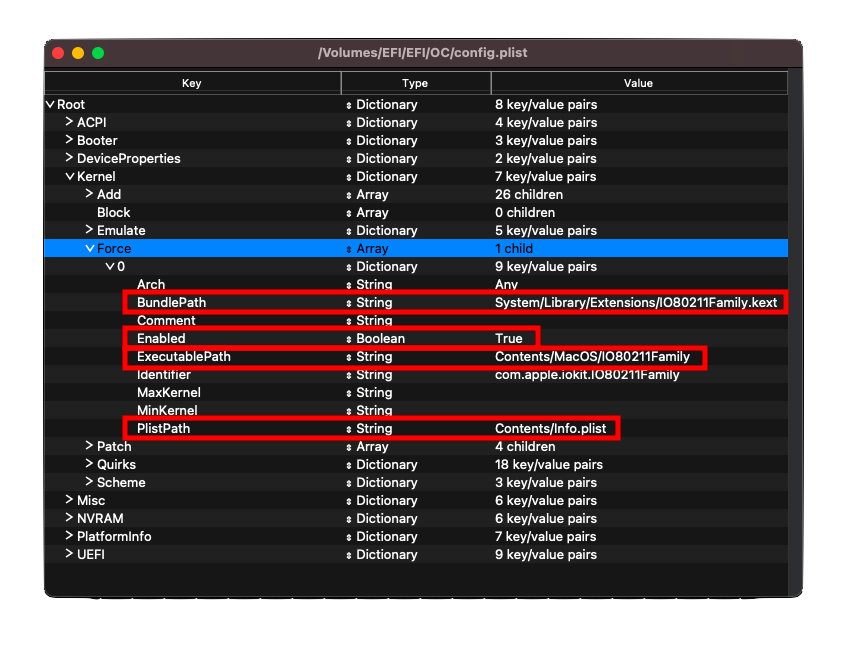

# 搜集檔案

本章節是為了收集令 macOS 開機的各類檔案，我們希望你在開始之前已經很好地了解你的硬體，並且最好有安裝 Hackintosh 的經驗，因為我們不會在這裡深入探討。

> 知道我的硬體是否被支援的最佳方法是什麼？

請參閱[**硬體限制頁面**](macos-limits.md) ，以更好地了解 macOS 啟動時需要什麼，Clover 和 OpenCore 之間的硬體支援非常相似。

> 有什麼方法可以找出我有什麼硬體？

參閱上一頁：[尋找你的硬體](./find-hardware.md)

[[toc]]

## 韌體驅動

韌體驅動程式是 OpenCore 在 UEFI 環境中使用的驅動程式。它們主要是通過擴展 OpenCore 的補丁功能或在 OpenCore 選擇器（例如 HFS 磁碟）中向你顯示不同類型的磁碟來啟動電腦。

* **位置說明**: 這些檔案 **必須** 放在 `EFI/OC/Drivers/` 目錄下

### 通用

::: tip 必需的驅動程式

對於大多數系統，你只需要 2 個 `.efi` 的驅動程式來開機和運行:

* [HfsPlus.efi](https://github.com/acidanthera/OcBinaryData/blob/master/Drivers/HfsPlus.efi)(<span style="color:red">必需</span>)
  * 用於檢查和顯示 HFS 磁碟（例如：macOS 安裝程式和恢復磁碟區／映像）。**不要混合使用其他 HFS 驅動程式**
  * 對於 Sandy Bridge 和更老的平台（及低端 Ivy Bridge（i3 和 Celeron）），請參閱下面的老舊系統部分
* [OpenRuntime.efi](https://github.com/acidanthera/OpenCorePkg/releases)(<span style="color:red">必需</span>)
  * 代替 [AptioMemoryFix.efi](https://github.com/acidanthera/AptioFixPkg), 用作 OpenCore 的擴展，以幫助修補 boot.efi 來修復 NVRAM 和更好的記憶體管理。
  * 提醒，這個檔案已包含在我們之前下載的 OpenCorePkg 裡

:::

### 老舊系統用戶

除上述外，如果您的硬體不支援 UEFI（2011 年和更早），那麼您將需要以下驅動程式。請密切關注每一項的內容，因為你可能無需要全數使用：

* [OpenUsbKbDxe.efi](https://github.com/acidanthera/OpenCorePkg/releases)
  * 用於讓**使用 DuetPkg 的老舊系統**上運行 OpenCore 選擇器， [不推薦，甚至在 UEFI（Ivy Bridge 和更新的）系統上有害](https://applelife.ru/threads/opencore-obsuzhdenie-i-ustanovka.2944066/page-176#post-856653)
* [HfsPlusLegacy.efi](https://github.com/acidanthera/OcBinaryData/blob/master/Drivers/HfsPlusLegacy.efi)
  * HfsPlus 的舊版變體，用於缺少 RDRAND 指令支持的系統。這通常在 Sandy Bridge和更老的（以及低端的 Ivy Bridge（i3 和 Celeron））平台出現
  * 不要將其與 HfsPlus.efi 混合使用，請根據您的硬體選擇其中之一
* [OpenPartitionDxe](https://github.com/acidanthera/OpenCorePkg/releases)
  * 在 OS X 10.7 到 10.9 上啟動恢復程式時需要
    * 此文件已包含在 OpenCorePkg 的 EFI/OC/Drivers 之下
    * 注意：OpenDuet 用戶（例如：沒有 UEFI）將內置此驅動程式，這些電腦並不需要它

將這些文件放在 EFI 的 Drivers 資料夾中

::: details 32 位元的詳細資訊

對於那些使用 32 位元的處理器，您也需要取得這些驅動程式

* [HfsPlus32](https://github.com/acidanthera/OcBinaryData/blob/master/Drivers/HfsPlus32.efi)
  * 用於 32 位元 CPU 的 HfsPlusLegacy 的替代品，不要將其與其他 HFS.efi 驅動程式混合使用

:::

## Kexts

kext 是指 **k**ernel **ext**ension，你可以把它想像成 macOS 的驅動程式，這些文件將放進 EFI 中的 Kexts 資料夾。

* **Windows 和 Linux 注意**：這些操作系統視 kext 為普通的資料夾，請**仔細檢查**你正在安裝的資料夾是否帶有 .kext 副檔名（如果缺少，不要手動添加）。
  * 如果任意 kext 還包含一個 `.dSYM` 檔案，你可以簡單地刪除它。它們只用於除錯目的。
* **位置注意**: 這些檔案 **必須** 放在 `EFI/OC/Kexts/` 目錄下。

下面列出的大多數**預編譯** kext 都可以在 [build repo](http://dortania.github.io/builds/) 中找到。這裡的 kext 在每次有新的提交時都會編譯一次。

### 必要的檔案

::: tip 必要的 kext

如果沒有下面的 2 個檔案，系統就無法啟動：

* [Lilu](https://github.com/acidanthera/Lilu/releases)(<span style="color:red">必需</span>)
  * 一個修補許多處理程序的 kext，被 AppleALC、WhateverGreen、VirtualSMC 和許多其他 kext 所依賴。沒有 Lilu，他們就無法工作。
  * 請注意，雖然 Lilu 最低支援 Mac OS X 10.4 版本，但許多插件只能在較新的版本上使用。
* [VirtualSMC](https://github.com/acidanthera/VirtualSMC/releases)(<span style="color:red">必需</span>)
  * 模擬真實 Mac 上的 SMC 芯片，如果沒有這個，macOS 將無法啟動
  * 要求 Mac OS X 10.4 或更新版本

:::

### VirtualSMC 插件

電腦開機時不需要以下插件，因為它們僅增加額外的硬體監控等系統功能。除非另有說明，這些插件都是隨 VirtualSMC 附帶的

::: tip 提示

雖然 VirtualSMC 支持 10.4，但插件可能需要更新的版本。

:::

* SMCProcessor.kext
  * 用於監控 Intel CPU 的溫度
  * 不適用於 AMD CPU 系統
  * 需要 Mac OS X 10.7 或更新版本
* [SMCAMDProcessor](https://github.com/trulyspinach/SMCAMDProcessor)
  * 用於監控 AMD Zen 系列 CPU 的溫度
  * **正在積極開發中，可能不穩定**
  * 需要 AMDRyzenCPUPowerManagement (參見 [AMD CPU 專用的 Kext](ktext.md#amd-cpu-specific-kexts))
  * 需要 macOS 10.13 或更新版本
* [SMCRadeonGPU](https://github.com/aluveitie/RadeonSensor)
  * 用於監控 AMD GPU 的溫度
  * 需要來自相同儲存庫的 RadeonSensor
  * 需要 macOS 11 或更新版本
* SMCSuperIO.kext
  * 用於監控風扇轉速
  * 不適用於基於 AMD CPU 的系統
  * 需要 Mac OS X 10.6 或更新的版本
* SMCLightSensor.kext
  * 用於筆記型電腦的環境光傳感器
  * **如果你沒有環境光傳感器，請不要使用。（例如桌面電腦），否則會導致問題**
  * 需要 Mac OS X 10.6 或更新的版本
* SMCBatteryManager.kext
  * 用於測量筆記型電腦的電池讀數
  * **不要在桌面電腦上使用**
  * 需要 Mac OS X 10.4 或更新的版本
* SMCDellSensors.kext
  * 允許對支持系統管理模式（SMM）的 Dell 電腦的風扇進行更精細的監控和控制
  * **如果你沒有支援的 Dell 電腦，請不要使用**，主要是 Dell 筆記型電腦可以從這個 kext 中受益
  * 需要 Mac OS X 10.7 或更新的版本

### 顯示

* [WhateverGreen](https://github.com/acidanthera/WhateverGreen/releases)(<span style="color:red">必需</span>)
  * 用於圖形修補、DRM 修復、Board ID 檢查、幀緩衝區修復等等的 Lilu 插件；（幾乎）所有 GPU 都因為這個 kext 而受益。
  * 注意內附的 SSDT-PNLF.dsl 文件只適用於筆記本電腦和 AIO，請參閱[ACPI 入門教學](https://sumingyd.github.io/Getting-Started-With-ACPI/) 以取得更多資訊
  * **如果你使用 AMD Vega iGPU，請不要使用**，請參閱 [AMD CPU 專用的 Kext](ktext.md#amd-cpu-specific-kexts)
  * 需要 Mac OS X 10.6 或更新的版本

### 音訊

* [AppleALC](https://github.com/acidanthera/AppleALC/releases)
  * 用於修補 AppleHDA，支援大多數集成的聲音控制器
  * AppleALCU.kext 是 AppleALC 的精簡版，只支持數位音訊，但你仍然可以使用 AppleALC.kext 在數位音訊系統上
  * AMD 15h/16h 使用 AppleALC 可能會有問題。而麥克風的支援在 Ryzen/Threadripper 系統則很少見
  * 需要 OS X 10.4 或更新版本
  
::: details 舊版音訊 Kext

對於那些計劃使用 10.7 或更舊版本的用戶，可以選擇這些 kext：

* [VoodooHDA](https://sourceforge.net/projects/voodoohda/)
  * 需要 OS X 10.6 或更新版本
  
* [VoodooHDA-FAT](https://github.com/khronokernel/Legacy-Kexts/blob/master/FAT/Zip/VoodooHDA.kext.zip)
  * 與上述類似，但是支援 32 及 64 位元內核，因此非常適合用於 OS X 10.4-5 和 32 位元 CPU

:::

### 乙太網路卡

在這裡，我們假設您知道系統的網路卡型號。提醒您：產品規格頁面很可能會列出網路卡的類型。

* [IntelMausi](https://github.com/acidanthera/IntelMausi/releases)
  * 對於大多數 Intel 網路卡，基於 I211 的芯片組將需要 SmallTreeIntel82576 kext
  * 支援 Intel 的 82578、82579、I217、I218 和 I219 網路卡
  * 需要 OS X 10.9 或更新版本，舊版的 10.6-10.8 操作系統用戶可以使用 IntelSnowMausi 代替
* [AppleIGB](https://github.com/donatengit/AppleIGB/releases)
  * 在 macOS Monterey 及以上版本上使用 I211 網路卡時需要
  * 可能在一些網路卡上出現不穩定的問題，建議留在 Big Sur 並使用 SmallTree
  * 大多數使用 Intel 網路卡的 AMD 主板都需要
  * 需要 macOS 12 及以上版本
* [SmallTreeIntel82576](https://github.com/khronokernel/SmallTree-I211-AT-patch/releases)
  * 在 macOS Big Sur 及以下版本使用 I211 網路卡時需要，基於 SmallTree kext，但有所修補以支援 I211（在 macOS 12 [Monterey](./extras/monterey.md#ethernet) 或以上不起作用）
  * 大多數使用 Intel 網路卡的 AMD 主板都需要
  * 需要 OS X 10.9-12 (v1.0.6)，macOS 10.13-14 (v1.2.5)，macOS 10.15+ (v1.3.0)
* [AtherosE2200Ethernet](https://github.com/Mieze/AtherosE2200Ethernet/releases)
  * 用於 Atheros 和 Killer 網路卡
  * 需要 OS X 10.8 或更新的版本
  * 注意:Atheros Killer E2500 型號實際上是基於 Realtek 的，這些電腦的用戶請使用 [RealtekRTL8111](https://github.com/Mieze/RTL8111_driver_for_OS_X/releases) 代替
* [RealtekRTL8111](https://github.com/Mieze/RTL8111_driver_for_OS_X/releases)
  * 用於 Realtek 的千兆以太網路卡
  * v2.2.0 及以下版本需要 OS X 10.8 及以上，v2.2.2 版本需要 macOS 10.12 及以上，v2.3.0 及以上版本需要 macOS 10.14 及以上
  * **注意：**有時最新版本的 kext 可能無法在讓您的以太網正常工作。如果你遇到這個問題，請嘗試舊版本。
* [LucyRTL8125Ethernet](https://www.insanelymac.com/forum/files/file/1004-lucyrtl8125ethernet/)
  * 用於 Realtek的 2.5Gb 以太網路卡
  * 需要 macOS 10.15 或更新的版本
* 對於 Intel 的 I225-V 網路卡，相關修補已在桌面平台 [Comet Lake 的 DeviceProperties](config.plist/comet-lake.md#deviceproperties) 部分中提到，不需要 kext。
  * 需要 macOS 10.15 或更新的版本
* 對於 Intel 的 I350 網路卡，相關修補已在 HEDT 平台 [Sandy 和 Ivy Bridge-E 的 DeviceProperties](config-HEDT/ivy-bridge-e.md#deviceproperties) 部分中提到，不需要 kext。
  * 需要 OS X 10.10 或更新的版本

::: details 舊版乙太網路卡的 Kexts

無論是安裝舊版 macOS 還是舊的電腦硬體。

* [AppleIntele1000e](https://github.com/chris1111/AppleIntelE1000e/releases)
  * 主要用於基於 10/100MBe 的 Intel 以太網路卡
  * 需要 OS X 10.6 或更新的版本
* [RealtekRTL8100](https://www.insanelymac.com/forum/files/file/259-realtekrtl8100-binary/)
  * 主要用於基於 10/100MBe 的 Realtek 以太網路卡
  * 需要 macOS 10.12 或更新的版本（v2.0.0+）
* [BCM5722D](https://github.com/chris1111/BCM5722D/releases)
  * 主要用於基於 BCM5722 的 Broadcom 以太網路卡
  * 需要 OS X 10.6 或更新的版本

:::

請記住，某些網路卡實際上在 macOS 中是原生支援的：

::: details 原生支援的網路卡

#### Aquantia 系列

```md
# AppleEthernetAquantiaAqtion.kext
pci1d6a,1    = Aquantia AQC107
pci1d6a,d107 = Aquantia AQC107
pci1d6a,7b1  = Aquantia AQC107
pci1d6a,80b1 = Aquantia AQC107
pci1d6a,87b1 = Aquantia AQC107
pci1d6a,88b1 = Aquantia AQC107
pci1d6a,89b1 = Aquantia AQC107
pci1d6a,91b1 = Aquantia AQC107
pci1d6a,92b1 = Aquantia AQC107
pci1d6a,c0   = Aquantia AQC113
pci1d6a,4c0  = Aquantia AQC113
```

**注意**：由於許多 Aquania 網路卡上的韌體都是過時的，您可能需要在 Linux/Windows 中更新韌體，以確保它與 macOS 相容。

#### Intel 系列

```md
# AppleIntel8254XEthernet.kext
pci8086,1096 = Intel 80003ES2LAN
pci8086,100f = Intel 82545EM
pci8086,105e = Intel 82571EB/82571GB

# AppleIntelI210Ethernet.kext
pci8086,1533 = Intel I210
pci8086,15f2 = Intel I225LM (macOS 10.15新增)

# Intel82574L.kext
pci8086,104b = Intel 82566DC
pci8086,10f6 = Intel 82574L

```

#### Broadcom 系列

```md
# AppleBCM5701Ethernet.kext
pci14e4,1684 = Broadcom BCM5764M
pci14e4,16b0 = Broadcom BCM57761
pci14e4,16b4 = Broadcom BCM57765
pci14e4,1682 = Broadcom BCM57762
pci14e4,1686 = Broadcom BCM57766
```

:::

### USB

* USBToolBox（[tool](https://github.com/USBToolBox/tool) 和 [kext](https://github.com/USBToolBox/kext)）
  * 用於 Windows 和 macOS 的 USB 映射工具。
  * 強烈建議在安裝 macOS 之前映射你的 USB 連接埠，以避免任何連接埠限制問題
  * 功能
    * 支援從 Windows 和 macOS 映射(Linux 支援正在開發中)
    * 可以使用 USBToolBox kext 或本機 Apple kext 構建一個映射表（AppleUSBHostMergeProperties）
    * 支持多種匹配方式
    * 支持配套連接埠（Windows）

* [XHCI-unsupported](https://github.com/RehabMan/OS-X-USB-Inject-All)
  * 有使用非原生 USB 控制器的電腦需要這個 kext
  * 基於 AMD CPU 的系統則不需要
  * 需要這些的常見芯片組：
    * H370
    * B360
    * H310
    * Z390 (Mojave 和更新版本不需要)
    * X79
    * X99
    * ASRock Intel 主板 (B460/Z490+ 板不需要)

### Wi-Fi 和 藍牙

#### 非原生藍牙卡

* [BlueToolFixup](https://github.com/acidanthera/BrcmPatchRAM/releases)
  * 修補 macOS 12 及以上版本的藍牙協議堆棧以支援第三方藍牙卡
  * 所有非原生（非蘋果原廠的 Broadcom、Intel 等）的藍牙卡都需要這個 kext
  * 包含在[BrcmPatchRAM](#broadcom) zip 檔案中
  * **不要在 macOS 11 和更舊的版本使用**

#### Intel

* [AirportItlwm](https://github.com/OpenIntelWireless/itlwm/releases)
  * 增加了對多種 Intel 無線網卡的支援，並集成了 IO80211Family，讓網卡能在恢復模式中工作
  * 需要 macOS 10.13 或更新版本，並且要啟用蘋果的安全開機才能正常運行
* [Itlwm](https://github.com/OpenIntelWireless/itlwm/releases)
  * AirportItlwm 的替代品，針對無法啟用蘋果安全開機的系統
  * 需要 [Heliport](https://github.com/OpenIntelWireless/HeliPort/releases)
  * 它將被視為以太網路卡，你必須通過 Heliport 連接 Wi-Fi
  * **在 macOS 恢復模式中無法使用**
* [IntelBluetoothFirmware](https://github.com/OpenIntelWireless/IntelBluetoothFirmware/releases)
  * 為 macOS 增加 Intel 無線網卡的藍牙支援（如無線網卡同時支援藍牙）
  * 除了修補 macOS 中的錯誤之外，還可以使用 IntelBTPatcher（已包含）
  * 需要 macOS 10.13 或更新的版本
  * 在 macOS 10.13 - 11 中，你還需要 IntelBluetoothInjector（已包含）

::: details 更多關於啟用 AirportItlwm 的資訊

要讓 OpenCore 支援並啟用 AirportItlwm，你需要：

* 啟用 `Misc -> Security -> SecureBootModel` 並將其設置為 `Default` 或其他有效值
  * 這將在本指南後部和安裝後完善指南中討論：[Apple Secure Boot](https://sumingyd.github.io/OpenCore-Post-Install/universal/security/applesecureboot.html)
* 如果你不能啟用 SecureBootModel，你仍然可以強制注入 IO80211Family（**非常不建议**）
  * 在 config.plist 檔案的 `Kernel -> Force` 下設定以下内容。（稍後將會討論）：
  


:::

#### Broadcom

* [AirportBrcmFixup](https://github.com/acidanthera/AirportBrcmFixup/releases)
  * 修補非蘋果或 fenvi 的 Broadcom 無線網卡 **不能在 Intel, Killer, Realtek 等網卡上工作**
  * 需要 OS X 10.10 或更新的版本
  * 關於 Big Sur，請參見[Big Sur 已知問題](./extras/big-sur#known-issues) 了解對 AirPortBrcm4360 驅動程式的額外設定步驟。
* [BrcmPatchRAM](https://github.com/acidanthera/BrcmPatchRAM/releases)
  * 用於把 Broadcom 藍牙芯片組的韌體上傳至電腦，所有非蘋果或 fenvi 的 Airport 卡都需要這個 kext。
  * 需與 BrcmFirmwareData.kext 配對
    * BrcmPatchRAM3 用于 10.15+（必須與 BrcmBluetoothInjector 配對）
    * BrcmPatchRAM2 用于 10.11-10.14
    * BrcmPatchRAM 用于 10.8-10.10
  * 在 macOS 10.11-11.0 中，你還需要 BrcmBluetoothInjector（已包含）

::: details BrcmPatchRAM 載入順序

`Kernel -> Add` 中的順序應該是:

1. BrcmBluetoothInjector（如果需要）
2. BrcmFirmwareData
3. BrcmPatchRAM3 (或 BrcmPatchRAM2/BrcmPatchRAM)

BlueToolFixup 可以放在 Lilu 之後的任何地方。

然而，ProperTree 將為您處理此問題，因此您無需擔心

:::

### AMD CPU 專用 kext

* [XLNCUSBFIX](https://cdn.discordapp.com/attachments/566705665616117760/566728101292408877/XLNCUSBFix.kext.zip)
  * AMD FX 系統的 USB 修復，不建議在 Ryzen 電腦使用
  * 需要 macOS 10.13 或更新的版本
* [VoodooHDA](https://sourceforge.net/projects/voodoohda/)
  * 用於 FX 系統的音訊支援和 Ryzen 系統的前面板麥克風及音訊支援，不要與 AppleALC 混合使用。音訊質量明顯比 Zen CPU 上的 AppleALC 差
  * 需要 OS X 10.6 或更新的版本
  * 不建議在 macOS 11.3 或更高版本上使用此 kext，因為你需要修改 macOS 檔案系統並停用 SIP
* [AMDRyzenCPUPowerManagement](https://github.com/trulyspinach/SMCAMDProcessor)
  * Ryzen 系統的 CPU 電源管理
  * **正在積極開發中，可能不穩定**
  * 需要 macOS 10.13 或更新的版本
* [NootedRed](https://github.com/NootInc/NootedRed)
  * 用於 Vega iGPU 的圖形修補、Board ID 檢查、幀緩衝區修復等等的 Lilu 插件
  * 不可同時使用「WhateverGreen」
  * **正在積極開發中，不穩定**。目前尚未正式發布，測試版需要 GitHub 帳號才能下載
  * 需要 macOS 11 或更新的版本

### 額外

* [AppleMCEReporterDisabler](https://github.com/acidanthera/bugtracker/files/3703498/AppleMCEReporterDisabler.kext.zip)
  * 在使用 macOS 12.3 和更高版本的 AMD 系統上，及使用 macOS 10.15 和更高版本的雙插槽 Intel 系統上都需要安裝。
  * 受影響的 SMBIOS:
    * MacPro6,1
    * MacPro7,1
    * iMacPro1,1
* [CpuTscSync](https://github.com/lvs1974/CpuTscSync/releases)
  * 在 Intel HEDT 和伺服器主板同步 TSC 時需要這個 kext，否則 macOS 可能非常緩慢甚至無法開機。
  * **不能在 AMD CPU 上工作**
  * 需要 OS X 10.8 或更新的版本
* [NVMeFix](https://github.com/acidanthera/NVMeFix/releases)
  * 用於修復非蘋果 NVMe 上的電源管理和初始化
  * 需要 macOS 10.14 或更新的版本
* [SATA-Unsupported](https://github.com/khronokernel/Legacy-Kexts/blob/master/Injectors/Zip/SATA-unsupported.kext.zip)
  * 增加了大量 SATA 控制器的支援，主要適用於在 macOS 中遇到 SATA 磁碟問題的筆記型電腦。我們建議首先在沒有這個 kext 的情況下進行測試。
  * Big Sur+ 註：請改為使用 [CtlnaAHCIPort](https://github.com/dortania/OpenCore-Install-Guide/blob/master/extra-files/CtlnaAHCIPort.kext.zip) ，因為有許多控制器遭到刪除
    * Catalina 和更舊的則不必擔心
  * AMD CPU 筆記型電腦註：經譯者測試，包含這個的大部分同類的 kext 均無法作用於 AMD 原生的 SATA 控制器。如果你的電腦沒有其他 SATA 控制器，你可能需要安裝至 USB 移動硬碟。
* [CPUTopologyRebuild](https://github.com/b00t0x/CpuTopologyRebuild)
  * 一個實驗性的 Lilu 插件，用於優化 Alder Lake 的異構核心配置。 **只適用於 Alder Lake CPU**
* [RestrictEvents](https://github.com/acidanthera/RestrictEvents)
  * macOS 各種功能的修補 kext，詳情見 [README](https://github.com/acidanthera/RestrictEvents#boot-arguments)
* [EmeraldSDHC](https://github.com/acidanthera/EmeraldSDHC)
  * 讓 macOS 支援 eMMC 的 kext。目前僅支援 eMMC 或 MMC 卡，最高速度為 HS200。此驅動程式目前正在開發中，在某些裝置上可能會出現性能不佳或無法使用的情況。目前不支持 SD 卡。

::: details 舊版 SATA kext

* [AppleIntelPIIXATA.kext](https://github.com/dortania/OpenCore-Legacy-Patcher/blob/d20d9975c144728da7ae2543d65422f53dabaa2d/payloads/Kexts/Misc/AppleIntelPIIXATA-v1.0.0.zip)
  * 適用於老舊的 Core 2 Duo/Quad 和 Pentium 4 系統的舊版 IDE 和 ATA kext。macOS 11（Big Sur）和更新的版本需要這個 kext，因為它已在 macOS 10.15（Catalina）中刪除
* [AHCIPortInjector](https://github.com/khronokernel/Legacy-Kexts/blob/master/Injectors/Zip/AHCIPortInjector.kext.zip)
  * 舊版 SATA/AHCI 注入器，主要適用於 Penryn 時代的老舊電腦
* [ATAPortInjector](https://github.com/khronokernel/Legacy-Kexts/blob/master/Injectors/Zip/ATAPortInjector.kext.zip)
  * 舊版 ATA 注入器，主要與 IDE 和 ATA 裝置相關（例如：當 BIOS 中沒有 AHCI 選項時）
  
:::

### 筆記型電腦輸入

要弄清楚你使用的是什麼的鍵盤和觸控板，請用 Windows 中的裝置管理員或 Linux 中的 `dmesg | grep -i input` 來檢查

::: warning

大多數筆記型電腦的鍵盤都是 PS2！即使你有 I2C、USB 或 SMBus 觸控板，你也可能需要使用 VoodooPS2。

:::

#### PS2 鍵盤／觸控板

* [VoodooPS2](https://github.com/acidanthera/VoodooPS2/releases)
  * 適用於各種 PS2 鍵盤，滑鼠和觸控板
  * 需要 macOS 10.11 或更新才能使用 MT2（Magic Trackpad 2）
* [RehabMan's VoodooPS2](https://bitbucket.org/RehabMan/os-x-voodoo-ps2-controller/downloads/)
  * 適用於帶有 PS2 鍵盤、滑鼠和觸控板的舊系統，或者當你不想使用 VoodooInput 時可用
  * 支援 macOS 10.6 +

#### SMBus 觸控板

* [VoodooRMI](https://github.com/VoodooSMBus/VoodooRMI/releases)
  * 適用於帶有 Synaptics SMBus 觸控板的系統
  * 需要 macOS 10.11 或更新版本才能使用 MT2（Magic Trackpad 2）
  * 依賴於 Acidanthera 的 VoodooPS2
* [VoodooSMBus](https://github.com/VoodooSMBus/VoodooSMBus/releases)
  * 適用於帶有 ELAN SMBus 觸控板的系统
  * 目前支援 macOS 10.14 或更新版本

#### I2C/USB HID 裝置

* [VoodooI2C](https://github.com/VoodooI2C/VoodooI2C/releases)
  * 支援 macOS 10.11 或更新版本
  * 連接到 I2C 控制器，允許插件與 I2C 觸控板交互
  * 使用以下插件的 USB 裝置仍然需要 VoodooI2C
  * 必須與一個或多個插件配合，如下所示:

::: tip VoodooI2C 插件

| 連接類型 | 插件 | 說明 |
| :--- | :--- | :--- |
| Multitouch HID | VoodooI2CHID | 可以與 I2C/USB 輕觸屏幕和觸控板一起使用 |
| ELAN Proprietary | VoodooI2CElan | ELAN1200+ 則需要 VoodooI2CHID |
| FTE1001 touchpad | VoodooI2CFTE | |
| Atmel Multitouch Protocol | VoodooI2CAtmelMXT | |
| Synaptics HID | [VoodooRMI](https://github.com/VoodooSMBus/VoodooRMI/releases) | I2C Synaptic 觸控板（只在 I2C 模式下需要 VoodooI2C) |
| Alps HID | [AlpsHID](https://github.com/blankmac/AlpsHID/releases) | 可配合 USB 或 I2C Alps 觸控板使用。主要出現在戴爾 (Dell) 筆記型電腦和惠普 (HP) 的一些 EliteBook 機型上 |

:::

#### 雜項

* [ECEnabler](https://github.com/1Revenger1/ECEnabler/releases)
  * 修復在許多設備上讀取電池狀態時的問題（允許讀取超過 8 位元的 EC 字段）
  * 支援 OS X 10.7 及以上版本（10.4 - 10.6 版本不需要）
* [BrightnessKeys](https://github.com/acidanthera/BrightnessKeys/releases)
  * 自動修復亮度快捷鍵

請參考 [Kexts.md](https://github.com/acidanthera/OpenCorePkg/blob/master/Docs/Kexts.md) 取得支援的 kext 的完整列表

## SSDT

你在 AcpiSamples 資料夾中可以看到所有 SSDT，你可能想知道是否需要它們。對於我們來說，我們將在 config.plist 中有關你的平台特定的 ACPI 部分中討論你需要的 SSDT，因為您需要的 SSDT 是按平台獨立設定的。有些甚至需要特定的系統並要進行額外的設定，如果我現在就給你一個 SSDT 列表讓你選擇，你很容易就會迷失方向。

[ACPI 入門教學](https://sumingyd.github.io/Getting-Started-With-ACPI/) 有更多關於 SSDT 的內容，包括在不同的平台上編譯它們。

對需要的 SSDT 感到 TL;DR 的話（這是原始碼，你必須將它們編譯為 .aml 檔案）:

### 桌面電腦

| 平台 | **CPU** | **EC** | **AWAC** | **NVRAM** | **USB** |
| :-------: | :-----: | :----: | :------: | :-------: | :-----: |
| Penryn | N/A | [SSDT-EC](https://sumingyd.github.io/Getting-Started-With-ACPI/Universal/ec-fix.html) | N/A | N/A | N/A |
| Lynnfield and Clarkdale | ^^ | ^^ | ^^ | ^^ | ^^ |
| SandyBridge | [CPU-PM](https://sumingyd.github.io/OpenCore-Post-Install/universal/pm.html#sandy-and-ivy-bridge-power-management) (安裝完畢後執行) | ^^ | ^^ | ^^ | ^^ |
| Ivy Bridge | ^^ | ^^ | ^^ | ^^ | ^^ |
| Haswell | [SSDT-PLUG](https://sumingyd.github.io/Getting-Started-With-ACPI/Universal/plug.html) | ^^ | ^^ | ^^ | ^^ |
| Broadwell | ^^ | ^^ | ^^ | ^^ | ^^ |
| Skylake | ^^ | [SSDT-EC-USBX](https://sumingyd.github.io/Getting-Started-With-ACPI/Universal/ec-fix.html) | ^^ | ^^ | ^^ |
| Kaby Lake | ^^ | ^^ | ^^ | ^^ | ^^ |
| Coffee Lake | ^^ | ^^ | [SSDT-AWAC](https://sumingyd.github.io/Getting-Started-With-ACPI/Universal/awac.html) | [SSDT-PMC](https://sumingyd.github.io/Getting-Started-With-ACPI/Universal/nvram.html) | ^^ |
| Comet Lake | ^^ | ^^ | ^^ | N/A | [SSDT-RHUB](https://sumingyd.github.io/Getting-Started-With-ACPI/Universal/rhub.html) |
| AMD (15/16h) | N/A | ^^ | N/A | ^^ | N/A |
| AMD (17/19h) | [SSDT-CPUR for B550 and A520](https://github.com/dortania/Getting-Started-With-ACPI/blob/master/extra-files/compiled/SSDT-CPUR.aml) | ^^ | ^^ | ^^ | ^^ |

### 高端桌面電腦

| 平台 | **CPU** | **EC** | **RTC** | **PCI** |
| :-------: | :-----: | :----: | :-----: | :-----: |
| Nehalem and Westmere | N/A | [SSDT-EC](https://sumingyd.github.io/Getting-Started-With-ACPI/Universal/ec-fix.html) | N/A | N/A |
| Sandy Bridge-E | ^^ | ^^ | ^^ | [SSDT-UNC](https://sumingyd.github.io/Getting-Started-With-ACPI/Universal/unc0) |
| Ivy Bridge-E | ^^ | ^^ | ^^ | ^^ |
| Haswell-E | [SSDT-PLUG](https://sumingyd.github.io/Getting-Started-With-ACPI/Universal/plug.html) | [SSDT-EC-USBX](https://sumingyd.github.io/Getting-Started-With-ACPI/Universal/ec-fix.html) | [SSDT-RTC0-RANGE](https://sumingyd.github.io/Getting-Started-With-ACPI/Universal/awac.html) | ^^ |
| Broadwell-E | ^^ | ^^ | ^^ | ^^ |
| Skylake-X | ^^ | ^^ | ^^ | N/A |

### 筆記型電腦

| 平台 | **CPU** | **EC** | **Backlight** | **I2C Trackpad** | **AWAC** | **USB** | **IRQ** |
| :-------: | :-----: | :----: | :-----------: | :--------------: | :------: | :-----: | :-----: |
| Clarksfield and Arrandale | N/A | [SSDT-EC](https://sumingyd.github.io/Getting-Started-With-ACPI/Universal/ec-fix.html) | [SSDT-PNLF](https://sumingyd.github.io/Getting-Started-With-ACPI/Laptops/backlight.html) | N/A | N/A | N/A | [IRQ SSDT](https://sumingyd.github.io/Getting-Started-With-ACPI/Universal/irq.html) |
| SandyBridge | [CPU-PM](https://sumingyd.github.io/OpenCore-Post-Install/universal/pm.html#sandy-and-ivy-bridge-power-management) (Run in Post-Install) | ^^ | ^^ | ^^ | ^^ | ^^ | ^^ |
| Ivy Bridge | ^^ | ^^ | ^^ | ^^ | ^^ | ^^ | ^^ |
| Haswell | [SSDT-PLUG](https://sumingyd.github.io/Getting-Started-With-ACPI/Universal/plug.html) | ^^ | ^^ | [SSDT-GPI0](https://sumingyd.github.io/Getting-Started-With-ACPI/Laptops/trackpad.html) | ^^ | ^^ | ^^ |
| Broadwell | ^^ | ^^ | ^^ | ^^ | ^^ | ^^ | ^^ |
| Skylake | ^^ | [SSDT-EC-USBX](https://sumingyd.github.io/Getting-Started-With-ACPI/Universal/ec-fix.html) | ^^ | ^^ | ^^ | ^^ | N/A |
| Kaby Lake | ^^ | ^^ | ^^ | ^^ | ^^ | ^^ | ^^ |
| Coffee Lake (8th Gen) and Whiskey Lake | ^^ | ^^ | [SSDT-PNLF](https://sumingyd.github.io/Getting-Started-With-ACPI/Laptops/backlight.html) | ^^ | [SSDT-AWAC](https://sumingyd.github.io/Getting-Started-With-ACPI/Universal/awac.html) | ^^ | ^^ |
| Coffee Lake (9th Gen) | ^^ | ^^ | ^^ | ^^ | ^^ | ^^ | ^^ |
| Comet Lake | ^^ | ^^ | ^^ | ^^ | ^^ | ^^ | ^^ |
| Ice Lake | ^^ | ^^ | ^^ | ^^ | ^^ | [SSDT-RHUB](https://sumingyd.github.io/Getting-Started-With-ACPI/Universal/rhub.html) | ^^ |

繼續：

| 平台 | **NVRAM** | **IMEI** |
| :-------: | :-------: | :------: |
| Clarksfield and Arrandale | N/A | N/A |
| Sandy Bridge | ^^| [SSDT-IMEI](https://sumingyd.github.io/Getting-Started-With-ACPI/Universal/imei.html) |
| Ivy Bridge | ^^ | ^^ |
| Haswell | ^^ | N/A |
| Broadwell | ^^ | ^^ |
| Skylake | ^^ | ^^ |
| Kaby Lake | ^^ | ^^ |
| Coffee Lake (8th Gen) and Whiskey Lake | ^^ | ^^ |
| Coffee Lake (9th Gen) | [SSDT-PMC](https://sumingyd.github.io/Getting-Started-With-ACPI/Universal/nvram.html) | ^^ |
| Comet Lake | N/A | ^^ |
| Ice Lake | ^^ | ^^ |

# 現在，這些步驟都完成了，你可前往 [ACPI 入門教學](https://sumingyd.github.io/Getting-Started-With-ACPI/)
