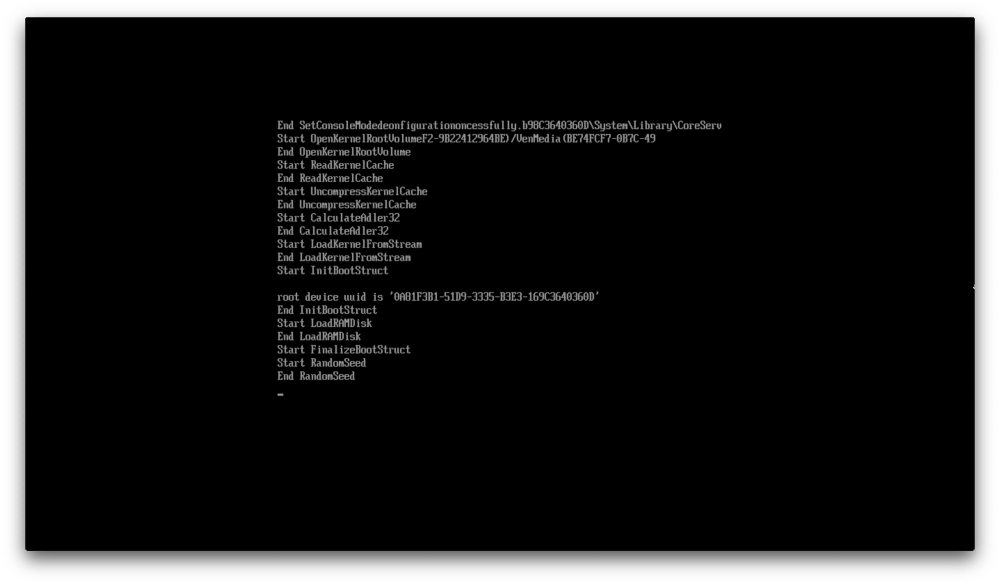
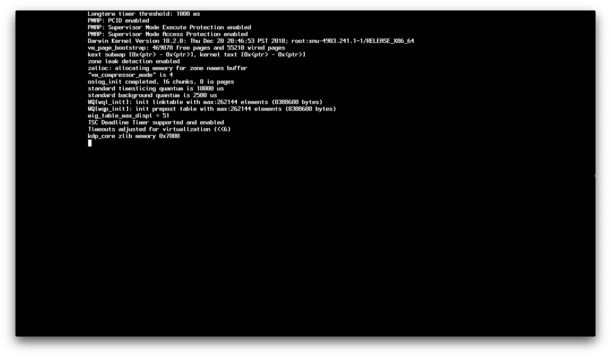
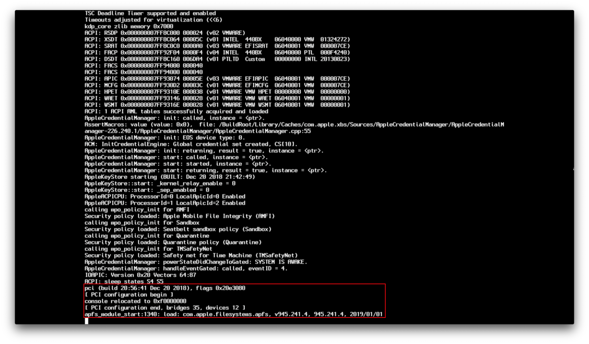
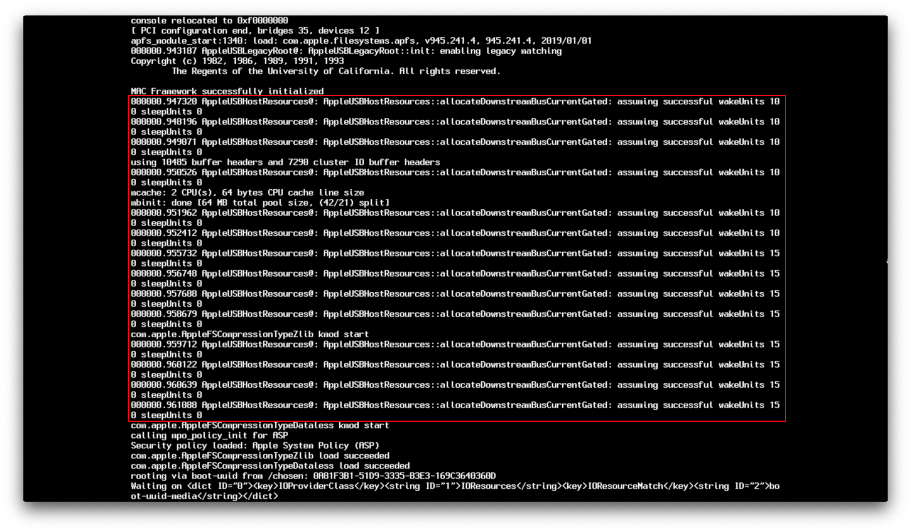
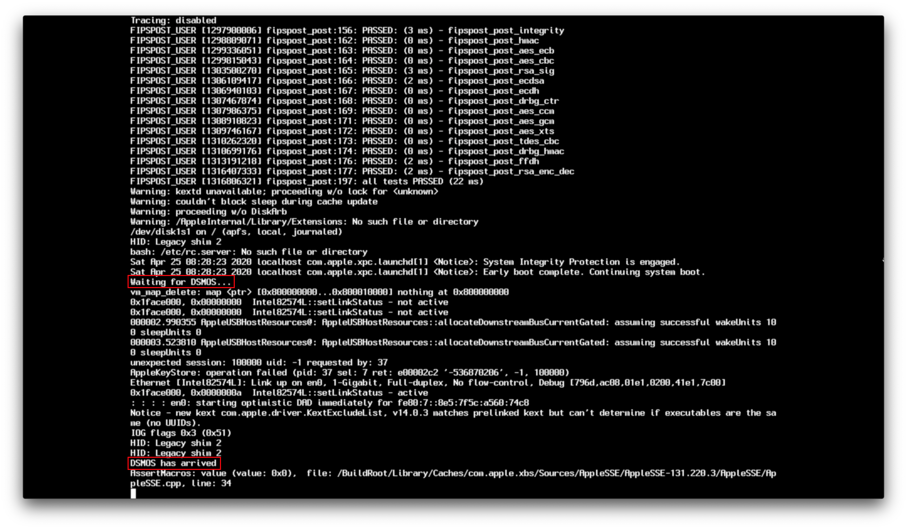
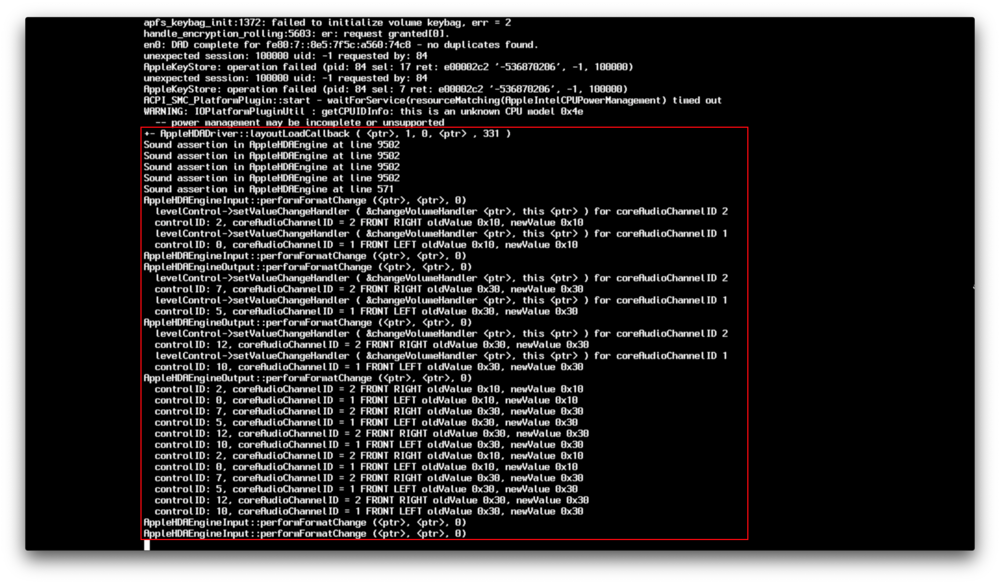
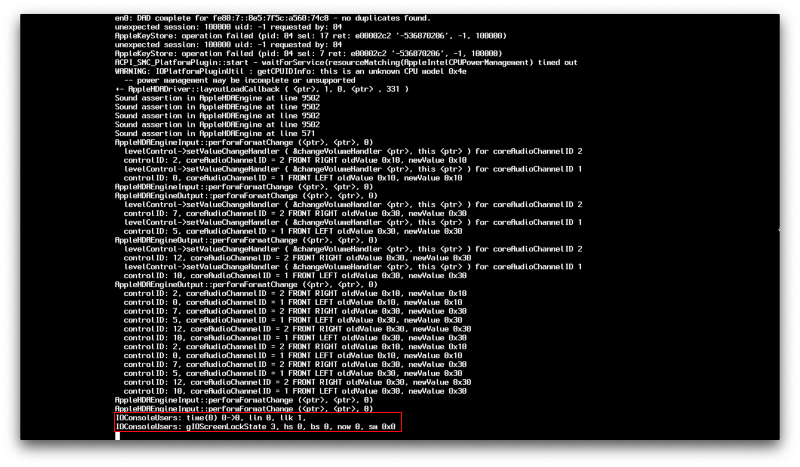
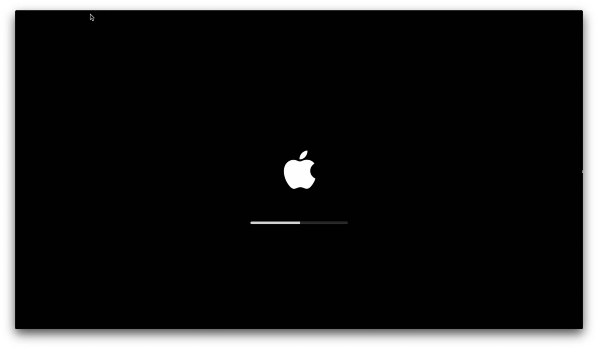

# 了解 macOS 啟動過程

在對 hackintosh 進行故障診斷時，要真正理解你在**哪裡**遇到困難可能會有點難度，因為無嘗試搜尋的關鍵字可能在 Google 上找不到任何結果。雖然這篇文章不會解決你所有的問題，但它至少可以幫助你更好地理解 macOS 啟動過程中在哪裡卡住了，並希望能給你一些為什麼卡住的想法。

## OpenCore 啟動過程

本節將會很簡短，因為 OpenCore 啟動問題相當罕見，通常是用戶引發的簡單錯誤：

* 系統啟動並搜尋可開機裝置
* 系統在你的 OpenCore USB 上的 efi/BOOT/ 下搜尋 BOOTx64.efi
* 載入 BOOTx64.efi，然後從 efi/OC/ 鏈式載入 OpenCore.efi
* 套用 NVRAM 屬性
* 從 EFI/OC/Drivers 載入 EFI 驅動程式
* 安裝圖形輸出協議 (GOP)
* 從 EFI/OC/ACPI 載入 ACPI 表
* 套用 SMBIOS 資料
* 載入 OpenCore，並顯示所有可用的啟動選項
* 啟動 macOS 或 macOS 安裝程式

如果你在啟動 OpenCore 的過程中發生問題，請查看以下頁面：

* [卡在 `no vault provided!`](./extended/opencore-issues.md#stuck-on-no-vault-provided)
* [看不到 macOS 磁碟分區](./extended/opencore-issues.md#can-t-see-macos-partitions)
* [OpenCore 啟動時卻重新開機至 BIOS](./extended/opencore-issues.md#booting-opencore-reboots-to-bios)

關於其他可能的問題，請參閱：

* [OpenCore 啟動問題](./extended/opencore-issues.md)

## boot.efi 切換



這裡是 macOS 的開機程式 (boot.efi) 發揮作用的地方。具體來說，它所做的是準備一個載入內核，和讓 OpenCore 注入 kext 的環境。如果你在這裡卡住了，很可能是内核載入期間發生問題，主要的罪魁禍首有:

* [卡在 EndRandomSeed](./extended/kernel-issues.md#stuck-on-endrandomseed)
* [卡在 `[EB|#LOG:EXITBS:START]`](./extended/kernel-issues.md#stuck-on-eb-log-exitbs-start)
* [`Couldn't allocate runtime area` 錯誤](./extended/kernel-issues.md#couldn-t-allocate-runtime-area-errors)

至於其他問題，請參閱:

* [內核問題](./extended/kernel-issues.md)

**註**: 在 macOS 10.15.4 中，蘋果更改了 boot.efi 的除錯協議，所以看起來與以前有很大的不同，但所有的規則仍然適用

## XNU/Kernel 切換

現在，boot.efi 已經準備我們需要的東西。我們現在可以觀察內核的工作了。這個部分通常稱為 [Rooting phase](https://developer.apple.com/library/archive/documentation/Darwin/Conceptual/KernelProgramming/booting/booting.html):



這個部分主要是驗證 SMBIOS 資訊，載入 ACPI 表和 Kext，及讓 macOS 嘗試使一切正常運作的地方。在這部分失敗的主要原因有：

* 損壞的 SSDT
* 損壞的 kext（或是你在 config.plist -> Kernel -> Add 中的 kext 載人次序有誤）
* 混亂的記憶體映射

更多除錯資訊，請參閱:

* [內核錯誤：`Cannot perform kext summary`](./extended/kernel-issues.md#kernel-panic-cannot-perform-kext-summary)
* [內核錯誤：`Invalid frame pointer`](./extended/kernel-issues.md#kernel-panic-on-invalid-frame-pointer)



到了這裡，我們看到 `[ PCI configurations begin ]`, 這一部分可以看作是對我們的系統、注入的 kext 和 SSDT 的硬體測試，IOKit 會在這裡啟動硬體檢測以尋找要連接的裝置。

在這裡測試的主要硬體：

* 嵌入式控制器
* 儲存裝置（NVMe, SATA, etc）
* PCI/e
* NVRAM
* RTC
* PS2 和 I2C

關於如何通過這個部分的更多具體資訊，請參閱

* [卡在 `RTC...`, `PCI Configuration Begins`, `Previous Shutdown...`, `HPET`, `HID: Legacy...`](./extended/kernel-issues.md#stuck-on-rtc-pci-configuration-begins-previous-shutdown-hpet-hid-legacy)



這裡就是 15 連接埠限制和 USB 映射發揮作用的地方，也是臭名昭著的 "Waiting for Root Device" 錯誤發生的地方，主要的問題有：

* ["Waiting for Root Device" 或停止符號錯誤](./extended/kernel-issues.md#waiting-for-root-device-or-prohibited-sign-error)



這裡就是我們的 FakeSMC/VirtualSMC 發揮作用的地方，DSMOS 本身是一個 kext，它驗證你的系統是否有一個 SMC，並向其請求一個密鑰。如果這個密鑰缺失，那麼 DSMOS 將無法解密其餘的二進制檔案，你將被卡在這裡。你也可能卡在 AppleACPICPU，這是同樣的錯誤。

* [kextd stall[0]: AppleACPICPU](./extended/kernel-issues.md#kextd-stall-0-appleacpicpu)

```
Your karma check for today:
There once was a user that whined
his existing OS was so blind,
he'd do better to pirate an OS that ran great
but found his hardware declined.
Please don't steal Mac OS!
Really, that's way uncool.
(C) Apple Computer, Inc.
```

來源：Dont Steal Mac OS X.kext



這裡就是蘋果的音訊驅動程式和 AppleALC 的亮點所在。通常這裡很少有問題，但如果有的話，請嘗試停用 AppleALC 和任何其他與音訊相關的 kext。



這裡我們進入了 GPU 驅動程式初始化，WhateverGreen 也在這裡發揮了它的作用。這裡的錯誤通常是由於 GPU，而不是 WhateverGreen 本身，主要的問題有：

* [卡在 `IOConsoleUsers: gIOScreenLock...` 或其附近](./extended/kernel-issues.md#stuck-on-or-near-ioconsoleusers-gioscreenlock-giolockstate-3)
* [使用 Navi 時，在 `IOConsoleUsers: gIOScreenLock...` 後卡住](./extended/kernel-issues.md#black-screen-after-ioconsoleusers-gioscreenlock-on-navi)

## macOS 切換



現在，你終於離開了詳細模式！如果你在離開詳細模式後卡在蘋果標誌，那麼有幾件事需要檢查：

* [macOS 在登入前凍結](./extended/kernel-issues.md#macos-frozen-right-before-login)
* [使用 Navi 時，在 `IOConsoleUsers: gIOScreenLock...` 後卡住](./extended/kernel-issues.md#black-screen-after-ioconsoleusers-gioscreenlock-on-navi)
* [macOS installer 在 30 秒後凍結](./extended/userspace-issues.md#frozen-in-the-macos-installer-after-30-seconds)
