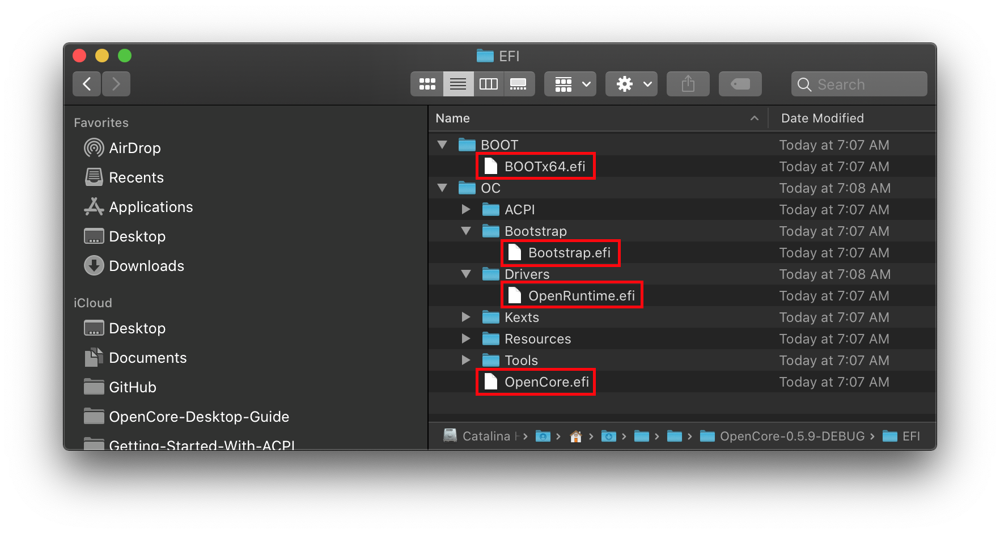
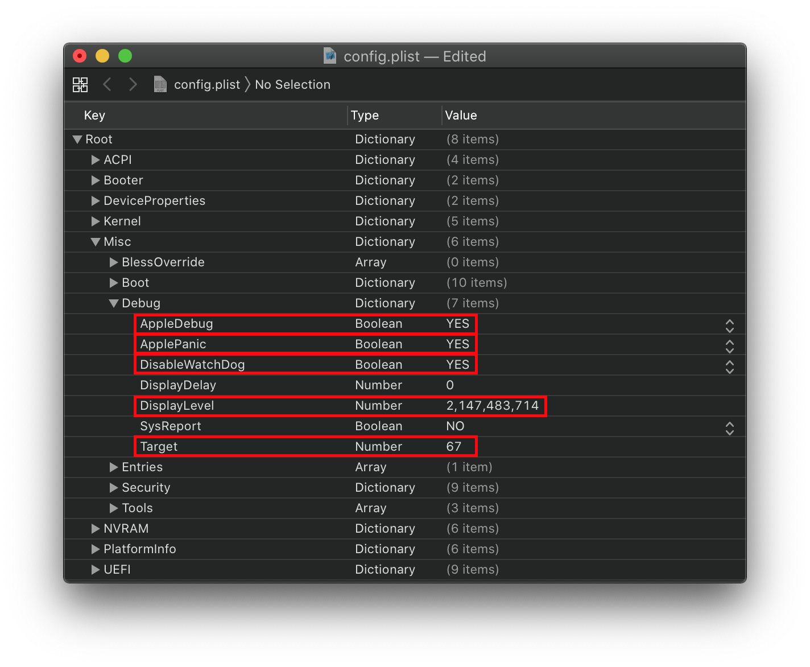

# OpenCore 除錯

需要弄清楚為什麼你會遇到問題或是卡住了？嗯，你來對地方了：

[[toc]]

## 替換檔案

首先，確保你使用的是 `DEBUG` 或 `NOOPT` 版本的 OpenCore。這將提供比 `RELEASE` 版本更多的資訊。需要替換的檔案包括：

* EFI/BOOT/
  * `BOOTx64.efi`
* EFI/OC/Drivers/
  * `OpenRuntime.efi`
  * `OpenCanopy.efi`（如果你正在使用它的話）
* EFI/OC/
  * `OpenCore.efi`

* **注意**：通常來說，最好以沒有 OpenCanopy 的系統來進行除錯。如有需要，請確保檔案是來自 DEBUG，否則將幾乎沒有除錯資訊。

## 更改配置

接下來，開啟你的 config.plist 並前往 `Misc` > `Debug` 部分。我們需要啟用一些設定：

### Misc > Debug

我們需要啟用以下功能：

* **AppleDebug**: YES
  * 提供更多除錯資訊，特別是與 boot.efi 有關的資訊，並將相關日誌儲存至磁碟。

* **ApplePanic**: YES
  * 允許內核錯誤資訊儲存至磁碟。強烈建議在 boot-args 中保持 `keepsyms=1` 以盡可能多地保存資訊。

* **DisableWatchdog**: YES
  * 停用 UEFI watchdog, 當 OpenCore 在一些非關鍵的問題上卡住時會有作用.

* **Target**: `67`（或從下表計算出來）
  * 調整除錯級別

| Value | 說明 |
| :--- | :--- |
| `0x01` | 啟用日誌記錄 |
| `0x02` | 啟用屏幕除錯 |
| `0x04` | 啟用記錄日誌至 Data Hub 功能 |
| `0x08` | 啟用序列連接埠日誌記錄功能 |
| `0x10` | 啟用 UEFI 變量日誌記錄 |
| `0x20` | 啟用非易失性 UEFI 變量日誌記錄 |
| `0x40` | 啟用儲存日誌至檔案功能 |

要計算需要的目標值，我們可以使用十六進制計算器，然後再將其轉換為十進制數字。我們要把這些日誌儲存至一個 .txt 檔案，以便以後查看：

* `0x01` — 啟用日誌記錄
* `0x02` — 啟用屏幕除錯
  * 請注意，對於 GOP 執行效率不佳的韌體，這可能會嚴重增加啓動時間
* `0x40` — 啟用儲存日誌至檔案功能

`0x01` + `0x02` + `0x40` = `0x43`

`0x43` 轉換成十進制後就是 `67`

因此，我們可以設定 `Misc` -> `Debug` -> `Target` -> `67`

* **DisplayLevel**: `2147483714` (或從下表計算出來)
  * 用於設定要記錄的內容

| Value | 說明 |
| :--- | :--- |
| `0x00000002` | 在 DEBUG, NOOPT, RELEASE 記錄 DEBUG_WARN |
| `0x00000040` | 在 DEBUG, NOOPT 記錄 DEBUG_INFO |
| `0x00400000` | 在自訂版本建構中記錄 DEBUG_VERBOSE |
| `0x80000000` | 在 DEBUG, NOOPT, RELEASE 記錄 DEBUG_ERROR |

完整的列表可以在 [DebugLib.h](https://github.com/tianocore/edk2/blob/UDK2018/MdePkg/Include/Library/DebugLib.h) 中找到。

對於我們來說，我們只需要以下內容:

* `0x00000002` — 在 DEBUG, NOOPT, RELEASE 記錄 DEBUG_WARN
* `0x00000040` — 在 DEBUG, NOOPT 記錄 DEBUG_INFO
* `0x80000000` — 在 DEBUG, NOOPT, RELEASE 記錄 DEBUG_ERROR

同樣地，我們可以使用十六進制計算器，將其轉換為十進制數字：

`0x80000042` 轉換成十進制後就是 `2147483714`

`Misc` -> `Debug` -> `DisplayLevel` -> `2147483714`

完成後，你的 config.plist 應該是這樣的:

## 停用日誌記錄功能

如果要移除所有日誌記錄和除錯訊息功能，你只需要像[替換檔案](#替換檔案)章節那樣，將 OpenCore 的檔案替換為 RELEASE 版本即可。

另外，我們需要設定以下選項來停用寫入日誌記錄至磁碟的功能:

* AppleDebug = `NO`
* ApplePanic = `NO`
* Target = `0`
