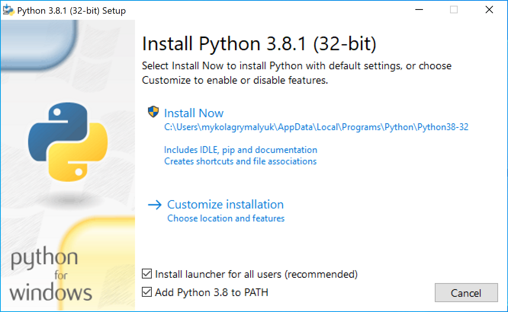

# 雜項問題

與 macOS 本身無關的雜項問題，例如多系統開機。

[[toc]]

## 無法執行 `acpidump.efi`

在 OpenCore shell 中執行：

```
shell> fs0: //替換為正確的磁碟

fs0:\> dir //驗證這是正確的目錄

  Directory of fs0:\

   01/01/01 3:30p  EFI
fs0:\> cd EFI\OC\Tools //注意它是用正向斜線

fs0:\EFI\OC\Tools> acpidump.efi -b -n DSDT -z
```

## 修復 SSDTTime: `Could not locate or download iasl!`

這通常是由於過時的 Python 版本，請嘗試更新 Python 或把 iasl 加入到 SSDTTime 的 scripts 資料夾：

* [iasl macOS 版](https://bitbucket.org/RehabMan/acpica/downloads/iasl.zip)
* [iasl Windows 版](https://acpica.org/downloads/binary-tools)
* [iasl Linux 版](http://amdosx.kellynet.nl/iasl.zip)

## 修復 Python: `Python is not installed or not found on PATH`

非常容易，下載並安裝最新版本的 Python:

* [macOS 版](https://www.python.org/downloads/macos)
* [Windows 版](https://www.python.org/downloads/windows/)
* [Linux 版](https://www.python.org/downloads/source/)

記得要選擇 `Add Python to PATH`



## Windows 啟動磁碟找不到 APFS 磁碟區

* 過時的 BootCamp 驅動程式 (通常 6.0 版本會附帶 brigadier，macOS 中的 BootCamp Utility 提供較新的版本，如 6.1 版本）。CorpNewt 的 brigadier 分支亦修復了這個問題: [CorpNewt 的 brigadier](https://github.com/corpnewt/brigadier)

## OpenCore 解析度不正確

* 跟隨 [修復解析度及詳細模式](https://eason329.github.io/OpenCore-Post-Install/cosmetic/verbose.html) 的正確設定，在 HiDPI 顯示器中將  `UIScale` 設為 `2`
* 有用戶注意到將 `ConsoleMode` 設為 Max 可能會失敗, 將該部分保留空值可能有幫助

## 無法在選擇器中找到 Windows/BootCamp 磁碟區

我們需要知道 OpenCore 只支援 UEFI 而不支援以傳統 BIOS 方式安裝 Windows。現在的 Windows 大部分均以 UEFI 方式安裝，但由 BootCamp Assistant 安裝的以 Windows 卻是傳統 BIOS 方式安裝。因此，你需要找其他方法製作相關的安裝程式（請自行 Google）。這亦代表你的磁碟不能使用 MasterBootRecord 或 Hybrid 磁碟分割方式。您需要在磁碟工具程式格式化欲安裝的磁碟。詳情請見[多系統開機指南](https://dortania.github.io/OpenCore-Multiboot/)。

現在我們來排除這個故障:

* 確認 `Misc -> Security -> ScanPolicy` 已設定為 `0` 以顯示所有磁碟
* 當 Windows 開機程式位於同一磁碟時，啟用 `Misc -> Boot -> Hideself`

## 所選的啟動磁碟無法正確地套用

如果你在為新的啟動項設定為啟動磁碟時遇到無法正確設定的問題，這很可能是由於 I/O 註冊表中缺少 `DevicePathsSupported` 造成的。要解決這個問題，請確保你已啟用 `PlatformInfo -> Automatic -> True`

缺少 `DevicePathsSupported` 的示例:

* [Default DevicePath match failure due to different PciRoot #664](https://github.com/acidanthera/bugtracker/issues/664#issuecomment-663873846)

## 啟動 Windows 時出現藍屏，或是 Linux 發生崩潰

這是由於對齊問題所致。請確保在支援 MATs 的韌體上啟用了 `SyncRuntimePermissions`。檢查你的日誌，確認你的韌體是否支援記憶體屬性表（通常能在 2018 年或更新的韌體上看到）

常見的 Windows 錯誤代碼:

* `0xc000000d`

## 啟動 Windows 時發生錯誤: `OCB: StartImage failed - Already started`

這是由於 OpenCore 嘗試啟動 Windows 時出現問題，意外地認為它正在啟動 OpenCore。這可以通過移動 Windows 到獨立的磁碟 *或* 在 BlessOverride 下新增一個自訂磁碟路徑來避免問題。詳情請見 [Configuration.pdf](https://github.com/acidanthera/OpenCorePkg/blob/master/Docs/Configuration.pdf)。

## iASL 警告，only X resolved

如果你嘗試反編譯你的 DSDT，並得到以下錯誤:

```
iASL Warning: There were 19 external control methods found during disassembly, but only 0 were resolved (19 unresolved)
```

當 ACPI 表需要其他表來進行適當的引用時就會發生這種情況，這是因為我們只使用它來建立選定的幾個 SSDT，使它拒絕建立 DSDT。對於那些擔心的人，你可以執行以下命令:

```
iasl * [insert all ACPI files here]
```

## macOS 與 Windows 之間的時間不同步

這是因為 macOS 使用世界協調時間（UTC），而 Windows 卻使用格林威治時間，所以你需要強制一個作業系統使用不同的時間標準。我們強烈建議修改 Windows，因為它的破壞性和痛苦要小得多:

* [安裝 Bootcamp 工具程式](https://dortania.github.io/OpenCore-Post-Install/multiboot/bootcamp.html)
* [修改 Windows 登錄檔案](https://superuser.com/q/494432)
