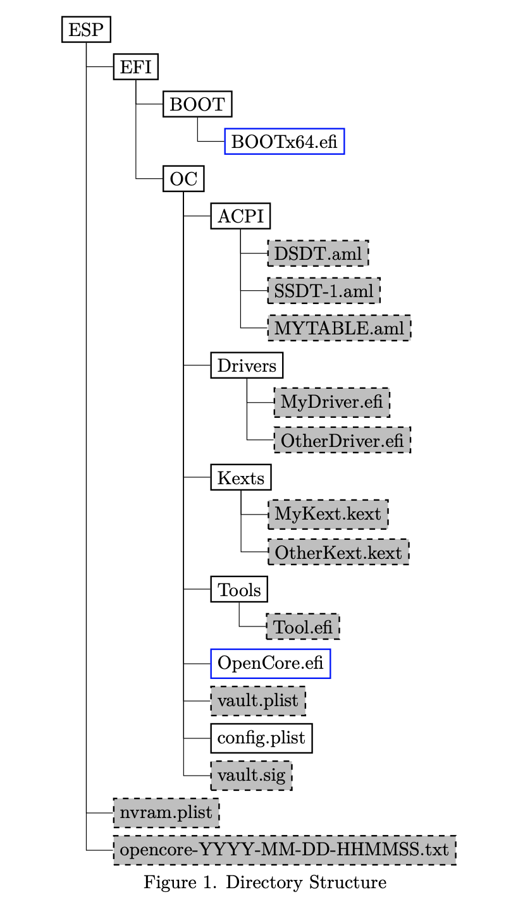

# OpenCore 啟動問題

從啟動 USB 隨身碟到選擇啟動 macOS 安裝程式之前的問題

[[toc]]

## 在出現選擇選單前卡在黑屏上

這可能是您的韌體或 OpenCore 本身發生了錯誤，或者在載入驅動程式或顯示選單期間出現問題。診斷它的最佳方法是通過 [OpenCore 的 DEBUG 版本](./../debug.md) 並檢查記錄檔來判斷 OpenCore 是否已經實際載入，以及尋找阻礙它正常載入的東西。

**OpenCore 未載入的情況**:

* 如果在使用 OpenCore 的 DEBUG 版本，並把 Target 設定為 67 後仍然沒有記錄，則可能出現以下問題：
  * 不正確的 USB 資料夾結構
    * 參見 [啟動 OpenCore 時重新啟動到 BIOS](#booting-opencore-reboots-to-bios) 了解更多資訊
  * 韌體不支援 UEFI
    * 您需要設定 DuetPkg, 这在 [macOS](../../installer-guide/mac-install.md) 和 [Windows](../../installer-guide/windows-install.md) 安裝頁面中都有介紹

**SOpenCore 已載入的情況**:

* 檢查記錄檔中列出的最後一行，這很有可能是載入了 .efi 驅動程式或其他的一些中斷（ASSERT）
  * 對於中斷（ASSERT），您需要在這裡通知開發人員這個問題: [Acidanthera's Bugtracker](https://github.com/acidanthera/bugtracker)
  * 如果是 .efi 驅動程式載入時卡住了，請檢查以下內容:
    * **HfsPlus.efi 載入問題:**
      * 嘗試使用 [HfsPlusLegacy.efi](https://github.com/acidanthera/OcBinaryData/blob/master/Drivers/HfsPlusLegacy.efi) 代替
      * 建議在不支援 RDRAND 的 CPU 上使用，主要與第 3 代 Ivy bridge i3 及更老的 CPU 有關
      * [VBoxHfs.efi](https://github.com/acidanthera/AppleSupportPkg/releases/tag/2.1.7) 是另一個選擇，但是比 HfsPlus 的版本要慢得多
    * **HiiDatabase.efi 載入問題:**
      * 這可能是您的韌體已支援 HiiDatabase，因此驅動程式發生衝突。您不需要這個驅動程式，只需要移除它即可。

## 卡在 `no vault provided!`

在你的 config.plist 中的 `Misc -> Security -> Vault` 將 Vault 設定為:

* `Optional`

如果您已經執行了 `sign.command`，您將需要恢復 OpenCore.efi 檔案，因為原來檔案已經插入了 256 位元組 的 RSA-2048 簽名。您可以在這裡獲取新的 OpenCore.efi 副本: [OpenCorePkg](https://github.com/acidanthera/OpenCorePkg/releases)

**注意**: Vault 和 FileVault 是兩個不同的東西，請參閱 [安全與 FileVault](https://dortania.github.io/OpenCore-Post-Install/universal/security.html) 了解更多資訊

## 卡在 `OC: Invalid Vault mode`

這可能是一個拼寫錯誤，OpenCore 中的選項是區分大小寫的，所以請務必仔細檢查， **O**ptional 是在 `Misc -> Security -> Vault` 下正確的輸入方式。

## 無法看到 macOS 磁碟分區

需要檢查的地方:

* 將 ScanPolicy 設為 `0` 來顯示所有磁碟
* 安裝合適的韌體驅動程式，例如 HfsPlus（注意：Note ApfsDriverLoader 不應在 0.5.8 中使用）
* 在 config.plist -> UEFI -> Quirks 中將 UnblockFsConnect 設為 True。一些 HP 系統需要設定
* 在 BIOS 中將 SATA 模式設定為：`AHCI`
* 在 `UEFI -> APFS` 進行以下設定來查看 APFS 磁碟:
  * **EnableJumpstart**: YES
  * **HideVerbose**: NO
  * 如要運行 High Sierra 或更舊版本（10.13.5 或更舊），請進行以下設定:
    * **MinDate**: `-1`
    * **MinVersion**: `-1`

## 卡在 `OCB: OcScanForBootEntries failure - Not Found`

這是因為 OpenCore 無法找到任何符合目前 ScanPolicy 的磁碟區，設定為 `0` 將允許顯示所有啟動選項

* `Misc -> Security -> ScanPolicy -> 0`

## 卡在 `OCB: failed to match a default boot option`

進行與 `OCB: OcScanForBootEntries failure - Not Found` 一樣的修復，因為 OpenCore 無法找到任何符合目前 ScanPolicy 的磁碟區，設定為 `0` 將允許顯示所有啟動選項

* `Misc -> Security -> ScanPolicy -> 0`

## 卡在 `OCB: System has no boot entries`

與上述兩個錯誤相同的修復方法:

* `Misc -> Security -> ScanPolicy -> 0`

## 卡在 `OCS: No schema for DSDT, KernelAndKextPatch, RtVariable, SMBIOS, SystemParameters...`

有兩個原因：

* 在 OpenCore 中使用了 Clover 設定，或者使用了像 Mackie 的 Clover 和 OpenCore configurator 這樣的配置器。您將需要重新開始並建立一個新的配置檔，或從原來的檔案中刪除所有有問題的內容。**這就是為什麼我們不支持配置器的原因，配置器在這些問題上是眾所周知的**
* 您的配置檔有過時的設定，並與新版本的 OpenCore 混合使用。請在更新 OpenCore 時相應地更新配置檔

## 卡在 `OC: Driver XXX.efi at 0 cannot be found`

This is due to an entry being in your config.plist, however not present in your EFI. To resolve:

* Ensure your EFI/OC/Drivers matches up with your config.plist -> UEFI -> Drivers
  * If not, please run Cmd/Ctrl+R with OpenCore to re-snapshot your config.plist

Note that the entries are case-sensitive.

## Receiving "Failed to parse real field of type 1"

This is due to a value set as `real` when it's not supposed to be, generally being that Xcode converted `HaltLevel` by accident:

```xml
<key>HaltLevel</key>
 <real>2147483648</real>
```

To fix, swap `real` for `integer`:

```xml
<key>HaltLevel</key>
 <integer>2147483648</integer>
```

## Can't select anything in the picker

This is due to either a few things

* Incompatible keyboard driver:
  * Disable `PollAppleHotKeys` and enable `KeySupport`, then remove [OpenUsbKbDxe](https://github.com/acidanthera/OpenCorePkg/releases) from your config.plist -> UEFI -> Drivers
  * If the above doesn't work, reverse: disable `KeySupport`, then add [OpenUsbKbDxe](https://github.com/acidanthera/OpenCorePkg/releases) to your config.plist -> UEFI -> Drivers

* Missing PS2 keyboard driver(Ignore if using a USB keyboard):
  * While most firmwares will include it by default, some laptops and older PCs may still need [Ps2KeyboardDxe.efi](https://github.com/acidanthera/OpenCorePkg/releases) to function correctly. Remember to add this to your config.plist as well

## SSDTs not being added

So with OpenCore, there's some extra security checks added around ACPI files, specifically that table length header must equal to the file size. This is actually the fault of iASL when you compiled the file. Example of how to find it:

```c
* Original Table Header:
*     Signature        "SSDT"
*     Length           0x0000015D (349)
*     Revision         0x02
*     Checksum         0xCF
*     OEM ID           "ACDT"
*     OEM Table ID     "SsdtEC"
*     OEM Revision     0x00001000 (4096)
*     Compiler ID      "INTL"
*     Compiler Version 0x20190509 (538510601)
```

The `Length` and `checksum` value is what we care about, so if our SSDT is actually 347 bytes then we want to change `Length` to `0x0000015B (347)`(the `015B` is in HEX)

Best way to actually fix this is to grab a newer copy of iASL or Acidanthera's copy of [MaciASL](https://github.com/acidanthera/MaciASL/releases) and remaking the SSDT

* Note: MaciASL distributed by Rehabman are prone to ACPI corruption, please avoid it as they no longer maintain their repos

## Booting OpenCore reboots to BIOS

* Incorrect EFI folder structure, make sure all of your OC files are within an EFI folder located on your ESP(EFI system partition)

::: details Example of folder structure



:::

## OCABC: Incompatible OpenRuntime r4, require r10

Outdated OpenRuntime.efi, make sure BOOTx64.efi, OpenCore.efi and OpenRuntime are **all from the same exact build**. Anything mismatched will break booting

* **Note**: FwRuntimeServices has been renamed to OpenRuntime with 0.5.7 and newer

## Failed to open OpenCore image - Access Denied

On newer Microsoft Surface device firmwares, loading OpenCore will now result in a security violation even when Secure Boot is disabled. To resolve this, enable `UEFI -> Quirks -> DisableSecurityPolicy` in your config.plist. See here for more info: [Failed to open OpenCore image - Access Denied #1446](https://github.com/acidanthera/bugtracker/issues/1446)

## OC: Failed to find SB model disable halting on critical error

This is a typo, ensure that in your config.plist `Misc -> Security -> SecureBootModel` is set to Disable**d**

## Legacy boot stuck on `BOOT FAIL!`

This error means that EFI/OC/OpenCore.efi could not be found on any partition.
Double check that the EFI folder structure is correct.

::: details Example of folder structure


:::
