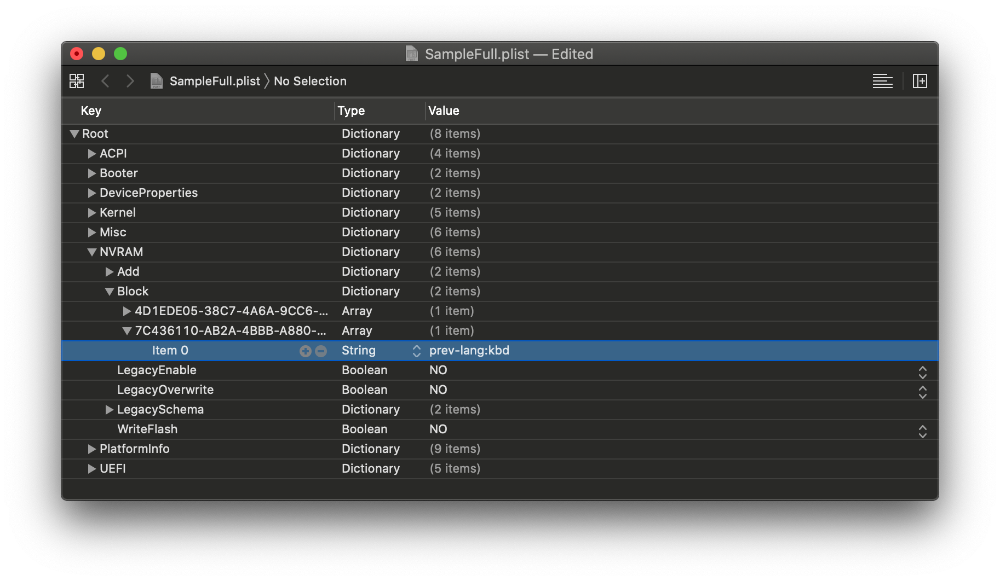
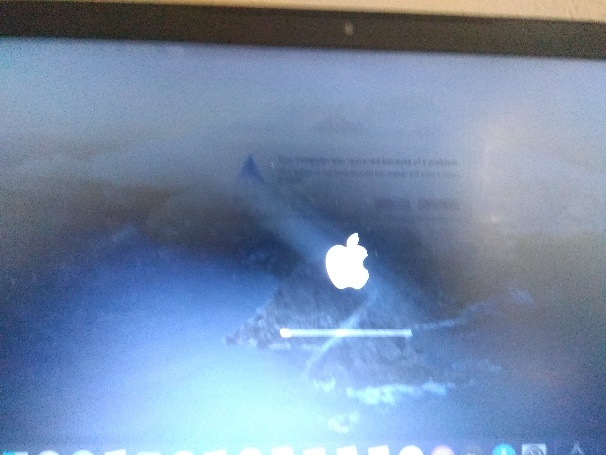
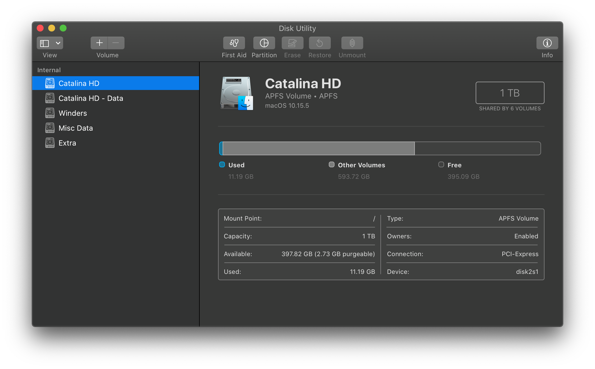
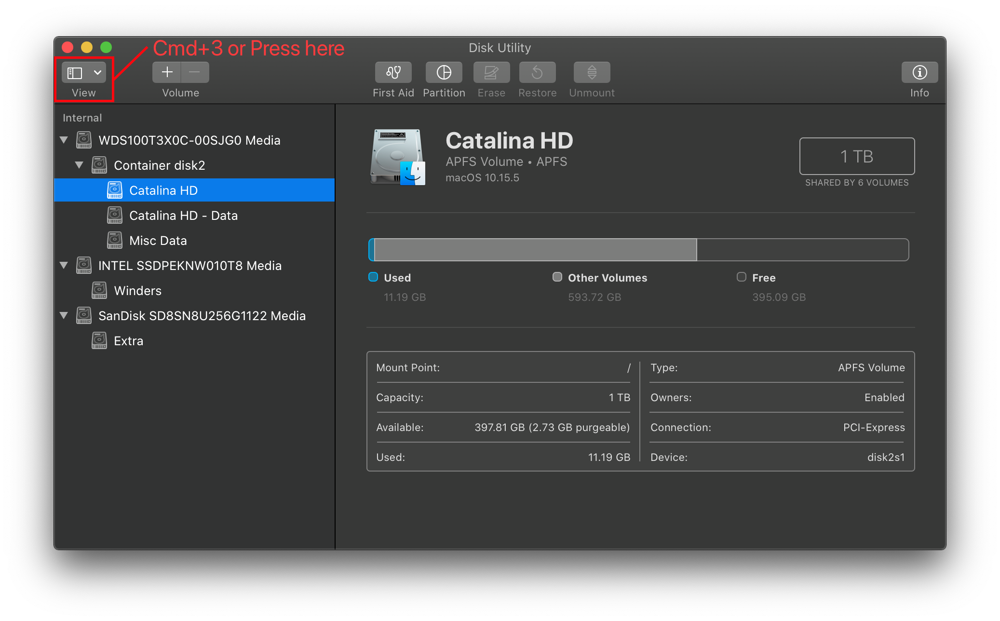
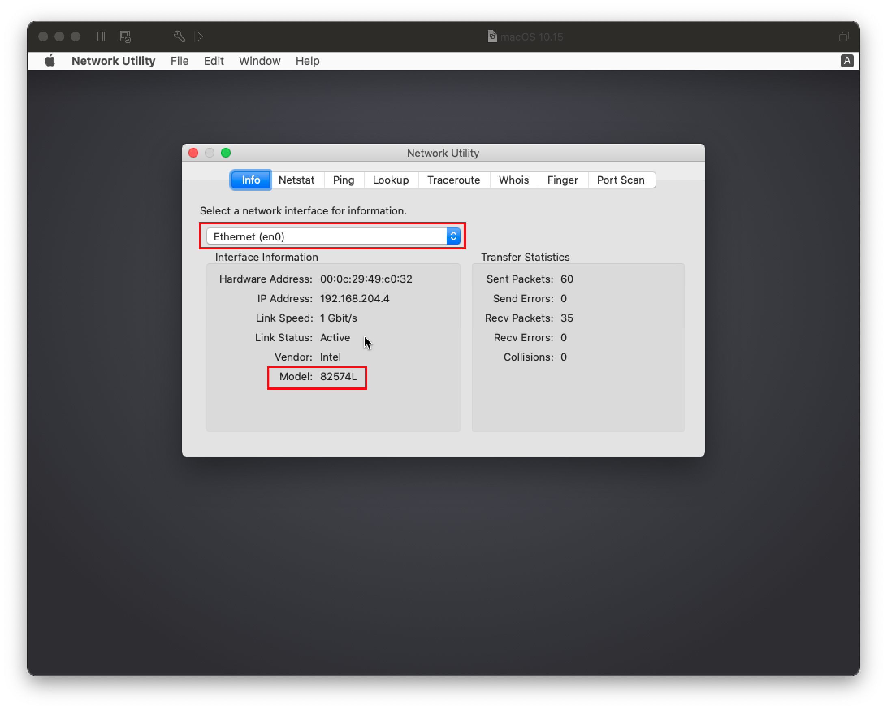
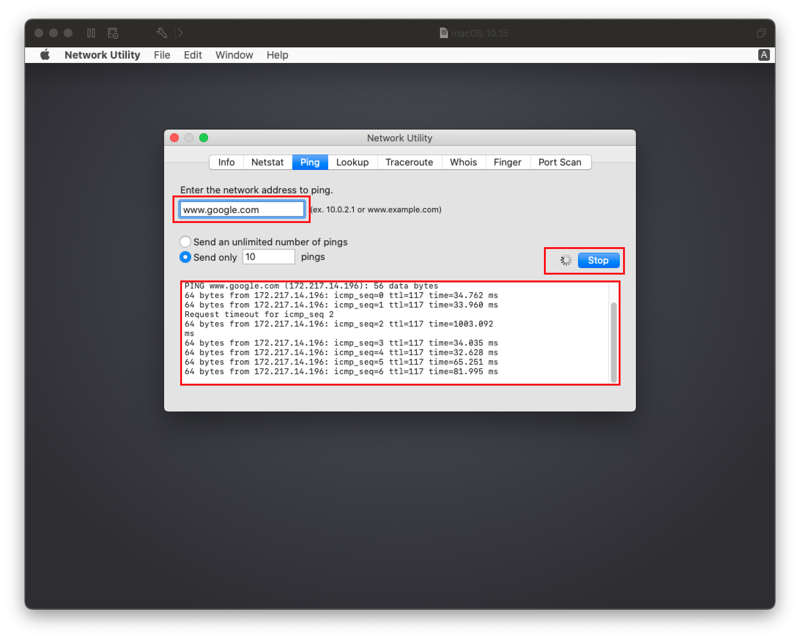

# Userspace 問題

關於安裝程式和 GUI 啟動時的問題。

[[toc]]

## macOS 安裝程式顯示俄語

在範例配置檔案中，我們預設了俄語為 macOS 安裝程式顯示語言。這是因為黑蘋果的世界基本由斯拉夫人主導的。現在，檢查 `NVRAM -> Add -> 7C436110-AB2A-4BBB-A880-FE41995C9F82` 的 `prev-lang:kbd` 的值。請移除這個值（這將使安裝程式讓你自行選擇語言）或將其設定為 `656e2d55533a30`（即 American: en-US:0）。完整列表可在 [AppleKeyboardLayouts.txt](https://github.com/acidanthera/OpenCorePkg/blob/master/Utilities/AppleKeyboardLayouts/AppleKeyboardLayouts.txt) 找到。

使用文字編輯器（如 UEFI Shell, Notepad++ 等）的用戶會發現 `656e2d55533a30` 會變成 `ZW4tVVM6MA==`

您可能還需要在開機程式中重置 NVRAM

* 注意: ThinkPad 筆記型電腦可能在 OpenCore 中重置 NVRAM 後會變磚並無法使用，我們建議通過更新這些電腦的 BIOS 來重置 NVRAM。

還是不管用？好吧，是時候讓大人物上場了。我們將強制刪除該屬性，並讓 OpenCore 重建它:

`NVRAM -> Delete -> 7C436110-AB2A-4BBB-A880-FE41995C9F82 -> Item 0` 然後設置它的類型和值分別為 `String` 和 `prev-lang:kbd`



## macOS 安裝程式損壞

如果你在 2019 年 10 月之前下載了 macOS，你可能已經有一個過期的 macOS 安裝程式證書，有兩種方法可以解決這個問題:

* 下載最新版本的 macOS
* 在終端機把日期更改為證書有效日期

後者需要進行以下步驟:

* 斷開或關閉所有網路裝置（乙太網, WiFi）
* 在恢復模式的終端機把日期更改為 2019 年 9 月 1 日:

```
date 0901000019
```

## 在 `IOConsoleUsers: gIOScreenLock...`/`gIOLockState (3...` 或接近的位置卡住

這錯誤發生在 GPU 正確初始化之前，請驗證以下內容:

* GPU 支援 UEFI（GTX 7XX/2013+）
  * 如果你的 GPU 支援 macOS 但不支援 UEFI，你也許可以嘗試[強制注入 GOP](https://winraid.level1techs.com/t/amd-and-nvidia-gop-update-no-requests-diy/30917/2)
* 已在 BIOS 中停用 CSM
* 強制使用 PCIe 3.0
* 如使用 iGPU，請仔細檢查 ig-platform-id 和 device-id 是否有效。
  * 桌面平台 UHD 630 可能需要改為使用 `00009B3E`
* 試用各種 [WhateverGreen 修復](https://github.com/acidanthera/WhateverGreen/blob/master/Manual/FAQ.IntelHD.en.md)參數
  * `-igfxmlr` 開機參數。這也可以表現為 "Divide by Zero" 錯誤。
  * 在 10.15.4 及更新版本中，Coffee Lake iGPU 用戶可能還需要 `igfxonln=1`

## 在筆記型電腦上出現花屏

在 BIOS 設定中啟用 CSM。這可能顯示為 "Boot legacy ROMs" 或其他 legacy 設定.

## 在筆記型電腦和 AIO 上，於 `IOConsoleUsers: gIOScreenLock...` 後出現黑屏

驗證以下內容:

* 已加入 SSDT-PNLF（即同時出現在 EFI/OC/ACPI 及 config.plist -> ACPI -> Add）
* iGPU 屬性 `DeviceProperties -> Add -> PciRoot(0x0)/Pci(0x2,0x0)` 已正確設定
* Coffee Lake 和較新的筆記型電腦，請加入 `-igfxblr` 開機參數
  * 或者，在 `PciRoot(0x0)/Pci(0x2,0x0)` 加入 `enable-backlight-registers-fix | Data | 01000000`

此外，請驗證[在 `IOConsoleUsers: gIOScreenLock...` 或接近的位置卡住](#stuck-on-or-near-ioconsoleusers-gioscreenlock-giolockstate-3) 中提到的問題

## 在 Navi 上，於 `IOConsoleUsers: gIOScreenLock...` 後出現黑屏

* 加入開機參數 `agdpmod=pikera`
* 在不同的顯示輸出之間切換
* 嘗試使用 MacPro7,1 SMBIOS，及配合 `agdpmod=ignore` 開機參數

MSI Navi 用戶需要使用這裡提到的修補: [安裝程式不能與 5700XT 工作 #901](https://github.com/acidanthera/bugtracker/issues/901)

具體來說，在 `Kernel -> Patch` 下加入以下條目:

```
Base:
Comment: Navi VBIOS Bug Patch
Count: 1
Enabled: YES
Find: 4154592C526F6D2300
Identifier: com.apple.kext.AMDRadeonX6000Framebuffer
Limit: 0
Mask:
MinKernel:
MaxKernel:
Replace: 414D442C526F6D2300
ReplaceMask:
Skip: 0
```

## macOS 安裝程式卡在「剩餘 30 秒」

這可能是由於 NullCPUPowerManagement 驅動程式發生錯誤或完全缺失。另外， AMD OSX 教學所提供的驅動程式是有問題的，請要求 Shannee 進行修復。要解決這個問題，請從 `Kernel -> Add` 和 `EFI/OC/Kexts` 中移除 NullCPUPowerManagement，然後在 `Kernel -> Emulate` 中啟用 `DummyPowerManagement`

## AMD 15h/16h CPU 在數據和隱私畫面後自行重新啟動

請遵循此貼文的 UPDATE 2 的指示: [Fix Data and Privacy reboot](https://www.insanelymac.com/forum/topic/335877-amd-mojave-kernel-development-and-testing/?do=findComment&comment=2658085)

## macOS 在登入前就凍結了

這問題有兩個原因：

* 這是一個常見的 TSC 錯誤的例子，請加入 [CpuTscSync](https://github.com/lvs1974/CpuTscSync)
  * 對於 Skylake-X，由於像 Asus and EVGA 的廠商不會在韌體中寫入所有核心。所以我們需要在冷開機和喚醒時使用 [TSCAdjustReset](https://github.com/interferenc/TSCAdjustReset) 重置 TSC。已編譯版本: [TSCAdjustReset.kext](https://github.com/dortania/OpenCore-Install-Guide/blob/master/extra-files/TSCAdjustReset.kext.zip)。請注意，您**必須**打開 kext（在 Finder 按顯示套件內容，`Contents -> Info.plist`）及修改 Info.plist -> `IOKitPersonalities -> IOPropertyMatch -> IOCPUNumber` 的 CPU 線程數量。你需要由 `0` 數起（i9 7980XE 是 18 核心 36 線程，因此填寫 `35`）

* 對於 NootedRed 用戶，在 macOS 13 以後新增的 "mediaanalysisd" 也會導致這個問題（有機會在登入後才凍結）。請加入 [RestrictEvents](https://github.com/acidanthera/RestrictEvents) 及 `revblock=media` 開機參數。

查看這個問題的最常見方法:

Case 1    |  Case 2
:-------------------------:|:-------------------------:
  |  

## MediaKit 報告空間不足

這個錯誤是由於 EFI 空間太小所致。在預設情況下，Windows 會建立一個 100MB 的 EFI 分割區（ESP），但 macOS 要求 ESP 必須至少 200MB。要解決這個問題，你有兩種方法：

* 延伸 EFI 分割區到 200MB（做法請自行 Google）
* 格式化整個磁碟，而不只是一些分割區
  * 注意：磁碟工具程式預設只顯示分割區，按 Cmd/Win+2 來顯示所有裝置（或者你可以按查看按钮）

Default           |  Show All Devices(Cmd+2)
:-------------------------:|:-------------------------:
  |  

## DiskUtility 無法清除磁碟

可能是以下的其中一個（或更多）原因:

* 只格式化分割區而不是整個磁碟，請見 [MediaKit 報告空間不足](#mediakit-報告空間不足)
* DiskUtility 有一個奇怪的 bug，它會在第一次清除時失敗，然後嘗試再次清除
* BIOS 中的 SATA 熱插拔功能導致問題（嘗試停用此選項）
* 韌體太舊，確保磁碟使用最新的韌體
* 最後，你的磁碟可能壞了

## 磁碟工具程式沒有顯示任何 SATA 磁碟

* 請確認你的主板 BIOS 設定中的 SATA 控制器模式為 AHCI
* 部分 SATA 控制器可能不受 macOS 官方的支援。對於這種情況，你需要下載 [CtlnaAHCIPort.kext](https://github.com/dortania/OpenCore-Install-Guide/blob/master/extra-files/CtlnaAHCIPort.kext.zip)
  * 對於一些非常老舊的 SATA 控制器，[AHCIPortInjector.kext](https://www.insanelymac.com/forum/files/file/436-ahciportinjectorkext/) 可能更適合
  * 對於 AMD 的 FCH SATA 控制器，你需要下載 AMD FCH SATA 控制器專用的 [AMD-SATA-unsupported.kext](https://github.com/eason329/AMD-SATA-unsupported)

## 卡在 剩餘 2 分鐘


此錯誤與 macOS 為系統下次啟動編寫特定 NVRAM 變量的階段直接相關，因此當出現有關 NVRAM 的問題時，它將在此處停止。

要解決這個問題，你有幾個選擇：

* 300 系列 Intel 主板（如 Z390）修復：
  * [SSDT-PMC](https://dortania.github.io/Getting-Started-With-ACPI/)
* 其他主板可以在 config.plist 中進行以下設定：
  * LegacyEnable -> YES
  * LegacyOverwrite -> YES
  * WriteFlash -> YES

## 無法聯繫恢復伺服器

如果你是在 Windows 或 Linux 製作安裝程式，那麼這代表你的 USB 安裝程式是基於 recoveryOS 的。這意味著只有一小部分 macOS 安裝程式在磁碟上，而其餘部分必須通過安裝程式從蘋果伺服器下載。我們沒有包含完整安裝檔案的原因包括：不穩定的 HFS 驅動程式和其他工具程式通常會導致資料損壞。

要解決這個錯誤，你有幾個選擇：

* 確保你有可用的 Ethernet 或 Wi-Fi 連接
  * 在安裝程式的「工具」選單下打開“網路工具”，看看你的網卡是否顯示出來
    * 如果你的網卡 **沒有** 顯示，很可能是你使用了不支援的網卡或不正確的 kext
      * 請參考：[Ethernet Kexts](../../ktext.md#ethernet) 和 [尋找你的硬體](../../find-hardware.md)
    * 如果你的網卡 **有** 顯示出來，接下來在安裝程式的終端機執行 `ping -c3 www.google.com` 以確保網路連接正常
      * 如果沒有顯示，說明你的網路或 kext 出問題了
        * 如果新版本的 kext 在你的硬體中出現奇怪的 bug，我們建議嘗試舊版本的 kext
      * 如果它確實返回了一些東西，那麼問題就在蘋果這邊。不幸的是，您只能換個時間，再次嘗試安裝。

| Check NIC | Ping |
| :--- | :--- |
|  |  |

## Big Sur 上鍵盤和滑鼠壞了

你可能會注意到，當 USB 連接埠在某些舊系統（如 Core2 Duo/2010 及更老版本）工作時，基於 hid 的裝置（如鍵盤和滑鼠）可能會壞掉。要解決這個問題，請加入以下修補：

::: details IOHIDFamily 修補

config.plist -> Kernel -> Patch:

| Key | Type | Value |
| :--- | :--- | :--- |
| Base | String | _isSingleUser |
| Count | Integer | 1 |
| Enabled | Boolean | True |
| Find | Data | |
| Identifier | String | com.apple.iokit.IOHIDFamily |
| Limit | Integer | 0 |
| Mask | Data | |
| MaxKernel | String | |
| MinKernel | String | 20.0.0 |
| Replace | Data | `B801000000C3` |
| ReplaceMask | Data | |
| Skip | Integer | 0 |

[Source](https://applelife.ru/threads/ustanovka-macos-big-sur-11-0-beta-na-intel-pc-old.2944999/page-81#post-884400)

:::

## 卡在 `Your Mac needs a firmware update in order to install to this volume`

如果系統提示你更新韌體以安裝至 APFS 磁碟區，這可能表明 SMBIOS 表是過時的。首先，驗證以下幾點：

* 你已經啟用了 `PlatformInfo -> Automatic`
* `UpdateSMBIOSMode` 已設定為 `Create`
  * 同時確保停用了 `CustomSMBIOSGuid`
  * Dell 和 VAIO 電腦用戶，請確保啟用了 `CustomSMBIOSGuid`，並將 `UpdateSMBIOSMode` 已設定為 `Custom`
    * `CustomSMBIOSGuid` 和 `UpdateSMBIOSMode` 應該始終相互串聯
* 使用這個版本的 macOS 支援的 SMBIOS
  * 即：你沒有使用 `-no_compat_check`
* 你正在使用最新版本的 OpenCore

如果您仍然收到此錯誤，那麼可能在 OpenCore 本身中有一些過時的 SMBIOS 資訊。我們建議更改為類似的 SMBIOS，來查看這個問題是否得到解決。要獲得 SMBIOS 的完整列表，請參閱: [選擇正確的 SMBIOS](../../extras/smbios-support.md)
