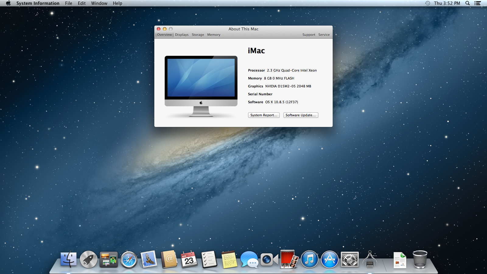
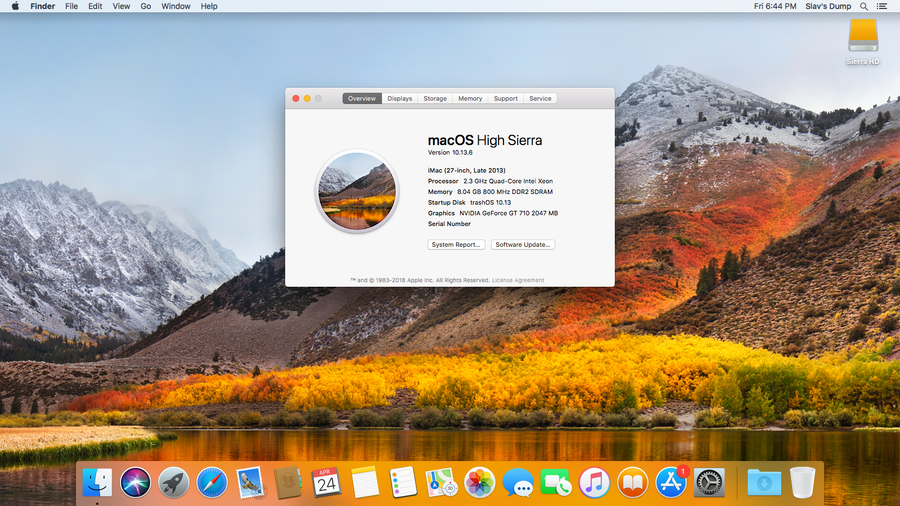
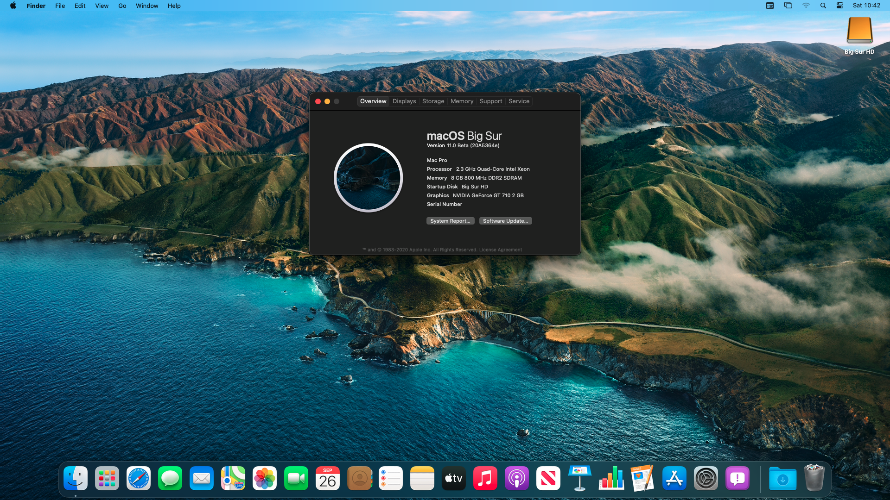

# 為什麼 OpenCore 超越 Clover 和其他程序

本節簡單介紹了為什麼社群已經過渡到 OpenCore，並旨在消除社群中常見的一些誤解。那些只是想要一台 macOS 電腦的人可以跳過這一頁。

[[toc]]

## OpenCore 特性

* 更多的操作系統支援！
  * OpenCore 現在支持更多版本的 OS X 和 macOS，而無需像 Clover 和 Chameleon 那樣必須進行痛苦的破解過程
  * 這包括早在 10.4、Tiger 的操作系統，甚至是最新版本的 macOS 13 Ventura！
* 平均而言，OpenCore 系統的啟動速度比使用 Clover 的系統要快，因為減少了不必要的補丁
* 更好的整體穩定性，補丁可以更精確：
  * [macOS 10.15.4 更新](https://www.reddit.com/r/hackintosh/comments/fo9bfv/macos_10154_update/)
  * AMD OSX 補丁不需要在每個小的安全更新中更新
* 以多種形式提高整體安全性:
  * 不需要停用系統完整性保護（SIP）
  * 內置 FileVault 2 支援
  * [Vaulting](https://sumingyd.github.io/OpenCore-Post-Install/universal/security.html#Vault) 允許創建 EFI 快照防止不必要的修改
  * 真正的 Secure Boot 支持
    * 包括 UEFI 和蘋果的變種
* BootCamp 切換和啟動設備選擇通過讀取啟動盤設置的 NVRAM 變量來支援，就像真正的 Mac 一樣。
* 通過 `boot.efi` 支援開機熱鍵 - 啟動時按 `Option` 或 `ESC` 來選擇啟動設備, `Cmd+R` 進入恢復模式或 `Cmd+Opt+P+R` 重設 NVRAM。

### 軟體支援

一些人想要從其他開機程式轉換的最大原因實際上是軟體支援：

* Kexts 不再使用 Clover 測試:
  * kext 出問題了？許多開發人員，包括 [Acidanthera](https://github.com/acidanthera) (您最喜歡的大多數 kext 的製造者) 不再提供除了 OpenCore 以外的支援
* 許多韌體驅動程式被整合到 OpenCore：
  * [APFS 支援](https://github.com/acidanthera/AppleSupportPkg)
  * [FileVault 支援](https://github.com/acidanthera/AppleSupportPkg)
  * [韌體補丁](https://github.com/acidanthera/AptioFixPkg)

## OpenCore 的缺點

Clover 的大部分功能實際上在 OpenCore 中以一些奇怪的形式得到了支援，但是在過渡時，你應該密切關注 OpenCore 缺失的功能，因為這可能會影響到你自己:

* 不支援引導基於 MBR 的操作系統
  * 解決方法是在 OpenCore 中鍊式加載 rEFInd 一次
* 不支援基於 UEFI 的 VBIOS 補丁
  * 但是在 macOS 中可以這樣做
* 不支援傳統 GPU 的自動設備屬性注入
  * 例如：InjectIntel、InjectNVIDIA、InjectAti
  * 然而，你可以手動 [修補 GPU](https://sumingyd.github.io/OpenCore-Post-Install/gpu-patching/)
* 不支援 IRQ 衝突補丁
  * 可以使用 [SSDTTime](https://github.com/corpnewt/SSDTTime)
* 不支援舊的 CPU 生成 P 和 C 狀態
* 不支援硬體 UUID 注入
* 不支援 Clover 的許多 XCPM 補丁
  * 例如：Ivy Bridge XCPM 補丁
* 不支援隱藏特定的硬碟區
* 不支援在 OpenCore 的選單內改變設置
* 不修補 PCIRoot UID 值
* 不支援 macOS 特有的 ACPI 補丁

## 常見的誤解

### OpenCore 還是測試版，所以不穩定嗎？

簡短的回答：不

長答案：不是

OpenCore 的版本號並不代表項目的質量。相反，它更多的是一種看到項目的墊腳石的方式。 Acidanthera 仍然有很多他們想要做的項目，包括全面的改進和更多的功能支持。

例如，OpenCore 通過適當的安全審計以確保符合 UEFI Secure Boot，並且是唯一經過這些嚴格審查並具有此類支援的 Hackintosh 開機程式。

版本 0.6.1 最初被設計為 OpenCore 的官方發布版本，因為它將擁有適當的 UEFI/Apple Secure Boot，並將是 OpenCore 作為公共工具發布的一周年。然而，由於 macOS Big Sur 周圍的情況以及 OpenCore 的預連接器的重寫以支持它，它決定將 1.0.0 推遲一年。

目前的路線圖：

* 2019年：測試年
* 2020年：安全啟動之年
* 2021年：改進之年

所以請不要把版本號看作是一個障礙，而應該看作是值得期待的東西。

### OpenCore 是否總是在其他操作系統中注入 SMBIOS 和 ACPI 數據?

預設情況下，OpenCore 將假設所有操作系統都應該平等對待 ACPI 和 SMBIOS 訊息。這種想法的原因包括三個部分:

* 這允許正確的多系統開機支援，如 [BootCamp](https://sumingyd.github.io/OpenCore-Post-Install/multiboot/bootcamp.html)
* 避免製作不良的 DSDT，並鼓勵適當的 ACPI 實踐
* 避免訊息被多次注入的邊緣情況，通常在 Clover 中看到
  * 例如：一旦啟動 boot.efi，你將如何處理 SMBIOS 和 ACPI 數據注入，但後來被趕出去嗎？因此試圖撤銷它們可能相當危險。這就是為什麼 Clover 的方法是不被允許的。

然而，在 OpenCore 中有一些奇怪的地方允許 SMBIOS 注入受到 macOS 的限制，這是通過為 macOS 讀取 SMBIOS 信息的地方打補丁實現的。將 `CustomSMBIOSMode` 設置為 `Custom` 的 `CustomSMIOSGuid` 選項可能會在未來中斷，因此我們只建議在其他操作系統中某些軟件中斷的情況下使用此選項。為了最好的穩定性，請禁用這些選項。

### OpenCore 需要全新安裝嗎？

如果你有一個純淨的安裝，那就完全不需要了——這指的是操作系統是否以任何方式被篡改了，比如將第三方 kext 安裝到系統卷或其他蘋果不支持的修改。當你的系統被嚴重篡改，無論是你還是第三方工具，如 Hackintool，我們建議重新安裝，以避免任何潛在的問題。

特別提醒 Clover 用戶：安裝 OpenCore 時，請重置 NVRAM。Clover 的許多變量可能與 OpenCore 和 macOS 衝突。

* 注：眾所周知，Thinkpad 筆記本電腦在 OpenCore 中 NVRAM 重置後是會變磚的，我們建議通過更新這些機器的 BIOS 來重置 NVRAM。

### OpenCore 只支援有限的 macOS 版本嗎？

從 OpenCore 0.6.2 開始，你現在可以啟動每個 Intel 版本的 macOS，一直到 OS X 10.4！正確的支援取決於您的硬體，所以請自行驗證：[硬體限制](macos-limits.md)

::: details macOS 安裝圖庫

Acidanthera 測試了很多版本的 OS X，而 dortania 也在他們的舊 HP DC 7900 (Core2 Quad Q8300) 上運行過很多版本的 OS X。以下是他們測試過的一小部分:

:::

### OpenCore 支援舊的硬體嗎?

到目前為止，只要操作系統本身支持，大多數 Intel 硬體都是支援的！但是，請參閱[硬體限制頁面](macos-limits.md) 以了解 OS X/macOS 的哪些版本支援哪些硬體。

目前，Intel 的 Yonah 和更新系列的 CPU 已經通過 OpenCore 進行了適當的測試。

### OpenCore 支持 Windows/Linux 開機嗎?

OpenCore 將自動檢測 Windows 而無需任何額外配置。在 OpenCore 0.7.3 中，OpenLinuxBoot 作為 EFI 驅動程序添加到 OpenCore 中，它將自動檢測 Linux 分區。這需要 [ext4_x64.efi](https://github.com/acidanthera/OcBinaryData/blob/master/Drivers/ext4_x64.efi) 或 [btrfs_x64.efi](https://github.com/acidanthera/OcBinaryData/blob/master/Drivers/btrfs_x64.efi)，具體取決於在發行版中使用的格式。對於開機程式具有不規則路徑或名稱的任何操作系統，你可以簡單地將其新增到 BlessOverride 部分。

### Hackintosh 的合法性

Hackintosh 位於法律的灰色地帶，主要是因為雖然這並不違法，但我們實際上違反了蘋果的 EULA。這不是違法的原因：

* 我們從[蘋果的伺服器](https://github.com/acidanthera/OpenCorePkg/blob/0.6.9/Utilities/macrecovery/macrecovery.py#L125)直接下載 macOS
* 我們是作為一個教學和個人使用的非營利組織來做這件事的
  * 計劃將 Hackintosh 用於工作或想轉售它們的人應該參考 [Psystar 案例](https://en.wikipedia.org/wiki/Psystar_Corporation) 和他們的地區法律

雖然 EULA 規定 macOS 只能安裝在真正的 mac 電腦或在真正的 mac 電腦上運行的虛擬機器上 ([第 2B-i 和 2B-iii 節](https://www.apple.com/legal/sla/docs/macOSBigSur.pdf))，但沒有強制執行的法律完全禁止這一點。然而，重新打包和修改 macOS 安裝程序的網站確實存在 [DMCA takedowns](https://en.wikipedia.org/wiki/Digital_Millennium_Copyright_Act) 等問題的潛在風險。

* **注意**：這不是法律建議，所以請自己進行適當的評估，如果你有任何疑問，請與你的律師討論。

### macOS 支援 NVIDIA GPU 嗎?

由於在 macOS 的新版本中圍繞 NVIDIA 支援的問題，許多用戶得出結論，macOS 從未支持 NVIDIA GPU。事實上，在直到 Monterey Beta 7 發布之前，蘋果都支持使用 NVIDIA GPU 的 mac 電腦（例如 2013 年使用 Kepler dGPU 的 MacBook Pro)。雖然有社區製作的補丁可以恢復支援，但它們需要停用 SIP（系統完整性保護），使 macOS 中的重要安全功能失效。

另一個問題與任何新的 NVIDIA GPU 有關，因為蘋果停止了與它們一起發貨的機器，因此它們從來沒有得到蘋果的官方操作系統支持。相反，用戶不得不依賴 NVIDIA 的第三方驅動。由於蘋果新推出的安全啟動的問題，他們不能再支援 Web Driver，因此 NVIDIA 不能在更新的平台上發布它們，限制它們在 mac OS 10.13, High Sierra。

有關操作系統支援的更多資訊，請參閱：[顯示卡購買指南](https://eason329.github.io/GPU-Buyers-Guide/)
